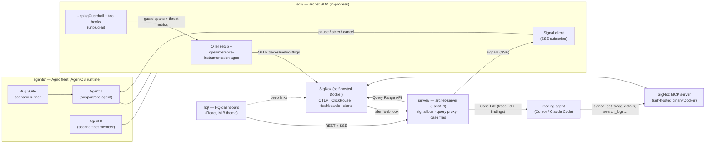

# ArcNet — Architecture

## System overview



## Framework decision: Agno

Demo agents run on **Agno** (we know it well; it's also the cleanest integration surface):

- **Instrumentation is first-class**: SigNoz has an official Agno guide using `openinference-instrumentation-agno`, and SigNoz ships a **prebuilt Agno dashboard template** — we import it day 1 and build our custom dashboards alongside it.
- **Guardrail framework**: Agno supports pre/post hooks + a `BaseGuardrail` class. Unplug integrates as `UnplugGuardrail` — idiomatic Agno, not bolted-on middleware. (Post-hackathon this doubles as an OSS contribution candidate to Agno.)
- **Tool hooks**: per-tool pre/post interception → `guard.check_tool_call()` + taint checks exactly where they belong.
- **HITL built in**: paused runs surface approval requests over a live socket → our `pause` signal becomes a real approve/reject flow driven from HQ.
- **Run cancellation** → `kill` signal. **AgentOS** (Agno's FastAPI runtime) serves the fleet → HQ triggers scenario runs over HTTP, sessions/state come free.

## Data flows

### 1. Telemetry (always on)
`AgnoInstrumentor().instrument()` + OTel SDK (traces/metrics/logs → OTLP → SigNoz). Agent runs emit agent/LLM/tool spans; we add `arcnet.guard` spans at checkpoints, threat counters, and finding logs. Token/cost metrics: derive OTel counters from Agno's per-run metrics (verify exact field names day 1) so the Cost dashboard has real numbers.

### 2. Inline defense (ms)
Guard checkpoints, implemented the Agno way:
- **pre-hook / input guardrail** → `guard.scan(text, source=USER)`
- **tool post-hook on fetch/retrieval tools** → `guard.scan(text, source=RETRIEVED)` + `wrap_for_context()` + `notify_taint_source()`
- **tool pre-hook (all tools)** → `guard.check_tool_call(name, args)` (taint + destructive + financial)
- **output guardrail / post-hook** → `guard.scan_output(text)` (secrets/PII → redact)

`ScanResult.action` drives behavior: `allow` → proceed; `redact` → substitute `redacted_text`; `block` → raise guardrail error (span status ERROR); `review` → proceed + flag. **Every result — including clean ones — becomes telemetry.**

### 3. Reactive signals (seconds)
SigNoz alert rule fires (threat count, cost burn, loop depth, p99 latency) → webhook POST `server/webhooks/signoz` → server maps to the canonical **`Signal{session_id, agent_id, kind, severity, reason, evidence_link, guidance}`** (this exact shape is the contract used everywhere — SDK, server, plan) → SSE. SDK signal client checks the per-session queue inside tool hooks (between steps):
- `steer` → inject corrective guidance into the run's context, continue
- `pause` → trigger Agno HITL pause; HQ shows approve/reject; resume on decision
- `kill` → cancel the run
- `note` → annotate telemetry only

Signals also stream to HQ's live feed.

### 4. Corrective loop (minutes) — Case File + SigNoz MCP
`GET /export/case-file/{trace_id|session_id}` → server pulls trace tree + findings + alerts via Query Range API → renders `case-file.md` (narrative timeline, findings with evidence, agent/tool config snapshot, **fix-prompt preamble**) + `case-file.json`. The case file embeds `trace_id`s and instructs the coding agent to pull live evidence itself via the **SigNoz MCP server** (`signoz_get_trace_details`, `signoz_search_logs`, `signoz_aggregate_traces`) — the coding agent investigates the incident against real telemetry, then patches the agent. This mirrors SigNoz's own "reconstruct a bug from a trace ID" / "postmortem evidence pack" MCP use cases, specialized for agent security.

## Components

### `sdk/` — Python package `arcnet`
- `arcnet.init(service_name, session_id, otlp_endpoint, guard_config)` — OTel providers (traces+metrics+logs), `AgnoInstrumentor`, Guard construction, signal subscription.
- `arcnet/guardrail.py` — `UnplugGuardrail` (Agno guardrail) + tool hook factories; emits spans/metrics/logs; maps `Action` → control flow.
- `arcnet/signals.py` — SSE client, per-session queue, `check_signals()` hook, HITL/cancel helpers.
- Telemetry namespace `arcnet.*`: see `04-signoz-integration.md`.

### `agents/` — demo fleet + Bug Suite
Agents J & K on **AgentOS** (single FastAPI app). Agent J: support/ops agent. Tools: `fetch_url` (injection vector), `lookup_customer` (seeded PII), `send_email` (exfil vector), `run_query` (destructive vector). Agent K: minimal second fleet member so the board isn't lonely. Model: cheap + fast (gpt-4o-mini or haiku — decide day 1 by keys; cost telemetry needs real tokens).

Bug Suite scenarios (`agents/scenarios/`), each = seeded fixture + script + expected detections:
| # | Codename | Attack | Expected chain |
|---|---|---|---|
| S1 | **Edgar** | Indirect injection in fetched page → email exfil attempt | retrieved-scan flags → taint → tool pre-hook **block** → alert → signal `steer` → agent self-corrects |
| S2 | **Neuralyzer** | Output contains PII/secret from DB | output guardrail → **redact** → HQ flash |
| S3 | **Serleena** | Injected destructive tool call (`DROP TABLE`) | tool pre-hook **block** |
| S4 | **The Worms** | Runaway loop / token burn | SigNoz metric alert → signal `kill` (cancel run) |
| S5 | **Frank** | Direct jailbreak/DAN in user input | input guardrail **block** (fast path) |
| S0 | Baseline | Clean run | all green — contrast shot |

Seeds: unplug-ai's built-in labeled samples + hand-written indirect-injection page fixtures (llmail-inject style).

### `server/` — FastAPI
Routes: `/webhooks/signoz`, `/signals/stream` (SSE per-session + firehose), `/api/fleet`, `/api/threats`, `/api/sessions/{id}`, `/export/case-file/{id}`, `/api/signal` (manual signal from HQ — pause/kill buttons), `/api/hitl/{run_id}` (approve/reject → AgentOS). State: SQLite. SigNoz access: Query Range API with service-account key (server-side only). Triggers scenario runs by calling AgentOS.

Also hosts **Griffin** (`server/griffin.py`, async worker): FM-powered metric anomaly detection — pulls metric history from the Query Range API every 60s, forecasts expected bands with Google TabFM (zero-shot regression + split-conformal residuals), and emits `arcnet.anomaly` telemetry only for true outliers, which rides the existing alert→webhook→signal path. Design: `07-griffin-anomaly.md`.

### `hq/` — React + Vite + Tailwind
Views: **Fleet Board** (registry + live status), **Threat Feed** (SSE), **Session Detail** (timeline + guard verdicts + SigNoz deep-links), **Signals Log** (incl. HITL approve/reject), **Case File** modal (preview + download + "open in Cursor" instructions). HQ never **queries SigNoz's API** directly — all telemetry comes through the arcnet-server proxy so the service-account key stays server-side. The only exception is deep-link hyperlinks that *open the SigNoz UI in a new tab* (no API call, no key).

### `deploy/`
- `docker-compose.yaml` — SigNoz self-host, pinned version.
- **SigNoz MCP server** — self-hosted binary (darwin_arm64) or Docker; wired into Cursor/Claude Code config. Used two ways: **dev-time** (we build dashboards/alerts/queries with SigNoz agent skills + MCP while developing) and **demo-time** (the Case File beat).
- `provision/` — idempotent setup: import Agno dashboard template + our 3 custom dashboards, alert rules, webhook channel. Prefer plain SigNoz APIs in the script; use MCP/agent-skills interactively to author the JSON.

## Repo layout

```
arcnet/
├── README.md
├── docs/
├── deploy/
│   ├── docker-compose.yaml      # SigNoz
│   ├── mcp/                     # SigNoz MCP server setup + client configs
│   └── provision/               # dashboards JSON, alert rules, setup script
├── sdk/                         # python: arcnet (uv project)
├── server/                      # python: arcnet-server (uv, depends on sdk)
├── agents/                      # python: AgentOS app + bug suite (uv)
├── hq/                          # pnpm: react dashboard
└── scripts/                     # run-demo.sh, seed.py, bring-up
```

Python 3.12+, `uv` workspaces. Pinned deps (versions verified on PyPI 2026-07-20 — pin these, re-resolve day 1): `unplug-ai==0.5.2` (requires-python ≥3.11), `agno==2.7.4` (v2 line = AgentOS), `openinference-instrumentation-agno==0.1.38`, `opentelemetry-sdk` + OTLP exporters, `opentelemetry-instrumentation-httpx`, `opentelemetry-instrumentation-system-metrics`, model SDK (`openai` or `anthropic`), `fastapi`, `httpx`, `sse-starlette`; server extra: `tabfm` (git-pinned commit, no PyPI) with `tabpfn==8.1.0` as fallback. SigNoz MCP server: `signoz-mcp-server v0.8.0` (binary/Docker).

## Secrets & env surface

Enumerated so the "judge runs `docker compose up` + `run-demo.sh`" claim is real. All in `.env` (git-ignored); `.env.example` ships with every key documented.

| Var | Purpose | Who needs it |
|---|---|---|
| `OPENAI_API_KEY` *or* `ANTHROPIC_API_KEY` | Demo agent model (gpt-4o-mini vs haiku — pick Day 0 by which key the dev has) | agents/, sdk/ |
| `ARCNET_MODEL` | Which model id to use (drives `pricing.py` lookup) | agents/ |
| `OTEL_EXPORTER_OTLP_ENDPOINT` | OTLP → SigNoz collector (self-host: `http://localhost:4318`) | sdk/ |
| `SIGNOZ_API_KEY` | Service-account key for Query Range API (server-side only) | server/ |
| `SIGNOZ_URL` | SigNoz instance URL | server/, MCP |
| `ARCNET_SERVER_URL` | Signal SSE + API base | sdk/, hq/ |
| `HF_TOKEN` | (only if TabFM/TabPFN weight download needs it) | server/ (Griffin) |

The **SigNoz MCP server** client config (Cursor `.cursor/mcp.json` / Claude Code) reuses `SIGNOZ_URL` + `SIGNOZ_API_KEY` — documented in `deploy/mcp/`. Model price constants (not a secret) live in `sdk/arcnet/pricing.py`.

## Key risks & mitigations

| Risk | Mitigation |
|---|---|
| SigNoz self-host heavy on the Mac (ClickHouse) | Pin versions, allocate Docker resources day 1; fallback = SigNoz Cloud (everything incl. MCP works there; would also unlock Noz) |
| `openinference-instrumentation-agno` gaps with current Agno version | Official SigNoz guide exists → low risk; day-1 smoke test; fallback manual OTel wrappers in guard hooks |
| Agno guardrail/HITL APIs drift (fast-moving framework) | Pin `agno` version day 1; we know the framework — verify hook signatures against the pinned version before building |
| `unplug-ai==0.5.2` API drift vs docs | Core contract verified; smoke-test day 1; pin |
| Query Range API shape on self-host | Verify day 2 before building export on it |
| Webhook payload lacks trace context | Encode session/agent identity into alert labels at provision time; server enriches via Query API |
| Solo + 6 days | P0 first; pre-agreed cut list in `03-plan.md` |
```
