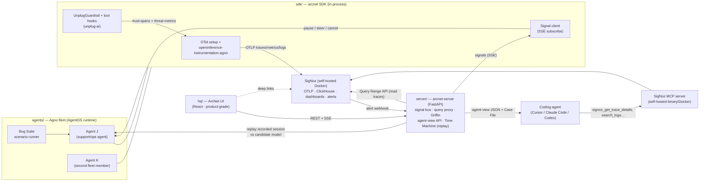

# ArcNet — Architecture

## System overview



## Framework decision: Agno

Demo agents run on **Agno** (we know it well; it's also the cleanest integration surface):

- **Instrumentation is first-class**: SigNoz has an official Agno guide using `openinference-instrumentation-agno`, and SigNoz ships a **prebuilt Agno dashboard template** — we import it in Phase 0 and build our custom dashboards alongside it.
- **Guardrail framework**: Agno supports pre/post hooks + a `BaseGuardrail` class. Unplug integrates as `UnplugGuardrail` — idiomatic Agno, not bolted-on middleware. (Post-hackathon this doubles as an OSS contribution candidate to Agno.)
- **Tool hooks**: per-tool pre/post interception → `guard.check_tool_call()` + taint checks exactly where they belong.
- **HITL built in**: paused runs surface approval requests over a live socket → our `pause` signal becomes a real approve/reject flow driven from the UI.
- **Run cancellation** → `kill` signal. **AgentOS** (Agno's FastAPI runtime) serves the fleet → the UI triggers scenario runs over HTTP, sessions/state come free.

## Data flows

### 1. Telemetry (always on)
`AgnoInstrumentor().instrument()` + OTel SDK (traces/metrics/logs → OTLP → SigNoz). Agent runs emit agent/LLM/tool spans; we add `arcnet.guard` spans at checkpoints, threat counters, and finding logs. Token/cost metrics: derive OTel counters from Agno's per-run metrics (verify exact field names in Phase 0) so the Cost dashboard has real numbers.

### 2. Inline defense — source-trust monitoring (ms)
Unplug is the **provenance/trust spine**. Every ingested datum is tagged with a trust level; the untrusted ones get scanned. Implemented the Agno way:
- **input**: `BaseGuardrail` subclass — Agno guardrails are **input-only by signature** (`check(run_input)`) → `guard.scan(text, source=USER)`
- **retrieved**: per-tool `@tool(post_hook=…)` on fetch/retrieval tools → `guard.scan(text, RETRIEVED)` + `wrap_for_context()` + `notify_taint_source()` — **scraped/fetched content filtered before it reaches the model**
- **tool_call**: agent-level `tool_hooks=[…]` middleware — Agno injects by **parameter name** (`function_name`/`name`, `func`/`function`, `args`/`arguments`, optional `agent`). Must call `func(**args)` to continue (or return a substitute value to short-circuit). → `guard.check_tool_call(name, args, taint_sources=[…])`
- **output**: plain `post_hooks=[…]` function on `RunOutput` — **Agno has no output-guardrail class** → `guard.scan_output(text)` (secrets/PII → redact)

Four structurally different Agno surfaces, one shared `Guard`. `arcnet/guardrail.py` builds all four callables with distinct names (`input_guardrail`, `retrieval_post_hook`, `tool_call_middleware`, `output_post_hook`) so the signature differences are design-time facts, not runtime surprises.

`ScanResult.action` drives behavior: `allow` → proceed; `redact` → substitute `redacted_text`; `block` → raise guardrail error (span status ERROR); `review` → proceed + flag (or hold side-effect tools for HITL). **Every result — including clean ones — becomes telemetry.** Each agent carries an `arcnet.exposure` attribute (`forward_facing` | `internal`) derived from whether it ingests third-party content; forward-facing agents are surfaced as higher injection-risk in the Fleet Health view.

### Agno 2.7.4 hook surface (Phase 0 verified)

| Surface | Exact API |
|---|---|
| Input guardrail | `class UnplugGuardrail(BaseGuardrail): def check(self, run_input: RunInput \| TeamRunInput) -> None` (+ `async_check`) — **input-only** |
| Agent hooks | `Agent(pre_hooks=[…], post_hooks=[…])` — each item is `Callable \| BaseGuardrail \| BaseEval` |
| Per-tool hooks | `@tool(pre_hook=…, post_hook=…)` on `Function`; hooks may accept `agent`/`team`/`run_context`/`fc` by name |
| Tool middleware | `Agent(tool_hooks=[fn])` — `fn` params by name: `name`/`function_name`, `func`/`function`, `args`/`arguments`, optional `agent`; call `func(**args)` to continue or **return a value** to substitute (replay stubs) |
| Cancel / kill | `Agent.cancel_run(run_id: str) -> bool` / `Agent.acancel_run(run_id: str) -> bool` |
| HITL | Built-in pause events (`RunPausedEvent`); confirmation flags on `Function` — wire UI approve/reject in Phase 3 |

### Phase 0 Gate G1 (replay + steer) — PASSED 2026-07-21

- **Replay stubs:** `tool_hooks` middleware returning canned outputs (no `func(**args)`) works; match by tool **function name** against recorded steps + step cursor. Confirmed on toy agent (`lookup`/`note`).
- **Steer propagation:** writing `agent.session_state["arcnet_steer"] = …` inside tool call N is **visible at tool call N+1** on agno 2.7.4. Primary path = session_state steer.
- **Substitution fallback:** `@tool(post_hook=…)` mutating `fc.result` also works (quarantine path) — keep as documented fallback (`02` §3) even though primary steer works.

### 3. Reactive signals (two paths, one contract)
Signals reach the bus two ways — both map to the canonical **`Signal{session_id, agent_id, kind, severity, reason, evidence_link, guidance}`** (this exact shape is the contract used everywhere — SDK, server, plan) → SSE:
- **Inline fast-path (ms):** when the guard blocks (e.g. Edgar's exfil), the SDK POSTs `/api/signal` directly — the on-camera steer is snappy and honest.
- **Alert-driven (system of record):** SigNoz alert rule fires (threat count, cost burn, loop depth, p99 latency) → webhook POST `server/webhooks/signoz`. Alert evaluation runs on an interval, so this path is tens-of-seconds; it's what you'd rely on at fleet scale, and the demo shows it landing right behind the fast-path.

SDK signal client checks the per-session queue inside tool hooks (between steps):
- `steer` → write guidance into `agent.session_state` (Phase 0 confirmed: visible at next tool call on agno 2.7.4); continue. Fallback (still documented): per-call output substitution in the retrieval `post_hook` mutating `fc.result`
- `pause` → trigger Agno HITL pause; the UI shows approve/reject; resume on decision
- `kill` → `Agent.cancel_run(run_id)`
- `note` → annotate telemetry only

Signals also stream to the UI's live feed.

### 4. Agent-view + hand-off (the machine-optimal twin)
Every ArcNet view has a paired **agent-view**: `GET /api/agent-view/{view}/{id}` returns a goal-level, trust-annotated, structured JSON — not raw logs. For an incident it carries: root cause (where + trust level + finding), the recorded outcome, recommended actions, and a `signoz:` trace pointer. The **Case File** is the packaged bundle of the same (`case-file.md` + `case-file.json` + embedded `trace_id`s + fix-prompt preamble). A coding agent (Claude Code / Codex / Cursor) reads the agent-view/Case File, pulls raw evidence itself via the **SigNoz MCP server** (`signoz_get_trace_details`, `signoz_search_logs`), and patches the observed agent. Mirrors SigNoz's own "reconstruct a bug from a trace ID" / "postmortem evidence pack" MCP use cases, specialized for agent trust.

### 5. Time Machine — counterfactual replay (the proof)
`POST /api/replay {session_id, candidate_model | candidate_prompt}`:
1. **Load** the recorded session from SigNoz traces (Query Range API): the ordered steps — user goal, each tool call and its **recorded output**, each model turn.
2. **Replay** the agent with tool outputs **mocked** from the trace (the replay harness intercepts Agno tool calls and returns the recorded result) so the *only* variable is the model/prompt. Runs against the candidate through the same `UnplugGuardrail` (so trust checks apply identically).
3. **Diff** the trajectories → core dimensions `{goal_reached, steps, tool_errors, cost, latency, tokens}` for every replay, plus `{resisted_injection, exfil_attempts}` when the session carried a threat.
4. **Verdict + recommendation** → surfaced in the Time Machine view and available as agent-view JSON for a coding agent to act on. Optionally loop over the corpus of 12 recorded incidents — loops, failures, leaks, injections — and aggregate the scorecard ("goals reached 10/12 vs 6/12 · steps −41% · cost −38% · attacks resisted 5/5").

This is **replay-from-trace, not live re-execution** — deterministic, cheap (one model call per step, no real tools), and demoable. Transcripts are **SQLite-primary** (full tool outputs must not depend on span attributes — collectors/backends *can* truncate, which would silently corrupt tool-stub matching). **Phase 0 oversized-fixture:** this self-hosted SigNoz/ClickHouse stored attributes through **256 KB** with no truncation observed; still treat that as a local observation, not a contract — keep SQLite-primary. Spans carry a summary twin (`arcnet.replay.digest`, step count, outcome flags, pointers) so SigNoz stays the proof/deep-link store. Full spec — transcript shape, tool-stub matching, diff semantics, verdict schema, corpus: **`10-time-machine.md`**.

## Components

### `sdk/` — Python package `arcnet`
- `arcnet.init(service_name, session_id, otlp_endpoint, guard_config)` — OTel providers (traces+metrics+logs), `AgnoInstrumentor`, Guard construction, signal subscription.
- `arcnet/guardrail.py` — four checkpoint callables built from one shared `Guard` (input guardrail class, retrieval post-hook, tool-call middleware, output post-hook — four different Agno signatures, named distinctly); emits spans/metrics/logs; maps `Action` → control flow.
- `arcnet/signals.py` — SSE client, per-session queue, `check_signals()` hook, HITL/cancel helpers.
- `arcnet/replay.py` — replay harness: wraps an Agno agent so tool calls return recorded outputs (from a trace) instead of executing; used by the Time Machine.
- Telemetry namespace `arcnet.*`: see `04-signoz-integration.md`.

### `agents/` — demo fleet + Bug Suite
Agent J on **AgentOS** (single FastAPI app): support/ops agent. Tools: `fetch_url` (injection vector), `lookup_customer` (seeded PII), `send_email` (exfil vector), `run_query` (destructive vector). Background fleet: **agents L & O** — clones of J with distinct ids running S0 on a loop, so Fleet Health is populated even if the Agent K persona (P2) is cut. **Model pick (Phase 0):** baseline `gpt-4o-mini` (`ARCNET_MODEL`); candidate `gpt-4o` (`ARCNET_CANDIDATE_MODEL`) — both via `OPENAI_API_KEY` (present). `ANTHROPIC_API_KEY` not funded in this env → Haiku path deferred; pricing table has placeholders.

Bug Suite scenarios (`agents/scenarios/`), each = seeded fixture + runner script + **telemetry assertions** (full spec, fixtures, goal predicates, camera notes: **`11-scenarios.md`**):
| # | Codename | Attack | Expected chain |
|---|---|---|---|
| S1 | **Edgar** | Indirect injection in fetched page → email exfil attempt | retrieved-scan flags → taint → tool pre-hook **block** → alert → signal `steer` → agent self-corrects |
| S2 | **Neuralyzer** | Output contains PII/secret from DB | output guardrail → **redact** → UI flash |
| S3 | **Serleena** | Injected destructive tool call (`DROP TABLE`) | tool pre-hook **block** |
| S4 | **The Worms** | Runaway loop / token burn | SigNoz metric alert → signal `kill` (cancel run) |
| S5 | **Frank** | Direct jailbreak/DAN in user input | input guardrail **block** (fast path) |
| S0 | Baseline | Clean run | all green — contrast shot |

Seeds: unplug-ai's built-in labeled samples + hand-written indirect-injection page fixtures (llmail-inject style).

### `server/` — FastAPI
Routes: `/webhooks/signoz`, `/signals/stream` (SSE per-session + firehose), `/api/fleet`, `/api/threats`, `/api/sources` (source-trust ledger), `/api/sessions/{id}`, `/api/agent-view/{view}/{id}` (machine-optimal twin of every view), `/export/case-file/{id}`, `/api/replay` (Time Machine — spec in `10`), `/api/signal` (inline fast-path from the SDK + manual pause/kill from the UI), `/api/hitl/{run_id}` (approve/reject → AgentOS). State: SQLite (incl. the replay-ready `sessions` table) — **full schema, every API/SSE shape, and write-ownership: `12-data-api.md`** (frozen contract; all components code against it). SigNoz access: Query Range API with service-account key (server-side only). Triggers scenario + replay runs by calling AgentOS. **No auth — localhost demo surface by design; say so in the README rather than shipping auth theater.**

Also hosts **Griffin** (`server/griffin.py`, async worker): FM-powered metric anomaly detection — pulls metric history from the Query Range API every 60s, forecasts expected bands with Google TabFM (zero-shot regression + split-conformal residuals), and emits `arcnet.anomaly` telemetry only for true outliers, which rides the existing alert→webhook→signal path. Design: `07-griffin-anomaly.md`.

### `hq/` — React + Vite + Tailwind (product-grade; direction in `09-frontend.md`)
Views (IA per v2):
- **Fleet Health** — agents + trust posture (forward-facing flagged) + threats + cost + Griffin anomalies.
- **Time Machine** (the star) — pick a recorded session, choose a candidate model/prompt, run the replay, see the side-by-side behavioral diff + verdict.
- **Sources & Trust** — per-agent ledger of ingested sources, trust levels, what Unplug filtered/blocked.
- **Signals** — live feed (incl. HITL approve/reject).
- **Case Files** — preview + download + "hand to coding agent" instructions.
- **Global Human ⇄ Agent view toggle** — every view flips to its agent-view JSON (the machine-optimal twin).

The UI never **queries SigNoz's API** directly — all telemetry comes through the arcnet-server proxy so the service-account key stays server-side. The only exception is deep-link hyperlinks that *open the SigNoz UI in a new tab* (no API call, no key).

### `deploy/`
- `docker-compose.yaml` — SigNoz self-host, pinned version.
- **SigNoz MCP server** — self-hosted binary (darwin_arm64) or Docker; wired into Cursor/Claude Code config. Used two ways: **dev-time** (we build dashboards/alerts/queries with SigNoz agent skills + MCP while developing) and **demo-time** (the Case File beat).
- `provision/` — idempotent setup: import Agno dashboard template + our 3 custom dashboards, alert rules, webhook channel. Prefer plain SigNoz APIs in the script; use MCP/agent-skills interactively to author the JSON.

### Model runtime boundaries (Phase 4 decision)

- **vLLM is not part of the current deployment.** The Time Machine currently compares hosted OpenAI chat models, so their provider API is already the inference boundary. vLLM only becomes relevant if ArcNet later serves a compatible open-weight **LLM** locally; it cannot serve TabFM/TabPFN because those are tabular estimators, not autoregressive LLMs.
- **Unplug remains in-process in `sdk/`.** It is a CPU-only, low-latency synchronous guard with per-session taint state. Moving it behind a network hop would add a failure mode to every checkpoint and weaken the fail-closed source-trust path without isolating a heavyweight runtime.
- **Griffin keeps MAD in the server process for the hackathon fallback.** If TabFM or TabPFN is enabled, its heavyweight model runtime belongs in a separate deployable worker/container so model loading, native dependencies, memory, and CPU do not compete with the control-plane API. The minimal internal boundary is `forecast(history, features) -> point predictions`; conformal calibration, noise-floor judgment, telemetry, and signal emission stay in `server/`. This boundary is internal and does not alter any frozen `12-data-api.md` route or shape.
- **Reliability order remains MAD → optional tabular worker, not the reverse.** A missing token, unavailable worker, or model timeout falls back to MAD and is reported honestly. No new network service is required for Phase 4 replay.

## Product core vs demo layer (this repo outlives the hackathon)

ArcNet is a long-term project; the hackathon is its v1 milestone (`08-vision-v2.md`). Two rules keep that true while building fast:

1. **`sdk/`, `server/`, `hq/` are the product core** — they never import from `agents/` or `scripts/`. Onboarding a live agent is `arcnet.init()` + env vars, nothing else; any Agno app qualifies, including the real working agents we run under ArcNet ourselves.
2. **Demo behavior is config + fixtures, never forked code paths.** Griffin's demo cadence, S4 choreography timings, seeded data — all flags/fixtures in `agents/`/`scripts/`/`*.toml`. If a "demo hack" wants to live in the core, it becomes a real feature or it doesn't ship.

## Repo layout

```
arcnet/
├── README.md
├── docs/
├── deploy/
│   ├── docker-compose.yaml      # SigNoz
│   ├── mcp/                     # SigNoz MCP server setup + client configs
│   └── provision/               # dashboards JSON, alert rules, setup script
├── sdk/                         # python: arcnet (uv project) — init, guardrail, signals, replay harness
├── server/                      # python: arcnet-server (uv, depends on sdk) — signals, Griffin, agent-view, Time Machine
├── agents/                      # python: AgentOS app + bug suite (uv)
├── hq/                          # pnpm: react UI (Fleet Health · Time Machine · Sources & Trust · Signals · Case Files)
└── scripts/                     # run-demo.sh, seed.py, bring-up
```

Python 3.12+, `uv` workspaces. Pinned deps (versions verified on PyPI 2026-07-20 — pin these, re-resolve in Phase 0): `unplug-ai==0.5.2` (requires-python ≥3.11), `agno==2.7.4` (v2 line = AgentOS), `openinference-instrumentation-agno==0.1.38`, `opentelemetry-sdk` + OTLP exporters, `opentelemetry-instrumentation-httpx`, `opentelemetry-instrumentation-system-metrics`, model SDK (`openai` or `anthropic`), `fastapi`, `httpx`, `sse-starlette`; server extra: `tabfm` (git-pinned commit, no PyPI) with `tabpfn==8.1.0` as fallback. SigNoz MCP server: `signoz-mcp-server v0.8.0` (binary/Docker).

## Secrets & env surface

Enumerated so the "judge runs `docker compose up` + `run-demo.sh`" claim is real. All in `.env` (git-ignored); `.env.example` ships with every key documented.

| Var | Purpose | Who needs it |
|---|---|---|
| `OPENAI_API_KEY` *or* `ANTHROPIC_API_KEY` | Demo agent model (gpt-4o-mini vs haiku — pick in Phase 0 by which key the dev has) | agents/, sdk/ |
| `ARCNET_MODEL` | Which model id to use (drives `pricing.py` lookup) | agents/ |
| `OTEL_EXPORTER_OTLP_ENDPOINT` | OTLP → SigNoz collector (self-host: `http://localhost:4318`) | sdk/ |
| `SIGNOZ_API_KEY` | Service-account key for Query Range API (server-side only) | server/ |
| `SIGNOZ_URL` | SigNoz instance URL | server/, MCP |
| `ARCNET_SERVER_URL` | Signal SSE + API base | sdk/, hq/ |
| `ARCNET_AGENTOS_URL` | Internal agent-runtime replay adapter (default `http://localhost:7777`) | server/ |
| `HF_TOKEN` | (only if TabFM/TabPFN weight download needs it) | server/ (Griffin) |
| `TABPFN_TOKEN` | Prior Labs model token; absent means MAD fallback | optional Griffin worker |

The **SigNoz MCP server** client config (Cursor `.cursor/mcp.json` / Claude Code) reuses `SIGNOZ_URL` + `SIGNOZ_API_KEY` — documented in `deploy/mcp/`. Model price constants (not a secret) live in `sdk/arcnet/pricing.py`.

## Key risks & mitigations

| Risk | Mitigation |
|---|---|
| SigNoz self-host heavy on the Mac (ClickHouse) | Pin versions, allocate Docker resources in Phase 0; fallback = SigNoz Cloud (everything incl. MCP works there; would also unlock Noz) |
| `openinference-instrumentation-agno` gaps with current Agno version | Official SigNoz guide exists → low risk; day-1 smoke test; fallback manual OTel wrappers in guard hooks |
| Agno guardrail/HITL APIs drift (fast-moving framework) | Pin `agno` version in Phase 0; we know the framework — verify hook signatures against the pinned version before building |
| `unplug-ai==0.5.2` API drift vs docs | Core contract verified; Phase-0 smoke test; pin |
| Query Range API shape on self-host | Verify in Phase 2 before building export on it |
| Webhook payload lacks trace context | Encode session/agent identity into alert labels at provision time; server enriches via Query API |
| Alert evaluation interval too slow for on-camera self-correct | Inline fast-path signal at block time (§3); alert stays the system of record; tune rule eval/`for:` windows in Phase 2 |
| **Time Machine replay: recorded trace lacks full inputs to re-run** | We control the demo agents, so the harness records the full transcript (goal, tool I/O, model turns) into SQLite at run time — never reconstructed from generic OTel spans (attribute size caps make that unreliable). Gate G3 (Phase-3 exit) manually replays the real S1+S4 transcripts before the diff API/UI is built. |
| Instrumentor emits OpenInference semconv, not `gen_ai.*` | Confirmed from source — dashboards/alerts/Griffin are authored against the real keys (`04`); Phase 0 pulls one live trace and pastes the actual names into `04` before any dashboard JSON is written |
| Steer via run-state write unverified on agno 2.7.4 | **Phase 0 G1 PASS:** `agent.session_state` write at tool N visible at N+1. Fallback = per-call `post_hook` substitution (also proven) remains documented |
| SigNoz alert API rejects legacy payloads | Author alert payloads in the current v5 `queries` format (crib from the Terraform-provider examples), never from memory/tutorials |
| **Counterfactual result is nondeterministic (LLM sampling)** | Replay at temperature 0; run the candidate 3× and report the majority behavior if needed; the demo scenario is chosen so the behavioral gap is large and stable. |
| Solo + 6 days | P0 first; pre-agreed cut list in `03-plan.md` |
```
