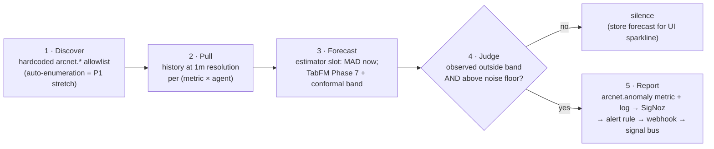

# Griffin — Anomaly Detection (F13)

> Griffin (MIB 3) sees every possible future and notices the moment reality goes off-script.

Griffin is ArcNet's metric-anomaly layer: a worker that forecasts what each agent metric *should* look like and reports **only when the observed value is an outlier**. Normal data → silence. That's the contract: no alert spam.

**Runtime honesty (2026-07-23):** Griffin runs **MAD** (robust z-score on rolling median/MAD) in-process today. **TabFM integration is required** on Phase 7 ([`21`](21-next-phases-plan.md) / [`22`](22-next-agent-packets.md)) — not optional, **not implemented yet**. TabPFN is deferred/out. Never claim foundation-model / TabFM / TabPFN live in HQ or README until Phase 7 exits. Overview: [`23`](23-product-overview.md).

## Why a foundation model (and the honest positioning)

SigNoz ships anomaly-based alerts (seasonal baseline + z-score). We **use one natively** (see `04-signoz-integration.md`) — but seasonal models need days/weeks of history. Agent fleets change hourly. TabFM is the **required** zero-shot path for short-history agents once Phase 7 ships. Pitch when live: *"SigNoz anomaly alerts learn your seasons; Griffin covers agents from the first minutes."* Complement, not replacement.

**Until Phase 7:** narrate Griffin as a **statistical baseline (MAD)**. Do not say "foundation-model precog" on camera.

## Model

- **Runtime now (locked):** robust z-score on rolling median/MAD — Griffin's I/O contract. Narration = **statistical baseline**. HQ/status labels `estimator=mad`.
- **Required Phase 7:** **Google TabFM** (`google/tabfm-1.0.0-pytorch`, **`subfolder="regression"`** / `TabFMRegressor`). Sklearn-style `fit/predict`, PyTorch backend. **Phase-2 G2 result (2026-07-21):** install OK; load ~28s; fit+predict ~12–26s/series → ~150s for 12 series (≫15s budget) → needs **async worker / subset series / longer cadence**; MAD degrade at runtime is OK.
- **Phase-7 P7-A re-measure (2026-07-23, CPU arm64, `docs/_phase7_g7.json`):** weights cached; load ~54s; median fit+predict ~80s/series (7 series timed) → projected ~960s for 12 series (≫15s budget). **Decision (not live):** `series_count=1`, `cadence_s=360`, `hardware=cpu`, verdict `SINGLE_SERIES_LONG_CADENCE`; async worker + MAD degrade required. Interface stub: `server/arcnet_server/tabfm_worker.py` `forecast(history, features) → predictions` (MAD fallback only; **not wired** to Griffin runtime). HQ must **not** label `tabfm` until P7-B exit.
- **Phase-7 P7-B ship (2026-07-24, pending live-verify):** opt-in `ARCNET_TABFM=1` starts daemon async worker (N=1 @ 360s); `tabfm_worker.forecast(backend=tabfm)` lazy-loads weights; any failure → MAD degrade for process lifetime; `GET /api/griffin/status` reports `estimator=tabfm` only after a successful forecast + additive `tabfm{enabled, loaded, last_forecast_ms, degrade_reason}`. Default runtime unchanged (MAD). Driver live-verify with cached weights required for full exit.
- **Bands via split-conformal residuals** (TabFM outputs point predictions only): fit on history minus last C=20 calibration points, predict calibration tail, take `q95(|residual|)` → band = `forecast ± that`. Model-agnostic — any regressor can slot into Griffin.
- **TabPFN:** deferred/out (Prior Labs `TABPFN_TOKEN` friction). Do not block harden phases on it. Reopen only by explicit decision.

## The loop (every 60s, per series)

1. **Discover** — **default = a hardcoded allowlist of the `arcnet.*` counters we emit ourselves**: `arcnet.threats.detected`, `arcnet.cost.usd`, `arcnet.tool.calls`, `arcnet.guard.latency`, `arcnet.tokens.total`, error rate — expanded per `agent_id` dimension, capped at top-N series (default 12). (No documented metrics-listing endpoint exists, and `gen_ai.*` metrics don't exist in this pipeline — see `04`. Auto-enumeration is the P1 stretch, not the plan.)
2. **Pull** — **Today:** seed file (`data/griffin_series.json`) if present, else in-memory SQLite proxy series (`series_source=seed|sqlite_proxy` in `griffin.py`). SigNoz Query Range is **not** Griffin’s evaluate input yet (it powers evidence/status seams elsewhere). Target shape remains last `H` at 1m buckets per (metric × agent).
3. **Forecast** — features per bucket: running index, minute-of-hour, rolling mean/std (5m, 15m), lag values. **Today:** MAD band. **Phase 7:** TabFM point forecast + conformal band (see Model section).
4. **Judge** — outlier iff `observed` outside the band **and** `|observed − forecast| > noise_floor(metric)` **and** series is warm (≥ 30 points; else status `warming`). Cooldown: same series can't re-fire within 5m.
5. **Report** — one path, through SigNoz when available (anomalies are telemetry, not a side channel):
   - emit `arcnet.anomaly` metric + structured log
   - alert → webhook → signal bus → Fleet Health Griffin strip + `note`/`steer` signal
   - no outlier → nothing reported; forecasts cached for UI band when available

## Integration points (already-built rails it rides on)

- **In (today)**: seed file or SQLite proxy series only. Query Range is used for SigNoz evidence/status — not wired into Griffin pull yet.
- **Out**: OTLP + the existing alert→webhook→signal pipeline when SigNoz is up.
- **Runtime**: MAD task inside `server/` (`griffin.py`); config in `griffin.toml`.
- **UI**: MAD strip / honesty on Fleet Health (+ HQ Agent tools labeled MAD).
- **Demo**: S4 *The Worms* — Griffin flags the token-rate outlier **before** the static cost-burn threshold trips when choreographed.

### Runtime isolation decision

The locked **MAD** path remains an async task in `arcnet-server`: lightweight, no extra deploy surface. **Phase 7 TabFM** must run in a separate worker/container behind `forecast(history, features) -> predictions`. The server owns history queries, conformal calibration, anomaly judgment, OTLP emission, and **degrade-to-MAD**. A worker failure or cold TabFM degrades to MAD; public API stays stable. TabPFN is not on the critical path.

### S4 choreography — guaranteeing "Griffin first" (don't leave it to chance)

Griffin's default 60s cycle vs an instant threshold is a coin-flip on camera. Make the ordering deterministic:
- **Demo mode** runs Griffin on a short cadence (e.g. 10s) *or* exposes an on-demand `evaluate(series)` the scenario runner calls the moment S4 launches.
- The static cost-burn alert uses a longer `for:` window (e.g. sustained ≥45s) so it can't trip first.
- The `kill` signal that stops the loop is wired to fire *after* Griffin's anomaly is emitted (scenario runner orders: launch loop → Griffin evaluate → anomaly → kill), so the run isn't cancelled before Griffin's evidence exists.
Document the exact timings in the scenario fixture; rehearse it — don't leave ordering to chance on camera day.

## Cold start & seeding

Needs ~30 points/series when using seeded warm paths. Cold-path soak (Phase 3) proves status is not stuck `cold` without writing seed theater. UI shows `warming` / honesty strings until series are live.

## Build plan (aligned to current phases)

- **Phase 2 (done):** TabFM CPU spike → G2 FALLBACK to MAD for runtime; TabFM remains **required** on roadmap (Phase 7), not abandoned.
- **Phase 3 (done):** Griffin MAD core + cold soak; no TabFM-live claims.
- **Phase 7 (required, not coded):** spike re-measure on `google/tabfm-1.0.0-pytorch` `regression/`; worker isolation; conformal bands; MAD degrade; HQ labels `tabfm` only when live. Packets: [`22`](22-next-agent-packets.md) P7-A / P7-B.
- **Cut ladder:** TabFM path ships with MAD degrade — never block the product on FM latency. TabPFN stays out.

## Narration honesty

Name the estimator **actually running**. Today that is **MAD** — say "statistical baseline," never "TabFM live" or "foundation-model precog." After Phase 7 exits and HQ labels `tabfm` only when the worker is healthy, narration may name TabFM. Forced failure must degrade to MAD with an honesty string. TabPFN stays out of narration unless reopened.

## Risks

| Risk | Mitigation |
|---|---|
| TabFM CPU latency / weight size (~6.5 GiB) | Phase 7 spike re-measure; async worker; subset series; MAD degrade (runtime OK; TabFM path still required) |
| Claiming FM before Phase 7 | Docs/HQ honesty pin; grep exits in Phase 5 / P5-B |
| False positives on spiky-but-normal metrics | Conformal band + noise floor + 5m cooldown |
| Short history → wide bands → misses | Correct uncertainty honesty; demo scenarios produce extreme outliers |
| "Griffin first" inverts on camera | Deterministic S4 choreography; rehearse |
| TabPFN token friction | Deferred — do not block on Prior Labs token |
