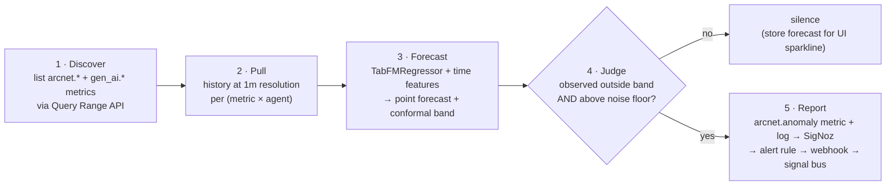

# Griffin — Foundation-Model Anomaly Detection (F13)

> Griffin (MIB 3) sees every possible future and notices the moment reality goes off-script.

Griffin is ArcNet's metric-anomaly layer: a worker that continuously forecasts what each agent metric *should* look like using a **tabular foundation model** and reports **only when the observed value is an outlier**. Normal data → silence. That's the contract: no thresholds to tune, no alert spam. (Model choice — Google TabFM primary, TabPFN fallback — is locked in the Model section below and de-risked by a Day-2 spike, the day before Griffin core.)

## Why a foundation model (and the honest positioning)

SigNoz ships anomaly-based alerts (seasonal baseline + z-score). We **use one natively** (see `04-signoz-integration.md`) — but seasonal models need days/weeks of history to learn a baseline. Agent fleets don't work like that: agents are deployed, redeployed, and change behavior hourly. TabPFN is zero-shot — calibrated predictive distributions from **minutes** of history, no training, no seasonality requirement. Pitch line: *"SigNoz anomaly alerts learn your seasons; Griffin covers your agents from the first 15 minutes of their lives."* Complement, not replacement.

## Model

- Primary: **Google TabFM** (`TabFMRegressor` from `github.com/google-research/tabfm`, Apache-2.0, weights auto-download from HF `google/tabfm-1.0.0-pytorch` — both verified live 2026-07-20). Sklearn-style `fit/predict`, CPU supported (JAX or PyTorch backend — pick in the spike; no PyPI package, so pin a git commit in `pyproject.toml` and pre-pull weights in the setup script so the "one-command bring-up" claim holds). Zero-shot regression on our time-featurized buckets. Brand-new Google release → strong Creativity/Innovation material, but treat as unproven: **spike on real M-series latency Day 2 (Wed) before committing** (budget: whole cycle < 15s for 12 series).
- **Bands via split-conformal residuals** (TabFM outputs point predictions only, no quantiles): fit on history minus the last C=20 calibration points, predict the calibration tail, take `q95(|residual|)` → band = `forecast ± that`. Model-agnostic and calibrated by construction — any regressor can slot into Griffin.
- Fallback A: **TabPFN** (the `tabpfn==8.1.0` PyPI package — its model line is marketed as "TabPFN-2.5"; same thing) — same regressor slot; its native predictive distribution can replace conformal bands if TabFM underperforms on CPU.
- Fallback B (interface-preserving): robust z-score on rolling median/MAD — Griffin's I/O contract doesn't change, so this is a safe last-resort swap.

## The loop (every 60s, per series)

1. **Discover** — query SigNoz for available metrics ("what all metrics do we have"), filtered by allowlist patterns: `arcnet.threats.detected`, `arcnet.cost.usd`, `arcnet.tool.calls`, `arcnet.guard.latency`, `gen_ai.client.token.usage`, `gen_ai.client.operation.duration`, error rate — expanded per `agent_id` dimension. Cap at top-N series (default 12) to bound the cycle.
2. **Pull** — last `H` (default 6h, or whatever exists) at 1m buckets via Query Range API.
3. **Forecast** — features per bucket: running index, minute-of-hour, rolling mean/std (5m, 15m), lag values. Train rows = history minus calibration tail, calibrate residuals on the tail, predict current bucket → point forecast + conformal band (see Model section).
4. **Judge** — outlier iff `observed` outside the conformal band **and** `|observed − forecast| > noise_floor(metric)` (absolute floor prevents flat-series false positives) **and** series is warm (≥ 30 points; else status `warming`). Cooldown: same series can't re-fire within 5m (fingerprint dedupe, alertmanager-style).
5. **Report** — one path, through SigNoz (anomalies are telemetry, not a side channel):
   - emit `arcnet.anomaly` metric (attrs: metric, agent_id, direction, severity = band-distance) + structured log with forecast/observed/quantiles
   - a standard SigNoz alert rule on `arcnet.anomaly > 0` → webhook → signal bus → the UI's **Griffin card** (sparkline + shaded forecast band + red observed dot) and a `note`/`steer` signal to the affected agent
   - no outlier → nothing reported; forecasts cached so the UI can still render the band live

## Integration points (already-built rails it rides on)

- **In**: SigNoz Query Range API (same client the server already has).
- **Out**: OTLP (same exporter the SDK already configures) + the existing alert→webhook→signal pipeline. Griffin adds zero new alerting machinery.
- **Runtime**: async worker task inside `server/` (`server/griffin.py`); config in `griffin.toml` (cadence, H, band, noise floors, allowlist, top-N).
- **UI**: Griffin card on Fleet Health + anomaly cards in the threat feed.
- **Demo**: S4 *The Worms* — Griffin flags the token-rate outlier **before** the static cost-burn threshold trips (show both firing, Griffin first). Optionally a latency-drift micro-scenario nothing else can catch.

### S4 choreography — guaranteeing "Griffin first" (don't leave it to chance)

Griffin's default 60s cycle vs an instant threshold is a coin-flip on camera. Make the ordering deterministic:
- **Demo mode** runs Griffin on a short cadence (e.g. 10s) *or* exposes an on-demand `evaluate(series)` the scenario runner calls the moment S4 launches.
- The static cost-burn alert uses a longer `for:` window (e.g. sustained ≥45s) so it can't trip first.
- The `kill` signal that stops the loop is wired to fire *after* Griffin's anomaly is emitted (scenario runner orders: launch loop → Griffin evaluate → anomaly → kill), so the run isn't cancelled before Griffin's evidence exists.
Document the exact timings in the scenario fixture; rehearse it on Day 3 (Thu), not on demo day.

## Cold start & seeding

Needs ~30 points/series. **`scripts/seed.py` is built on Day 3 (Thu)** — same day as Griffin core — so Griffin is testable on warm data the day it's written (not Day 5, which was the original bug: the tuning day came before the tool that produces tunable data existed). Demo bring-up runs seed first so Griffin is warm; the UI shows `warming` status honestly until then.

## Build plan (fits the re-anchored days; see 03-plan.md)

- **Day 2 (Wed Jul 22)** — timeboxed TabFM CPU spike: install from git, pick JAX vs PyTorch backend, measure fit+predict latency on M-series, **lock TabFM-vs-TabPFN before Griffin core is written tomorrow** (gate G2 in `03-plan.md`).
- **Day 3 (Thu Jul 23)** — Griffin core: worker skeleton, one hardcoded series (token rate), conformal judge + `arcnet.anomaly` emission, alert rule, `scripts/seed.py`, S4 choreography. *Exit: run S4 on seeded data → Griffin fires before the static alert.*
- **Day 4 (Fri Jul 24)** — Griffin card with forecast band in the UI (P0). **Day 5 (Sat)** — metric auto-discovery, top-N series (P1).
- **Cut ladder** (Griffin degrades, never blocks): multi-metric breadth → auto-discovery (hardcode 3 series) → TabFM→TabPFN→MAD fallback. Griffin core stays — it's a headline differentiator.

## Narration honesty (so the pitch survives a fallback)

The demo narration names the model **actually running**: TabFM (primary) or TabPFN (fallback) — **both are tabular foundation models**, so "foundation-model precog" stays true either way. The MAD z-score is an *emergency-only* last resort; if we ever fall to it, we re-narrate to "statistical baseline" and drop the FM claim. Decide which model is live **before recording** (locked at the Day-2 spike), so the recorded line is never false.

## Risks

| Risk | Mitigation |
|---|---|
| TabFM is brand-new: CPU latency / API rough edges unknown | Day-2 spike before committing; TabPFN drop-in (same regressor slot, still an FM); MAD last resort (re-narrate) |
| No PyPI package for TabFM | Pin git commit; vendor nothing; pre-install + pre-pull weights in setup script (protects one-command bring-up) |
| False positives on spiky-but-normal metrics | Conformal band + noise floor + 5m cooldown; tune on seeded traffic (seed exists Day 3) |
| Short history → wide bands → misses | That's correct behavior (uncertainty honesty); demo scenarios produce extreme outliers anyway |
| "Griffin first" inverts on camera | Deterministic S4 choreography (see above); rehearse Day 3 |
| Model download size/time on demo day | Pre-pull weights in setup script; pin versions |
