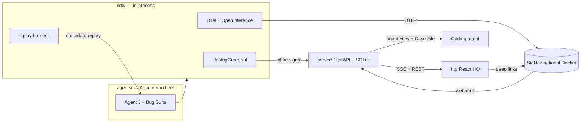

# ArcNet — Product & usage guide

User-facing guide for the Agents of SigNoz hackathon build: what ArcNet is, how to run it, how to use HQ, and how to verify each view. Demo narration beats live in [`06-demo-script.md`](06-demo-script.md). Build history: [`log.md`](log.md).

---

## 1. What ArcNet is

**ArcNet is an agent enhancement layer** — observe → defend → replay → case file → improve. It is not a SigNoz clone and not demo theater.

It watches every agent's behavior, cost, and the trust of everything it ingests; stops attacks in real time; makes incidents legible to coding agents; and proves a different model or prompt would behave better before you ship it. HQ is the operator control plane for that loop.

One loop:

```
OBSERVE → DETECT → DEFEND → HAND OFF → PROVE → IMPROVE
  SigNoz    Griffin MAD    Unplug       agent-view /    Time Machine    HQ Agent
  / fleet   (+ TabFM P7)   block/steer  Case File       counterfactual  propose→apply
```

Plain language: agents browse, call tools, and burn tokens. Untrusted scraped pages can inject instructions. ArcNet traces the run (SigNoz optional), tags source trust with Unplug, blocks exfil, steers or kills the run, then lets you **replay the recorded session** against another model with the same tools/guard — your own history as a behavioral regression suite — then propose/apply model upgrades with human confirm.

**Start here for product direction:** [`23-product-overview.md`](23-product-overview.md). **Measurement / roadmap truth:** [`20`](20-honest-progress.md) · [`21`](21-next-phases-plan.md) · [`22`](22-next-agent-packets.md). Honesty pin: **~57% / ≤60%**.

---

## 2. Who it's for / why it exists

| Audience | Why |
|---|---|
| Hackathon judges | Track 1 (AI & Agent Observability): observe → defend → replay → case file on SigNoz |
| Agent operators | Fleet health, threats, cost, and live signals in one HUD |
| Coding agents (Claude Code / Cursor / Codex) | Agent-view JSON + Case File zip with SigNoz MCP hints — fix the observed agent |

**Not in scope:** DSPy/GEPA evolvers, live tool re-execution for counterfactuals, general eval platforms, auth (localhost demo by design).

---

## 3. Architecture (one page)



| Piece | Role |
|---|---|
| **HQ** (`hq/`) | Six views + global `human_view ⇄ agent_view` |
| **Server** (`server/`) | Signal bus, Time Machine API, agent-view, Case File export, Griffin MAD, SigNoz webhook |
| **SDK / guard** (`sdk/`) | OTel init, Unplug in-process (no network hop on fail-closed path), signal client, replay stubs |
| **SigNoz** (`deploy/`) | Optional depth: traces, dashboards, alerts, MCP |
| **Agents / demo** (`agents/`) | Agno AgentOS + Bug Suite (`S0`–`S5`) |
| **Griffin** | **MAD** anomaly judge in-process today; **TabFM required Phase 7** (not live); TabPFN deferred |
| **Time Machine** | **SQLite-primary** transcripts — not reconstructed from span attributes |

Import rule: `sdk/`, `server/`, `hq/` never import `agents/` or `scripts/`.

---

## 4. Prerequisites

| Need | Required for |
|---|---|
| `OPENAI_API_KEY` | Live `replay.run()`, scenario runner (S0/S1/S2/S4) |
| Python 3.12+, `uv`, Node + `pnpm` | Install / HQ |
| `.env` from `.env.example` | Ports + keys |

**Optional (SigNoz depth):** Docker Desktop ≥4 GiB, `SIGNOZ_API_KEY` (service account in SigNoz UI → Settings → Service Accounts). Without Docker, the full SQLite-primary demo still works: fleet, signals, sources, Time Machine (seeded heroes), Case Files.

---

## 5. How to run

```bash
cp .env.example .env          # fill OPENAI_API_KEY
uv sync --all-packages
cd hq && pnpm install && cd ..

./scripts/run-demo.sh         # seed Griffin + fleet → server :8000 → AgentOS :7777 → HQ :5173
# HQ   http://localhost:5173
# API  http://127.0.0.1:8000/api/fleet
# Ctrl-C stops everything
```

| Port | Service |
|---|---|
| **5173** | HQ (Vite; proxies `/api`, `/signals`, `/export` → server) |
| **8000** | ArcNet server |
| **7777** | AgentOS replay runtime |
| **8080** | SigNoz UI (optional) |
| **4318** | OTLP HTTP (optional) |

### Optional SigNoz

```bash
cd deploy && foundryctl cast -f casting.yaml && cd ..
# UI http://localhost:8080 — create service account → .env SIGNOZ_API_KEY=…
python deploy/provision/setup.py
./deploy/mcp/install.sh
```

Env defaults: `VITE_ARCNET_API` empty (same-origin via Vite proxy). Override only if HQ talks to a remote API. `VITE_SIGNOZ_URL` defaults to `http://localhost:8080`.

---

## 6. How to use each HQ view

Global chrome: sidebar (`// observe` · `// improve`), mini fleet dots, breadcrumb `· live` / `· api_down`, **`human_view | agent_view`** toggle.

**How views evolved:** early HQ was a flat six-panel demo HUD. Product rework added **Agent → version → model → session cascade** (Case Files, Time Machine, HQ Agent), Fleet **MAD** strip, pagination **“showing N of Total”**, apply **reload honesty** (`agentos_reload_required` + probe — restart is operator step), and hash deep-links. HITL approve UI and `api_down` auto-recover are still deferred (Phase 6). Full story: [`23`](23-product-overview.md).

| View | Human mode | Agent mode | Buttons / actions |
|---|---|---|---|
| **fleet_health** | Agent cards: exposure, sessions/threats/blocked/cost/anomalies/signals. `[FORWARD]` = higher injection risk. **MAD** Griffin strip | `GET /api/agent-view/fleet/all` JSON | — |
| **signals** | Table of steer/pause/kill/note; live SSE updates; pagination totals | Agent-view signals envelope when wired | Watch feed; HITL approve/reject UI = Phase 6 (API decide = SQLite only today) |
| **sources_trust** | Ingested-source ledger: origin, trust_level, scan_action | Bounded sources agent-view when available | — |
| **time_machine** | **Cascade** agent→version→model→session · candidate · baseline vs candidate · verdict · history | `GET /api/agent-view/replay/{id}` after a verdict exists | **`replay.run()`** (needs key + AgentOS); **`hand_to(claude_code)`** downloads Case File |
| **case_files** | Same **cascade** · incident preview (root cause, actions, HTTP-prefer MCP hint) | Incident agent-view envelope | **`export_case_file()`** → zip (`case-file.md` + `.json`) |
| **hq_agent** | Proposals inbox · version timeline · apply with `confirm` · reload banner | Tools via `arcnet.hq_tools` | Propose → human apply → pin; **not** auto AgentOS restart |
| **dashboards** | SigNoz deep-links + live `/api/signoz/status` probe | Status + link list JSON | Opens SigNoz in a new tab; MCP PARTIAL |

**Toggle tip:** flip to `agent_view` on an incident/replay before the Case File handoff beat — that is the machine-optimal twin coding agents consume.

---

## 7. Hero scenarios · Time Machine · Case File

Hero sessions ship in `data/arcnet.db` (re-seeded by `run-demo.sh` / `seed_demo.py`). Stable IDs from the G4 gate:

| Scenario | Session | Story |
|---|---|---|
| **S1 Edgar** | `s_ecfdb55d` | Indirect injection → exfil attempt blocked; candidate resists |
| **S4 Worms** | `s_2af44726` | Runaway pagination → kill; candidate breaks the loop |

### Live replay

1. Open **time_machine**, pick `s_2af44726` (Worms) or `s_ecfdb55d` (Edgar).
2. Candidate defaults to `gpt-4o` (override via input / `ARCNET_CANDIDATE_MODEL`).
3. Click **`replay.run()`** — progress streams over SSE; verdict is majority of 3 runs.
4. **`hand_to(claude_code)`** or Case Files → **`export_case_file()`**.

### Re-run a live scenario (optional)

```bash
# server must be up
PYTHONPATH=sdk:agents uv run python agents/scenarios/runner.py --scenario S1
PYTHONPATH=sdk:agents uv run python agents/scenarios/runner.py --scenario S4
```

Demo narration (camera script, timings, backup-clip notes): **[`06-demo-script.md`](06-demo-script.md)**.

---

## 8. How to verify / test

### Automated

```bash
PYTHONPATH="sdk:server" uv run python -m unittest discover -s sdk/tests
PYTHONPATH="sdk:server" uv run python -m unittest discover -s server/tests
uv run python scripts/check_import_boundaries.py
cd hq && pnpm build
# optional live heroes (needs OPENAI_API_KEY + demo stack):
uv run python scripts/phase4_g4_check.py
```

### Manual HQ checklist (after `./scripts/run-demo.sh`)

See [§ Frontend audit](#11-frontend-audit-done-vs-left) below for per-view APIs and expected UI. Top checks:

1. Breadcrumb shows `· live`; sidebar lists `agent_j` / `agent_l` / `agent_o`.
2. Fleet Health: forward-facing badge on Agent J; non-zero demo stats.
3. Signals table non-empty; optional: run S1 and watch a new row + live counter.
4. Sources Trust: rows with trust levels / scan actions after S1.
5. Time Machine: select Worms → existing verdict or `replay.run()` → mixed/improved with cost tradeoff.
6. Flip `agent_view` on Time Machine → replay envelope JSON.
7. Case Files: select Edgar → root_cause populated → export zip opens.
8. Dashboards: status line reflects SigNoz up/down (not a hard failure if down).
9. Kill HQ only: breadcrumb `· api_down` + seam error with `./scripts/run-demo.sh` hint.
10. `curl -sf http://127.0.0.1:8000/api/signoz/status | jq`.

---

## 9. Known limitations

- **Griffin = MAD** until Phase 7 TabFM exits; never claim TabFM/TabPFN live. TabFM required on roadmap (`21`/`22`); TabPFN deferred.
- **HITL** — `POST /api/hitl/{id}` updates SQLite; does **not** yet relay/pause live AgentOS (Phase 6). Apply `confirm` ≠ auth.
- **SigNoz MCP** — binary installable; live stdio handoff remains **PARTIAL** (Case File + Query Range HTTP preferred).
- **Live AgentOS restart** after apply — operator step; probe/banner honesty only (auto-restart unproven).
- **Overall readiness ~57% / ≤60%** — [`20`](20-honest-progress.md). No 74/80/95 theater.
- **Screenshots / video** — human content tasks (slots listed in README + §12).
- **Timestamps** — APIs return epoch-ms (docs/12 said ISO; documented drift).
- **Temp-0 replay** ≠ determinism — 3-run majority; honest `inconclusive` / `mixed` verdicts.
- **Dashboards deep-links** open SigNoz shells; pick provisioned dashboards after `setup.py`.
- **Dedicated threats feed / corpus scorecard / HITL UI** — Phase 6 or deferred (see [`22`](22-next-agent-packets.md)).
- **No auth** — localhost demo surface.

---

## 10. Content readiness (what humans still fill)

| Artifact | How to fill | Pointer |
|---|---|---|
| README screenshots (4 slots) | Capture HQ + SigNoz with demo stack up | Slots in README; beats in `06` |
| Demo video &lt; 3 min | Assemble per-beat clips; backup Beats 4–5 | `06-demo-script.md` |
| SigNoz dashboard picks | After provision, screenshot Fleet / Threats / Cost / seasonal+Griffin | `04-signoz-integration.md` |
| Submission form / Slack provenance | Human blockers | `log.md` |

---

## 11. Frontend audit — DONE vs LEFT

Inventory of `hq/` as of this guide (live APIs only — Phase 3 mock route removed).

### DONE per view

| View | Wired | Empty / error / loading | Agent toggle | Notes |
|---|---|---|---|---|
| Shell (`App`) | Nav IA matches `09`; API seam probe via `/api/fleet` | `api_down` seam; mini fleet | Global toggle | No router — view state in React |
| fleet_health | `GET /api/fleet` | Empty + seam + loading | Agent envelope `fleet/all` | Forward-facing styling |
| signals | `GET /api/signals` + SSE `signal` | Empty + seam | Raw list JSON (not agent-view route — signals have no twin in `12`) | Live event counter |
| sources_trust | `GET /api/sources` | Empty + seam | Raw list JSON | Per-row scan_action badges |
| time_machine | sessions / replays / `POST /api/replay` + SSE progress | Empty states; seam on failure | `replay/{id}` when verdict present | Diff + verdict + history + Case File link |
| case_files | sessions + `agent-view/incident` + export URL | Empty + seam | Incident envelope | Preview + zip download |
| dashboards | Deep links + **`GET /api/signoz/status`** | Honest up/down/key/query copy | Status + links JSON | SigNoz optional |

### LEFT / gaps

| Gap | Priority | Notes |
|---|---|---|
| README / demo **screenshots** | Must for submission polish | Human capture; stack is available |
| Demo **video** + Beat 4–5 backups | Must for presentation | Script in `06` |
| HITL approve/reject UI | Nice (P1) | API ready; not needed for current demo beats |
| Threats list panel | Nice | Counts already on fleet; detail in Case File |
| Per-dashboard UUID deep-links | Nice | IDs change per provision; UI picker is fine |
| `replay_corpus` / scorecard UI | Nice (P1) | README artifact, off camera |
| Context inspector | Deferred P1 | Agent-view covers demo |
| Self-hosted JetBrains Mono woff2 | Polish | Falls back to system mono |
| Client-side tests / Playwright | Nice | `pnpm build` is the HQ gate today |
| Signals/sources agent mode via `/api/agent-view/*` | Nice | Spec folds threats into incident; list JSON is acceptable |

### Must-fix before demo vs nice-to-have

**Must (product path):** `./scripts/run-demo.sh` green · HQ build · heroes selectable · Case File export · agent_view toggle · honest SigNoz status (done).

**Must (human content):** screenshots · video · submission metadata.

**Nice:** HITL UI · corpus scorecard · font self-host · E2E tests · tighter SigNoz deep-links.

### How to test each view

| View | URL / action | Expected | APIs |
|---|---|---|---|
| Seam | Stop server, reload HQ | `· api_down` + run-demo hint | `/api/fleet` fail |
| fleet_health | Open HQ | Cards + `[FORWARD]` on agent_j | `GET /api/fleet` |
| fleet agent_view | Toggle | JSON envelope | `GET /api/agent-view/fleet/all` |
| signals | Open view | Rows; run S1 → new row / live count | `GET /api/signals`, `EventSource /signals/stream` |
| sources_trust | After S1 | Trust / scan_action rows | `GET /api/sources` |
| time_machine | Select `s_2af44726` | Diff or empty→`replay.run()` | `GET /api/sessions`, `/api/replays`, `POST /api/replay` |
| time_machine agent | After verdict | Replay envelope | `GET /api/agent-view/replay/{id}` |
| case_files | Select `s_ecfdb55d` → export | Root cause + zip download | `GET /api/agent-view/incident/{id}`, `/export/case-file/{id}` |
| dashboards | Open view | Status line; links open :8080 | `GET /api/signoz/status` |

---

## Related docs

| Doc | Role |
|---|---|
| [`23-product-overview.md`](23-product-overview.md) | **Product overview** — is/isn't, loop, HQ evolution, ~57% |
| [`20-honest-progress.md`](20-honest-progress.md) | **Measured scorecard** (source of truth) |
| [`21-next-phases-plan.md`](21-next-phases-plan.md) | **Phase plan + required TabFM** |
| [`22-next-agent-packets.md`](22-next-agent-packets.md) | **Next agent packets** Phases 5–7 |
| [`16-product-review-brief.md`](16-product-review-brief.md) | Human review brief — §11 founder decisions |
| [`17-product-rework-plan.md`](17-product-rework-plan.md) | Productization plan R1–R3 |
| [`15-product-map.md`](15-product-map.md) | Full built-surface map |
| [`01-product.md`](01-product.md) | Feature tiers / loop spec |
| [`02-architecture.md`](02-architecture.md) | Full architecture |
| [`06-demo-script.md`](06-demo-script.md) | Camera script |
| [`07-griffin-anomaly.md`](07-griffin-anomaly.md) | Griffin (MAD now; TabFM Phase 7) |
| [`09-frontend.md`](09-frontend.md) | Design system + IA |
| [`10-time-machine.md`](10-time-machine.md) | Replay semantics |
| [`11-scenarios.md`](11-scenarios.md) | Bug Suite fixtures |
| [`12-data-api.md`](12-data-api.md) | Wire contract |
