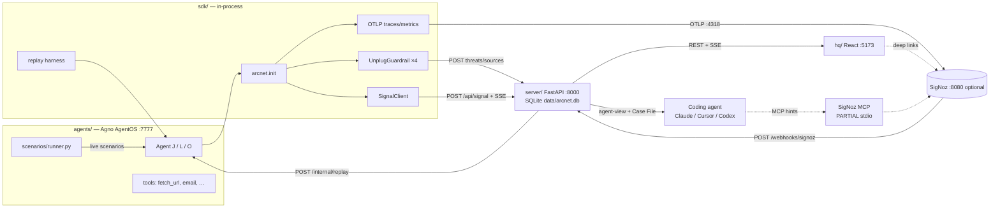
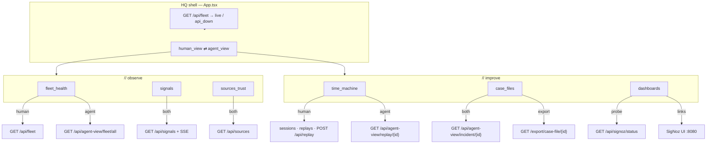

# ArcNet — Product map (built surface)

Complete inventory of **what is built**, mapped to docs/code. Not a redesign brief.
Use this before iterating frontend/dashboards view-by-view.

| Related | Role |
|---|---|
| [`16-product-review-brief.md`](16-product-review-brief.md) | **Human review brief** — §11 founder decisions; open questions closed |
| [`17-product-rework-plan.md`](17-product-rework-plan.md) | **Productization plan** R1–R3 (framing, API, HQ IA, model explore) |
| [`19-path-to-95.md`](19-path-to-95.md) | **Path to ~95%** robustness — execution waves after honest ~48% scorecard |
| [`14-product-guide.md`](14-product-guide.md) | How to run / use / verify HQ |
| [`12-data-api.md`](12-data-api.md) | Frozen wire/storage contract |
| [`13-phase6-api-read-models.md`](13-phase6-api-read-models.md) | Human vs agent read-model split |
| [`01-product.md`](01-product.md) | Feature tiers / loop |
| [`06-demo-script.md`](06-demo-script.md) | Camera beats (hackathon narration) |
| [`log.md`](log.md) | Gate outcomes (G1–G5) |

**Status key:** `DONE` = shipped and usable · `PARTIAL` = code exists but incomplete/fragile · `GAP` = missing or human-only · `CUT` = explicitly out of scope / deferred

**Product direction (2026-07-22):** ArcNet is an **agent enhancement layer** (observe → defend → replay → case file → improve), not a demo toy. See [`16` §11](16-product-review-brief.md) and [`17`](17-product-rework-plan.md).

---

## 1. One-page product purpose

**ArcNet is the layer that helps you make your agents work properly — and enhance them.**

One loop on a localhost surface (no auth in v1):

```
OBSERVE → DETECT → DEFEND → HAND OFF → PROVE
 SigNoz    Unplug trust +    block /      agent-view /     Time Machine
 traces    Griffin anomaly   steer / kill Case File        counterfactual replay
```

- **Observe** — Agno agents instrumented via `arcnet.init` → OTLP (optional SigNoz) + SQLite product tables.
- **Detect** — Unplug trust/taint at four checkpoints; Griffin MAD on metric series.
- **Defend** — inline signals (`steer`/`kill`) in ms; SigNoz alerts → webhook as system of record.
- **Hand off** — every panel has (or approximates) a machine twin: `/api/agent-view/*` + Case File zip with SigNoz MCP hints. Signals/sources/dashboards agent mode is raw/ad-hoc JSON (not enveloped).
- **Prove** — Time Machine replays a **recorded session** (SQLite transcript, mocked tools, **live guard**) against a candidate model; 3-run majority verdict.

**Not built (by design):** DSPy/GEPA evolvers, live tool re-execution for counterfactuals, auth, general eval platform, Agent K, S3 Serleena, corpus scorecard UI.

**Hero proof (measured):** S1 Edgar `s_ecfdb55d` and S4 Worms `s_2af44726` — both stable `mixed` 3/3 (`docs/_phase4_g4.json`).

---

## 2. System context



**Import rule (enforced):** `sdk/`, `server/`, `hq/` never import `agents/` or `scripts/`. Server talks to AgentOS over HTTP (`ARCNET_AGENTOS_URL`, default `http://localhost:7777`).

---

## 3. HQ views → APIs → data (human vs agent)



**Note:** HQ has **no URL router** — views are React state. Cannot bookmark `time_machine` or deep-link a session.

---

## 4. Inventory tables

### 4.1 HQ views

| View | Purpose | Widgets / fields shown | APIs | Empty / error | Demo beat | Status |
|---|---|---|---|---|---|---|
| **Shell** | Nav + mode + reachability | Sidebar IA; mini-fleet dots; `· connecting` / `· live` / `· api_down`; static `demo` tag; human/agent toggle | `GET /api/fleet` (probe once on mount — reload after kill) | `api_down` + run-demo hint; `no agents` | Cold open chrome | **DONE** |
| **fleet_health** | Fleet posture | Cards: name, `agent_id`, role, model, hot/ok, `[FORWARD]` if `forward_facing`; `sessions_24h`, `threats_24h`, `blocked_24h`, `cost_24h_usd`, `anomalies_24h`, `active_signals` (cost yes; **no latency** on cards) | H: `/api/fleet` · A: `/api/agent-view/fleet/all` | Empty + seam + loading | Beat 0–1 | **DONE** |
| **signals** | Live defense feed | Table: time, kind (`kill`/`pause`/`steer`/`note`), severity, agent, session, reason, source, status; live SSE count (human path). **`guidance` typed but not rendered** | H: `/api/signals` + SSE · A: raw `GET /api/signals` only (**not** agent-view envelope) | Empty + S1 runner hint; no dedicated loading flash | Beat 2–3 | **DONE** (agent twin = **PARTIAL** — raw JSON) |
| **sources_trust** | Ingested-source ledger | time, agent, session, origin, trust_level, scan_action badge, findings | H+A: `/api/sources` (agent = raw list) | Empty + S1 hint | Beat 2 | **DONE** (agent twin = **PARTIAL**) |
| **time_machine** | Counterfactual proof | Session select (`has_transcript`); candidate model; baseline vs candidate cols + badges; dimension rows; divergences; verdict + recommendation; history list if ≥2 replays; SSE progress; `hand_to(claude_code)` | sessions, replays, `POST /api/replay`, SSE `replay_progress`, agent-view replay, export | No transcripts; agent empty until a **verdict exists** (seeded history or `replay.run()`). Default select = latest transcript session — **not** auto-heroes | Beat 5 (headline) | **DONE** |
| **case_files** | Incident handoff preview | Session select; incident / root_cause / recommended_actions; MCP hint; export zip. **Human mode always loads incident agent-view** | `/api/agent-view/incident/{id}`, `/export/case-file/{id}`, sessions | No sessions; agent needs selection. Default = latest session (often clean `s_demo_*`) — **pick heroes for Beat 4** | Beat 4 | **DONE** |
| **dashboards** | SigNoz launcher | Status line (`ui_reachable`, `api_key_present`, `query_range_ok`); 5 link cards (3 named dashboards all hit `/dashboard`; traces; alerts) | `/api/signoz/status`; no agent-view | Honest warn copy; links still open | Beat 1 / close | **PARTIAL** — deep-links only, no embedded charts; named dashboards share `/dashboard` |

### 4.2 Human APIs vs agent-view

Frozen contract: [`12-data-api.md`](12-data-api.md). Serializers: `server/arcnet_server/read_models.py`.

| Human endpoint | Shape summary | Agent twin | Intentional difference |
|---|---|---|---|
| `GET /api/fleet` | `[{agent_id, name, role, exposure, model, last_seen, health:{…}}]` | `GET /api/agent-view/fleet/all` → envelope `data.agents` | Same rows, wrapped |
| `GET /api/sessions` | Index rows + `has_transcript`; **no** transcript | — (list is human-only) | Agents use per-id views |
| `GET /api/sessions/{id}?include=transcript` | Full row; transcript opt-in (**includes full `recorded_output`**) | `GET /api/agent-view/session/{id}` | Bounded timeline ≤40 steps; evidence excerpts ≤200 / args ≤120; digests of outputs in `data` — **but** `data.full_transcript` still points at the open human URL (escape hatch; no auth) |
| `GET /api/threats` | Threat rows (cap 200) | Folded into incident `root_cause` | No standalone threats agent-view |
| `GET /api/sources` | Source rows | `GET /api/agent-view/sources/{id}` | Envelope `{sources:[…]}`; 404 if id unknown |
| `GET /api/signals` | Signal rows (+ fleet-wide NULL session) | — (SSE is the live twin) | No signals in `12` view enum |
| `POST /api/replay` → verdict | Verdict object sync | `GET /api/agent-view/replay/{id}` | Envelope around stored verdict |
| `GET /api/replays` | Index without `runs` blob | — | — |
| Case File UI | Renders incident envelope | `GET /api/agent-view/incident/{id}` + zip | Zip = `case-file.md` + same JSON envelope |
| — | — | Envelope always: `{view, id, generated_at, data, links, hints}` | `generated_at` ISO-Z; row timestamps remain **epoch-ms** (documented drift vs `12`) |

Every agent-view wraps with `{view, id, generated_at, data, links, hints}`. `links.human_view` values (e.g. `/fleet`, `/time-machine/{id}`) are **logical** paths — HQ has no URL router yet (backlog #7).

**Documented drift (not a bug to “fix” in map):** `12` says ISO-8601 for APIs; shipped rows use epoch-ms (`13` conflict #1).

**Not built:** `POST /api/replay/corpus` (P1). HITL decide does **not** relay to AgentOS (docs claim; code updates SQLite only).

### 4.3 SDK / init + guard + signals

| Surface | Path | What it does | Status |
|---|---|---|---|
| Public exports | `sdk/arcnet/__init__.py` | `init`, `bind_session`, `shutdown`, `PRICES`, `cost_usd` | **DONE** (thin — guard/signals via submodules) |
| `arcnet.init` | `sdk/arcnet/init.py` | OTLP + AgnoInstrumentor + Unplug Guard + SignalClient + meters + runtime contextvar | **DONE** |
| Checkpoint **input** | `guardrail.py` `UnplugGuardrail` | `pre_hooks` → BLOCK raises | **DONE** |
| Checkpoint **retrieved** | `retrieval_post_hook` | scan/quarantine/taint; also called from middleware for `fetch_url` | **DONE** |
| Checkpoint **tool_call** | `tool_call_middleware` | `check_tool_call` + taint; BLOCK → steer + stub | **DONE** |
| Checkpoint **output** | `output_post_hook` | PII/leakage → `[REDACTED]` (Neuralyzer / S2) | **DONE** |
| Signals | `signals.py` | `steer`/`kill`/`pause`/`note`; POST + SSE; kill → `cancel_run` | **DONE** (`pause` = **PARTIAL** scaffold) |
| Replay | `replay.py` | Tool stubs from transcript; **live** guard; recorded signals only | **DONE** |
| Transcript | `transcript.py` | Persist to server SQLite-primary | **DONE** |
| Telemetry | `telemetry.py` | POST threats/sources to server | **DONE** |

**Integration pattern (config, not forks):**

```text
arcnet.init(service_name=…, agent_id=…, exposure=…, model=…)
hooks = build_guard_hooks()   # input UnplugGuardrail + output_post_hook + tool_hooks
Agent(pre_hooks=[input], post_hooks=[output], tool_hooks=[middleware], tools=TOOLS)
# retrieved checkpoint: invoked inside tool_call_middleware for fetch_url
#   (not registered as Agent post_hooks)
TranscriptRecorder → POST /api/sessions
```

Friction: `PYTHONPATH=sdk:agents`; submodule imports (`arcnet.guardrail`, …); **AgentOS `:7777` required** for live `replay.run()`; per-session `Guard()` reset. Agents L/O are clones via `build_fleet_clone` — same tools/prompt, different ids. No agent-code forks for ArcNet.

### 4.4 Agent tools + demo scenarios

| Tool (`agents/arcnet_agents/tools.py`) | Role |
|---|---|
| `fetch_url` | Scrapes fixture pages (S1 poison); retrieval scan |
| `lookup_customer` / `get_customer_profile` | Customer DB fixtures |
| `send_email` | Sensitive — taint blocks exfil (S1) |
| `run_query` | SQL-ish (S3 cut) |
| `paginate_records` | Endless cursor (S4 Worms) |

| Scenario | Runner | Camera | Status |
|---|---|---|---|
| S0 Baseline | yes | Beat 1 | **DONE** |
| S1 Edgar | yes | Beat 2 | **DONE** (delivered-path fixture) |
| S2 Neuralyzer | yes | optional | **DONE** |
| S3 Serleena | no | — | **CUT** (P2) |
| S4 Worms | yes | Beat 3 + 5 | **DONE** (runner posts kill after Griffin; not sole alert-driven) |
| S5 Frank | yes | corpus | **DONE** |

### 4.5 SigNoz / webhook / MCP

| Asset | Location | Status |
|---|---|---|
| Cast pin v0.133.0 | `deploy/casting.yaml` | **DONE** |
| Dashboards Fleet Ops / Threats & Trust / Cost & Tokens + Agno | `deploy/provision/dashboard-*.json`, `agno-dashboard.json` | **DONE** (provision via `setup.py` when key present) |
| 6 threshold alerts + webhook channel | `alerts.json` | **DONE** |
| Seasonal anomaly alert | `alert-seasonal-anomaly.json` | **DONE** as **screenshot artifact** (`never_demo_live`) |
| Webhook receiver | `POST /webhooks/signoz` | **DONE** (dedupe 5m → signal) |
| Query Range probe | `GET /api/signoz/status` | **DONE** |
| MCP binary + Cursor/Claude configs | `deploy/mcp/` | **PARTIAL** — install works; G5 stdio handoff hung; Case File + Query Range fallback |
| Service-account key | human UI step | **GAP** (manual; cannot create headlessly) |
| HQ embedded charts | — | **GAP** |
| Per-dashboard UUID deep-links from HQ | — | **GAP** (IDs change per provision) |

### 4.6 Time Machine / Case File / export

| Format | Endpoint / artifact | Contents | Status |
|---|---|---|---|
| Verdict JSON | `POST /api/replay` | `replay_id`, scenario, baseline/candidate dims, divergences, verdict, confidence, recommendation | **DONE** |
| Replay agent twin | `GET /api/agent-view/replay/{id}` | Envelope around verdict | **DONE** |
| Progress | SSE `replay_progress` | `{replay_id, step, total_steps, phase}` | **DONE** |
| Case File zip | `GET /export/case-file/{id}` | `case-file.md` (summary, root cause, timeline, actions, fix-prompt + MCP hints) + `case-file.json` (incident envelope) | **DONE** |
| Incident twin | `GET /api/agent-view/incident/{id}` | goal, agent, exposure, root_cause, outcome, recommended_actions, related_replay_id | **DONE** |
| Corpus scorecard | `POST /api/replay/corpus` | — | **GAP** (P1, pre-cut) |

### 4.7 Griffin

| Piece | Status |
|---|---|
| MAD z-score worker in server | **DONE** |
| `GET /api/griffin/status`, `POST /api/griffin/evaluate` | **DONE** |
| Seed series (`scripts/seed.py` / demo seed) | **DONE** |
| TabPFN / TabFM foundation model | **GAP** / optional (`TABPFN_TOKEN`); narration must say MAD |
| HQ Griffin card / forecast band | **GAP** (fleet `anomalies_24h` + signals `source=griffin`; no forecast band UI) |

---

## 5. "What we check" matrix

Verification points for later adversarial/QA. Sources: `14` §8–11, `log.md` gates, tests.

| Surface | Checks (#) | What to verify |
|---|---|---|
| **Demo bring-up** | 5 | `run-demo.sh` starts; `:8000` health; `:7777` AgentOS; `:5173` HQ; seed fleet non-empty |
| **HQ shell** | 4 | `· live`; mini-fleet ids; toggle persists across views; `api_down` when server killed |
| **fleet_health** | 6 | Cards render; `[FORWARD]` on `agent_j`; health numbers; agent envelope shape; empty DB; seam error |
| **signals** | 6 | Initial rows; SSE merge by `signal_id`; kinds/severity; live counter; empty hint; agent raw JSON |
| **sources_trust** | 5 | Rows after S1; trust_level; scan_action badges; empty; agent raw JSON |
| **time_machine** | 10 | Hero sessions listed; history loads; `replay.run()` progress; verdict dims; badges; agent replay envelope; hand_to download; no-transcript empty; AgentOS-down error; mixed≠fake improved |
| **case_files** | 7 | Edgar root_cause; actions list; MCP hint text; agent envelope; zip has md+json; clean-run path; empty |
| **dashboards** | 5 | Status fields honest; links open; no false "provisioned" claim; agent local JSON; SigNoz-down still usable |
| **Human APIs** | 8 | fleet shape; sessions filter/limit; threats/sources caps; signals NULL-session attribution; replays omit `runs`; 404s |
| **Agent-view** | 7 | Envelope keys; session timeline bounds (no full `recorded_output`); incident root_cause; sources 404; fleet wrap; replay wrap; hints present |
| **Case File export** | 4 | zip members; md sections; json == incident envelope; no secret/tool dump |
| **SDK guard** | 8 | init once; 4 checkpoints fire; S1 taint block; S2 redact; S5 input block; threat/source POSTs; steer/kill; Guard reset per session |
| **SSE / webhook** | 6 | inline POST; SSE catch-up (best-effort last-N when Last-Event-ID numeric — not true seq); webhook 204; bad payload 400; dedupe; resolved→expired |
| **Time Machine server** | 5 | 3× AgentOS; majority verdict; persist replays; progress events; heroes match `_phase4_g4` class |
| **Griffin** | 4 | evaluate fires; signal `source=griffin`; status cache; MAD-only without token |
| **SigNoz depth** | 7 | cast healthy; provision dashboards/alerts; Query Range 200; status probe; webhook channel; seasonal not live; OTLP spans OpenInference keys |
| **MCP** | 3 | binary present; configs valid; **stdio live = PARTIAL** (do not claim PASS) |
| **Scenarios** | 6 | S0/S1/S2/S4/S5 runner exit 0; S1 fixture contract test; S3 absent |
| **Boundaries / build** | 4 | import boundary script; `pnpm build`; unittest sdk+server; lock check |
| **Human ship** | 4 | screenshots; video; Slack provenance; submission form |

**Approx total check points mapped:** ~110 across surfaces (use as QA backlog seeds, not a pass/fail suite count).

---

## 6. Prioritized iteration backlog (frontend / dashboard)

**Superseded for ordering by [`17-product-rework-plan.md`](17-product-rework-plan.md)** after founder review. Table below retained as inventory; R-phase column shows current sequencing.

Ordered originally by demo impact; **now ordered by product usability**.

| # | View / area | Problem / gap | R-phase | Acceptance criteria |
|---|---|---|---|---|
| R1a | **Framing** | User-facing “demo” chrome/empty copy reads as a toy | **R1** | No demo badge; empty hints are operator bring-up, not “demo fleet” |
| R1b | **List APIs** | No pagination / offset; cascade filters incomplete | **R1** | `limit`+`offset` + `X-Total-Count`; sessions filter by `model` |
| R1c | **Agent signals** | No agent-view for signals | **R1** | `GET /api/agent-view/signals/{id}` envelope |
| R1d | **Session check** | Agents lack a compact session inspection surface | **R1** | `GET /api/agent-view/check/{session_id}` bounded |
| R2a | **case_files** | Flat session pick; wrong coupling | **R2** | Cascade Agent → model → session; hero prefer when present |
| R2b | **time_machine** | Same flat pick; defaults ≠ heroes | **R2** | Same cascade; honest `mixed`; AgentOS-down seam |
| 4 | **signals** | `guidance` unused; HITL missing | **R2** / later | Render `guidance`; HITL optional |
| 7 | **HQ routing** | No bookmarkable views | **R2** | Hash routes + optional session/agent params |
| 1 | **dashboards** | Named boards don’t deep-link UUID | Later | Correct UUIDs or documented picker |
| 5 | **fleet_health** | Mini-fleet not clickable | Later | Click → filter signals/sources or case_files |
| 6 | **sources_trust** | Agent mode raw; no link to incident | Later | Envelope + row → case_files |
| 8 | **Shell** | (was cosmetic demo tag) | **R1** | See R1a |
| 9 | **Griffin in HQ** | Count only | Later | MAD status strip |
| 10 | **Threats panel** | API unused in HQ | Later | Compact table or in-UI “folded” note |
| 11 | **Embedded SigNoz** | No charts | Later | Sparkline only if key present |
| 12 | **Agent-view consistency** | signals/sources/dashboards skip envelope | **R1–R2** | Signals twin in R1; rest document or wrap |
| 13 | **HITL pause UI** | Scaffold only | Later | Approve/reject when pause pending |
| 14 | **Corpus scorecard** | No UI / API | Defer | Until corpus endpoint exists |
| R3 | **Model explore** | No discovery layer | **R3** | Skills + MCP scaffold; exploration-only agents |
| HQ | **HQ Agent** | No overall maintenance agent | **HQ** ([`18`](18-hq-agent.md)) | Version timeline, MAD griffin tools, proposals, Unplug |
| 15 | **Screenshots / video** | Human content | Parallel | Submission assets |

---

## 6.1 Founder-aligned gaps (2026-07-22)

| Gap | Severity for “real product” | Plan |
|---|---|---|
| Demo framing in HQ/README | High (trust) | R1 |
| No list pagination | High (scale / agents) | R1 |
| No agent signals twin | High (agent tools) | R1 |
| Weak session-check for agents | High (agent tools) | R1 |
| Case File / TM flat session pick | High (UX coupling) | R2 |
| No model exploration path | Medium (improve loop) | R3 scaffold |
| No HQ maintenance agent / version timeline | High (product layer) | HQ ([`18`](18-hq-agent.md)) |
| Dashboard UUID links | Medium | Later |
| MCP stdio PARTIAL | Medium (honesty) | Keep fallbacks; don’t overclaim |

---

## 7. Validation findings

Method: map drafted from `hq/`, `server/arcnet_server/`, `sdk/`, `agents/`, `deploy/`, and docs `01`/`04`/`06`/`09`–`14`/`log.md`. Cross-checked against frozen `12` + `13`. Re-validated after draft; surgical fixes applied (noted below).

| ID | Claim in map / docs | Code reality | Result | Map corrected? |
|---|---|---|---|---|
| V1 | Six HQ views, no router | `App.tsx` state switch | **PASS** | — |
| V2 | Agent-view views ∈ incident, fleet, session, sources, replay | `main.py` routes + `read_models` | **PASS** | — |
| V3 | Session agent-view body bounded (no full tool outputs in `timeline`) | `agent_session_context` excerpts/digests | **PASS** | Body yes; see V18 / A15 for escape hatch |
| V4 | Timestamps ISO per `12` | Rows epoch-ms; envelope ISO | **WARN** (documented drift) | Map §4.2 states drift |
| V5 | HITL relays to AgentOS (`12`) | `decide_hitl` SQLite only | **FAIL** (doc>code) | Map marks GAP / no relay |
| V6 | `POST /api/replay/corpus` | Absent | **PASS** (map = GAP) | — |
| V7 | Mock time-machine route removed | Not in `main.py` | **PASS** | — |
| V8 | Signals/sources HQ agent mode use agent-view | Raw `/api/signals` & `/api/sources` | **WARN** | Map PARTIAL |
| V9 | Dashboards = provisioned boards | HQ links generic `/dashboard` | **WARN** | Map PARTIAL + backlog #1 |
| V10 | G5 MCP complete | stdio PARTIAL per `log.md` | **PASS** (map honest) | — |
| V11 | Griffin = TabFM | MAD shipped | **PASS** (map honest) | — |
| V12 | S3 in Bug Suite | No runner | **PASS** (CUT) | — |
| V13 | Query Range powers Fleet Health UI (`04`) | Fleet is SQLite aggregates; Query Range used for status/evidence | **WARN** (docs/04 aspirational) | Map uses SQLite-primary for fleet |
| V14 | Product guide §11 DONE matrix | Inventory matches `hq/src`; guide vocab omits PARTIAL for dashboards | **WARN** | Map stricter than guide — intentional |
| V15 | `guidance` on signals | Typed in HQ, not rendered | **WARN** | Map + backlog #4 |
| V16 | TM agent empty “until human run” (draft) | Seeded heroes already have replays → agent envelope without re-run | **FAIL** → fixed | Empty column now “until verdict exists” |
| V17 | §9 HQ DONE 5 / PARTIAL 2 vs §4.1 | Shell+5 views DONE; signals/sources twin thin; dashboards PARTIAL | **WARN** → fixed | §9 rollup reconciled |
| V18 | “No full tool payloads” absolute | Agent `data` bounded; `full_transcript` URL still open | **WARN** | §4.2 notes escape hatch |

---

## 8. Adversarial findings

Judge / confused-user lens. Severity: would it mislead a demo or review?

| ID | Risk | Why it confuses | Severity | Result | Map corrected? |
|---|---|---|---|---|---|
| A1 | **Fake completeness on Dashboards** | Labels `fleet_overview` / `threat_center` / `reliability` all open the same SigNoz shell | High for "Best Use of SigNoz" UX | **FAIL** | Called out PARTIAL + backlog #1 |
| A2 | **Agent toggle inconsistency** | Fleet/TM/CF = envelopes; signals/sources/dashboards = ad-hoc JSON | Medium — looks unfinished | **WARN** | Documented |
| A3 | **Tool-output in agent contexts** | Timeline body bounded (Phase 6) | Body **PASS**; escape hatch **WARN** (A15) | Softened | |
| A4 | **Case File implies live MCP** | Hints name MCP tools; stdio may hang | Medium if narration overclaims | **WARN** | PARTIAL + fallback noted |
| A5 | **S4 "alert killed the agent"** | Runner evaluates Griffin then posts kill — choreography, not pure alert path | Medium if judge digs | **WARN** | Map §4.4 notes |
| A6 | **Seasonal anomaly on camera** | ≥5m windows — cannot fire live | High if demo pretends | **PASS** if treated as screenshot | Map: artifact only |
| A7 | **Integration friction** | Thin `__all__`; 4 Agno hook APIs; two processes; `PYTHONPATH`; manual SigNoz key | Medium for adopters | **WARN** | §4.3 expanded |
| A8 | **HITL looks productized in `12`** | Pause kind exists; no HQ UI; no AgentOS relay | Medium | **FAIL** (docs overclaim) | Map GAP |
| A9 | **No deep links** | Can't send judge to Time Machine URL | Low–medium for rehearsal | **WARN** | Backlog #7 |
| A10 | **Hero IDs in guide** | Stable only while seed DB preserved | Low | **WARN** | Cite `14` heroes; re-seed resets |
| A11 | **Open write APIs** | No auth POSTs on localhost | Expected for demo; scary if exposed | **PASS** (scoped) | Limitations |
| A12 | **Verdict "improved" temptation** | Heroes are honest `mixed` | High if UI greens washes cost | **PASS** if UI keeps `mixed` | Backlog #2 |
| A13 | **Default session ≠ heroes** | CF/TM auto-pick latest → often clean demo / non-G4 row; Beat 4–5 fail unless operator selects | High for live demo | **FAIL** | §4.1 + backlog #2–3 |
| A14 | **`06` Beat 5 vs G4 `mixed`** | Script sells `[OK]`/`[RESISTED]`; shipped heroes stable `mixed` | High if script≠UI | **FAIL** | Backlog #2 acceptance |
| A15 | **`full_transcript` escape hatch** | Agent envelope points at open human transcript with full tool payloads | Medium for “bounded agent” claim | **WARN** | §4.2 + backlog note |
| A16 | **“Every panel has a twin”** | Narration absolute; signals/sources/dashboards approximate | Medium | **WARN** | §1 says “or approximates” |
| A17 | **Beat 2 “threat feed” / “finishes safely”** | No threats HQ view; Edgar outcome `goal_reached: failed` with blocked exfil | Medium | **WARN** | Noted for demo ops |
| A18 | **Griffin TabFM live narration** | `06`/`07` foundation-model language; HQ has no forecast band; signals say MAD | High if overclaimed | **FAIL** if narrated without MAD | Map Griffin = MAD |
| A19 | **Hero Case File `trace_id=None`** | MCP hint no-op on money-path heroes without OTLP | Medium with A4 | **WARN** | Backlog #3 |
| A20 | **Cold open “cost and latency”** | Fleet cards show cost, not latency; aggregates not live stream | Low | **WARN** | §4.1 fleet note |
| A21 | **`api_down` needs reload** | Fleet probe is mount-once | Low | **WARN** | §4.1 shell |
| A22 | **Bring-up docs drift** | Some checklists still say docker-compose; casting + `run-demo.sh` is path | Low | **WARN** | Prefer `14` / README |

---

## 9. DONE vs GAP counts (summary)

| Area | DONE | PARTIAL | GAP / CUT / human |
|---|---:|---:|---:|
| HQ surfaces (shell + 6 views) | 6 (shell + fleet + signals + sources + TM + CF) | 1 dashboards launcher; signals/sources **agent twin** thin | 0 views missing |
| Server human APIs | 12+ routes | HITL pause scaffold | corpus replay, AgentOS HITL relay |
| Agent-view endpoints | 5 | session `full_transcript` pointer | signals twin **not planned** (docs/13) |
| SDK checkpoints + init | 5/5 core | pause signal | thin `__all__` |
| Bug Suite scenarios | 5 | — | S3 CUT |
| SigNoz provision assets | dashboards+alerts+webhook | MCP G5 | seasonal live, HQ UUID links, screenshots |
| Time Machine / Case File | core path | hero default-select / MCP on heroes | corpus scorecard |
| Griffin | MAD | — | TabPFN, HQ forecast card |
| Human ship items | — | — | screenshots, video, Slack, submission |

**Rough rollup:** core demo loop **DONE**; polish/integration edges **PARTIAL**; content + a few P1 APIs **GAP**.

---

## 10. How to use this map

1. Open [`docs/15-product-map.md`](15-product-map.md) (this file).
2. Start from §2–3 diagrams for orientation.
3. Pick one backlog row (§6) — implement against acceptance criteria.
4. Re-run the matching checks in §5.
5. Update this map's Status column when DONE↔PARTIAL changes (keep honest).

---

## Related

- Review brief: [`16-product-review-brief.md`](16-product-review-brief.md) (§11 founder decisions)
- Rework plan: [`17-product-rework-plan.md`](17-product-rework-plan.md)
- Path to ~95%: [`19-path-to-95.md`](19-path-to-95.md)
- Usage guide: [`14-product-guide.md`](14-product-guide.md)
- Wire contract: [`12-data-api.md`](12-data-api.md)
- Build log: [`log.md`](log.md)
