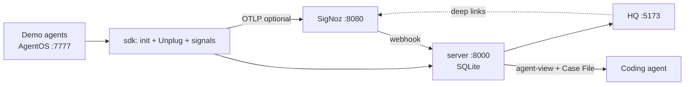
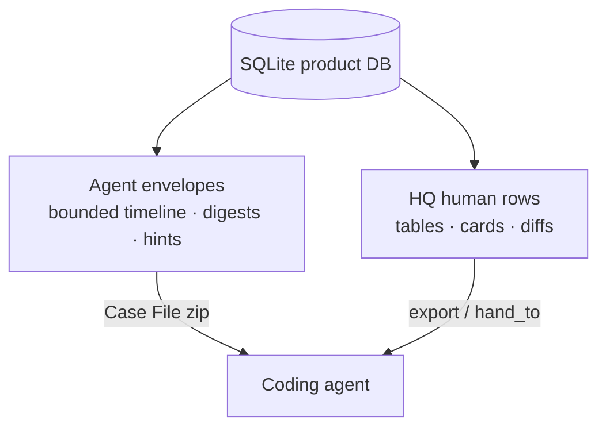

# ArcNet — Product review brief

A short brief for a human reviewer. Comment by **section number** (e.g. “§4: dashboards deep-links aren’t enough”). Answers to **§8 Open questions** and any reordering of **§9** are the highest-value feedback.

**Not this doc:** full inventory, API contracts, verification matrices. Those live in [`15-product-map.md`](15-product-map.md) and [`14-product-guide.md`](14-product-guide.md).

**Focus on:** Is the story clear? Is human vs agent split right? What’s missing for the demo? What should we fix first?

---

## 1. How to review

1. Skim §§2–4 for the product picture (~2 screens).
2. Read §5 (agent format) and §6–7 (tools / SigNoz) if you’ll judge handoff or Track-1 depth.
3. Answer the numbered questions in **§8**.
4. Reorder or cut rows in **§9** if the backlog priority is wrong.
5. Leave comments tagged by section (`§3`, `§8.Q3`, etc.).

You do **not** need to run the stack to review this brief. If you want to poke HQ later: `./scripts/run-demo.sh` → **http://localhost:5173**.

---

## 2. What ArcNet is

**ArcNet is the control plane for a self-improving agent fleet.**

One loop on a localhost demo (no auth):

```
OBSERVE → DETECT → DEFEND → HAND OFF → PROVE
 SigNoz    Unplug + Griffin   block/steer/kill   agent-view / Case File   Time Machine
```

| Stage | Plain meaning |
|---|---|
| **Observe** | Agents emit traces (optional SigNoz) + product rows in SQLite |
| **Detect** | Unplug tags source trust / blocks taint; Griffin flags metric outliers (MAD today) |
| **Defend** | Live signals: `steer`, `kill` (and scaffolded `pause`) — ms inline + SigNoz webhook |
| **Hand off** | Machine twin: `/api/agent-view/*` + Case File zip for Claude / Cursor / Codex |
| **Prove** | Time Machine replays a **recorded session** against a candidate model (mocked tools, live guard) |

**Hero proof (shipped):** S1 Edgar `s_ecfdb55d` and S4 Worms `s_2af44726` — both stable `mixed` (security/reliability win with honest cost tradeoff).

**Explicitly not built:** autonomous evolvers (DSPy/GEPA), live tool re-execution for counterfactuals, auth, corpus scorecard UI.



---

## 3. How you use it today

```bash
./scripts/run-demo.sh
# HQ  → http://localhost:5173
# API → http://127.0.0.1:8000
# AgentOS → :7777 (needed for live replay.run())
```

Optional SigNoz: cast `deploy/`, set `SIGNOZ_API_KEY`, run `deploy/provision/setup.py`. Without Docker, fleet / signals / sources / Time Machine / Case Files still work (SQLite-primary).

**Six views** (React state — no URL routes yet):

| Group | Views |
|---|---|
| `// observe` | fleet_health · signals · sources_trust |
| `// improve` | time_machine · case_files · dashboards |

Global chrome: mini-fleet dots, `· live` / `· api_down`, **`human_view | agent_view`** toggle.

---

## 4. What each surface shows

| View | What you see (human) | What the agent gets | Status |
|---|---|---|---|
| **fleet_health** | Cards: role, model, forward-facing, sessions/threats/blocked/cost/anomalies/signals | Envelope `GET /api/agent-view/fleet/all` | **DONE** |
| **signals** | Live table + SSE: steer / pause / kill / note | Raw `/api/signals` JSON (no envelope) | **DONE** · agent twin **PARTIAL** |
| **sources_trust** | Origin, trust_level, scan_action | Raw `/api/sources` list | **DONE** · agent twin **PARTIAL** |
| **time_machine** | Session pick · candidate model · baseline vs candidate · verdict · history | Envelope around stored verdict | **DONE** |
| **case_files** | Incident preview + MCP hint · export zip | Same incident envelope (+ zip = md+json) | **DONE** |
| **dashboards** | Honest SigNoz status + 5 deep-links | Status + link list JSON | **PARTIAL** — launcher only; named boards share `/dashboard` |

**Demo ops note:** Time Machine / Case Files default to the *latest* session, which is often a clean demo row — pick heroes `s_2af44726` / `s_ecfdb55d` for Beats 4–5.



---

## 5. Agent information format

**Humans** get scannable rows: time, kind, agent, badges, diff columns.

**Coding agents** get a wrapped envelope:

```json
{
  "view": "incident",
  "id": "s_ecfdb55d",
  "generated_at": "…Z",
  "data": {
    "goal": "…",
    "root_cause": { "checkpoint": "tool_call", "trust_level": "…", "…": "…" },
    "recommended_actions": ["…"],
    "timeline": [ { "step": 1, "kind": "tool", "excerpt": "…" } ]
  },
  "links": { "human_view": "/case-files/…", "export": "/export/case-file/…" },
  "hints": { "signoz_mcp": "…" }
}
```

Design intent: **goal-level, trust-annotated, bounded** — timeline excerpts/digests, not full tool payloads in the body. (There is still an escape hatch: `full_transcript` can point at the open human session URL.)

**Case File zip:** `case-file.md` (summary + fix-prompt + MCP hints) + `case-file.json` (same envelope).

---

## 6. Tools & integration

### Agent J tools (demo fleet)

| Tool | Role in the story |
|---|---|
| `fetch_url` | Scrapes fixtures (S1 poison path) → retrieval scan |
| `lookup_customer` / `get_customer_profile` | Customer fixtures |
| `send_email` | Sensitive — taint blocks exfil (Edgar) |
| `run_query` | Present; S3 Serleena **CUT** |
| `paginate_records` | Endless cursor (Worms) |

### `arcnet.init` (in-process)

One call wires OTLP + Agno instrumentor + Unplug guard (4 checkpoints: input / retrieved / tool_call / output) + signal client. No agent-code forks — config + hooks.

### Unplug checkpoints

| Checkpoint | What happens |
|---|---|
| **input** | Pre-hook can BLOCK |
| **retrieved** | Scan / quarantine / taint on fetched content |
| **tool_call** | Taint → BLOCK / steer + stub (exfil stop) |
| **output** | PII / leakage → `[REDACTED]` (Neuralyzer / S2) |

### Honesty on SigNoz MCP

MCP binary + Cursor/Claude configs install; **live stdio handoff was PARTIAL** in gate G5. Case File + Query Range are the reliable fallback. Do not claim “MCP always pulls the span live” in demo narration.

---

## 7. SigNoz dashboards & alerts

Provisioned assets (when key present via `setup.py`):

| Asset | Meant to show |
|---|---|
| **ArcNet Fleet Ops** | Sessions, cost, token burn per agent |
| **ArcNet Threats & Trust** | Guard actions by checkpoint/category, blocked tools |
| **ArcNet Cost & Tokens** | Spend / token dimensions |
| **Agno** (upstream) | Framework dashboard alongside ArcNet boards |
| **Traces / Alerts links** | Raw span explorer; alert rules UI |

**Threshold alerts → webhook → ArcNet signal:** threats detected, cost burn, tool-call loop depth, p99 latency, error rate, Griffin anomaly.

**Seasonal anomaly rule:** provisioned as a **screenshot / pairing artifact** — not a live demo fire (≥5m windows).

**HQ reality:** status probe is honest (`ui_reachable`, `api_key_present`, `query_range_ok`). The three named HQ cards currently all open the same SigNoz `/dashboard` shell — pick Fleet / Threats / Cost inside SigNoz after provision. Per-UUID deep-links are backlog #1.

---

## 8. Open questions for your review

Please answer by number (short answers fine):

1. **Is the human vs agent split clear?** Does the toggle + Case File story make sense, or does “every panel has a twin” overclaim given signals/sources/dashboards are raw JSON?
2. **Are SigNoz deep-links enough for the dashboards view**, or do we need UUID-accurate links / one embedded chart before demo day?
3. **Should Case File (and Time Machine) default-select Edgar / Worms heroes** when those sessions exist in the DB?
4. **Is any HQ view missing for the demo?** (e.g. dedicated threats table — API exists, folded into fleet + Case File today.)
5. **Agent payload shape** — is the bounded envelope + Case File zip the right handoff, or do you want more/less in `data`?
6. **Demo honesty** — heroes verdict `mixed` (not fake “improved”). OK for camera, or does narration/UI need clearer cost-tradeoff framing?
7. **Griffin** — narrate as MAD (shipped) vs foundation-model TabFM (optional token). Preferred language for judges?
8. **Anything in §9 you would cut or promote** before we touch code?

---

## 9. Proposed iteration order

Reorder freely. Acceptance criteria live in the map §6.

| # | Area | Problem in one line |
|---|---|---|
| 1 | **dashboards** | Named boards don’t deep-link to the right UUID |
| 2 | **time_machine** | Defaults ≠ heroes; AgentOS-down / `mixed` UX |
| 3 | **case_files** | Default often clean demo session, not Edgar |
| 4 | **signals** | `guidance` unused; no HITL approve/reject UI |
| 5 | **fleet_health** | Mini-fleet not clickable → drill-down |
| 6 | **sources_trust** | Agent mode raw; no link into Case File |
| 7 | **HQ routing** | No bookmarkable view / `?session=` |
| 8 | **Shell / demo** | Empty hints only; cosmetic `demo` tag |
| 9 | **Griffin in HQ** | Count/signals only — no small MAD status strip |
| 10 | **Threats panel** | `GET /api/threats` unused in HQ |
| 11 | **Embedded SigNoz** | Optional sparkline only if key present |
| 12 | **Agent-view consistency** | Document or envelope signals/sources/dashboards |
| 13 | **HITL pause UI** | Server scaffold; not camera-critical |
| 14 | **Corpus scorecard** | Needs API first — defer |
| 15 | **Screenshots / video** | Human content for submission |

---

## 10. Deep dives

| Doc | Use when |
|---|---|
| [`14-product-guide.md`](14-product-guide.md) | How to run, use each view, verify |
| [`15-product-map.md`](15-product-map.md) | Full DONE/PARTIAL/GAP inventory, check matrix, validation notes |
| [`01-product.md`](01-product.md) | Feature tiers / loop spec |
| [`06-demo-script.md`](06-demo-script.md) | Camera beats |
| [`12-data-api.md`](12-data-api.md) | Frozen wire contract |

---

*Feedback on this brief will drive the next edit pass — then implementation against §9.*
