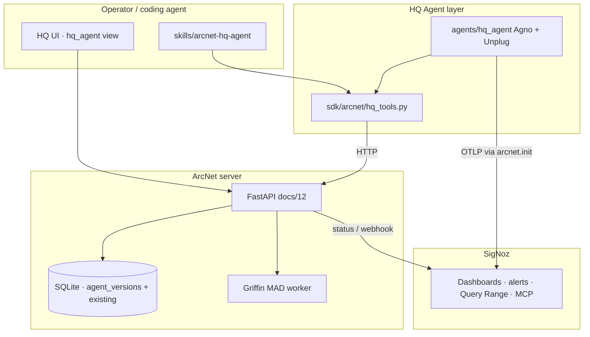

# ArcNet — HQ Agent (operator maintenance layer)

The **HQ Agent** is the overall maintenance / enhancement layer: help operators keep agents working, surface problems honestly, and propose improvements — without silently mutating production.

Related: [`04`](04-signoz-integration.md) · [`05`](05-unplug-integration.md) · [`07`](07-griffin-anomaly.md) · [`12`](12-data-api.md) · [`17`](17-product-rework-plan.md) · [`19-path-to-95.md`](19-path-to-95.md) (WS3 reliability + overall ~95% path).

---

## Positioning

**ArcNet helps you make your agent work properly and enhance it.**  
HQ Agent is the operator-facing agent that sits on that loop:

```
observe (SigNoz + fleet) → defend (Unplug) → diagnose (check / signals / Griffin MAD)
  → evidence (Case File / Time Machine) → propose (model / version) → human/coding-agent applies
```

YAGNI: **proposals + timelines + SigNoz reuse** first. No autonomous auto-remediation.

---

## What SigNoz already provides (reuse before inventing)

From [`04`](04-signoz-integration.md) + live Phase 6 reality:

| Capability | Status | HQ Agent use |
|---|---|---|
| **OTLP traces** (OpenInference) | Live | Point operators at `trace_id` / Case File; do **not** dump full spans into agent context |
| **OTLP metrics** (`arcnet.*`) | Live | Fleet health + Griffin inputs; Query Range via status probe |
| **OTLP logs** (guard + lifecycle) | Live | Correlation via SigNoz UI / MCP — not duplicated in SQLite |
| **Dashboards ×4** (Fleet Ops, Threats & Trust, Cost & Tokens, Agno) | Provisioned | `signoz_status` returns UUID map; deep-link only |
| **Alert rules + webhook** | Live | Alerts → `/webhooks/signoz` → signals (`source=alert`) |
| **Seasonal anomaly alert** | Provisioned | Complement to Griffin; ≥5m windows — never claim live on-camera fire |
| **Query Range API** (`POST /api/v5/query_range`) | Live behind key | Server probe in `/api/signoz/status`; HQ Agent reuses status, not a second query client in v1 |
| **SigNoz MCP** (40+ tools) | Optional / fragile stdio | Coding agents pull live evidence; HQ Agent links hints, does not reimplement MCP |
| **Noz (Cloud AI)** | Out of scope | Self-host only |

**Build ourselves (not in SigNoz):** agent version timeline, model recommendation proposals, session check envelopes, Case File assembly, Griffin MAD worker, Unplug in-process gates, Time Machine verdicts.

---

## What ArcNet already provides

| Surface | Role for HQ Agent |
|---|---|
| `GET /api/fleet` | Fleet overview + anomaly/threat counts |
| `GET /api/agent-view/check/{session}` | Compact session diagnosis |
| `GET /api/agent-view/signals/{id}` | Bounded signals (excerpts) |
| `GET /api/agent-view/incident/{id}` | Case-file envelope |
| `GET /api/agents/{id}/models` | Models observed per agent |
| `GET /api/griffin/status` + evaluate | **MAD**-labeled anomaly cache (TabFM too slow; TabPFN needs token — **do not claim TabFM live**) |
| `GET /api/signoz/status` | UI reachability, key, query_range, dashboard UUIDs |
| `arcnet.hq` / `arcnet.model_explore` | SDK reads + exploration recommendations |
| Unplug via `arcnet.init` + guard hooks | Prompt-injection / taint defense on every product agent |
| Time Machine / Case File export | Evidence for upgrade proposals |

---

## Responsibilities: reuse vs build

| Concern | Decision |
|---|---|
| Traces / metrics / dashboards / alerts | **Reuse SigNoz** — status + deep-links + existing webhook→signal path |
| Fleet / session / signals / check | **Reuse ArcNet APIs** via SDK tools (HTTP) |
| Griffin anomalies | **Reuse** `/api/griffin/*`; label **MAD** honestly |
| Model candidates | **Reuse** `model_explore`; HQ Agent wraps as `recommend_models` |
| Agent → model/version over time | **Build** `agent_versions` table + APIs |
| Propose replace/change | **Build** proposal as `signals` (`source=hq_agent`, `kind=note`) — no auto-apply |
| Auto-kill / auto-swap production model | **Out of scope** (YAGNI) |

---

## Architecture



**Import boundary:** `sdk/` and `server/` never import `agents/`. Tools live in SDK; the Agno definition lives under `agents/hq_agent/`.

---

## Tool list (HQ Agent)

Each tool returns **bounded JSON** (no full tool outputs / transcripts).

| Tool | Input | Output | Source |
|---|---|---|---|
| `signoz_status` | — | status + dashboard UUID map | `GET /api/signoz/status` |
| `fleet_overview` | — | fleet rows (health) | `GET /api/fleet` |
| `agent_signals` | `{agent_or_session_id}` | signals envelope | `GET /api/agent-view/signals/{id}` |
| `session_check` | `{session_id}` | check envelope | `GET /api/agent-view/check/{id}` |
| `case_file_view` | `{session_id}` | Case File / incident envelope | `GET /api/agent-view/incident/{id}` |
| `replay_compare` | `{session_id}` | bounded replay verdict summaries | `GET /api/replays?session_id=` via `model_explore` |
| `griffin_anomalies` | — | MAD cache snapshot + recent griffin signals | `GET /api/griffin/status` + signals `source=griffin` |
| `list_agent_models` | `{agent_id}` | `[{model, session_count, …}]` | `GET /api/agents/{id}/models` |
| `recommend_models` | `{task_type, constraints?}` | ranked candidates | `arcnet.model_explore` (local) |
| `agent_version_timeline` | `{agent_id}` | version rows newest-first | `GET /api/agents/{id}/versions` |
| `register_agent_version` | `{agent_id, version, model, …, session_id?}` | created row; optional session pin | `POST /api/agents/{id}/versions` |
| `propose_model_change` | `{agent_id, from_model?, to_model, reason}` | proposal signal | `POST /api/signal` (`source=hq_agent`) |
| `list_model_proposals` | `{agent_id?}` | recent hq_agent notes | `GET /api/signals?source=hq_agent` |
| `apply_model_change` | `{agent_id, model, version, confirm:true, …}` | applied model + version | `POST /api/agents/{id}/apply-model` |

Optional later: thin `signoz_query` proxy — only if status/query_note is insufficient; prefer SigNoz MCP for deep queries.

---

## Agent versioning model

### Table (additive)

```sql
CREATE TABLE IF NOT EXISTS agent_versions (
  version_id     TEXT PRIMARY KEY,   -- av_<hex>
  agent_id       TEXT NOT NULL REFERENCES agents(agent_id),
  version        TEXT NOT NULL,      -- semver or opaque tag e.g. "2026-07-22.1"
  model          TEXT,               -- LLM id at this version
  model_version  TEXT,               -- optional provider revision / snapshot label
  source_ref     TEXT,               -- git sha / prompt path@sha / image digest
  notes          TEXT,
  created_at     INTEGER
);
CREATE INDEX IF NOT EXISTS idx_agent_versions_agent ON agent_versions(agent_id, created_at DESC);
```

### Optional session link

`sessions.agent_version` TEXT nullable — set when known; never required.

### APIs

| Route | In | Out |
|---|---|---|
| `GET /api/agents/{agent_id}/versions?limit=&offset=` | path + page | `[version row]` + pagination headers |
| `POST /api/agents/{agent_id}/versions` | `{version, model?, model_version?, source_ref?, notes?, session_id?}` | created row; optional `session_id` sets `sessions.agent_version = version_id` |
| `GET /api/agents/{agent_id}/versions/timeline` | path | `{agent_id, versions[], current_model?}` |
| `POST /api/agents/{agent_id}/apply-model` | `{confirm: true, model, version, …, session_id?, proposal_signal_id?}` | bumps agent model + version; marks proposal applied when linked |

---

## Model registry / recommendation flow

1. **Observed models** — from sessions / `GET /api/agents/{id}/models`.
2. **Candidates** — curated snapshot via `model_explore` (live catalog optional, not looped).
3. **Recommend** — `recommend_models(task_type)` → ranked list + reasons (exploration only).
4. **Propose** — `propose_model_change` writes a `note` signal (`source=hq_agent`) with guidance; operators / coding agents apply.
5. **Apply (human-gated)** — `POST /api/agents/{id}/apply-model` with `confirm: true` bumps `agents.model` and registers a version. HQ UI proposal inbox has prep_apply + confirm checkbox.
6. **Register** — after a real deploy, `register_agent_version` records the new `(version, model, source_ref)`; optional `session_id` pins `sessions.agent_version`.

Never auto-apply model swaps without explicit `confirm: true` on the apply endpoint.

---

## Unplug placement

HQ Agent is **forward_facing-ish for tool outputs it ingests** (signals, reasons, Case File text can contain attacker-controlled strings). Wire like Agent J:

1. `arcnet.init(...)` at process start (OTel + Guard + signals).
2. Agno `pre_hooks` / `post_hooks` / `tool_hooks` from `build_guard_hooks()`.
3. Tool handlers treat remote text as **untrusted**: never paste full payloads into spans; prefer excerpts already bounded by agent-view APIs.
4. Narrative in skill: prompt-injection defense is part of the maintenance layer, not optional.

### Unplug coverage matrix (stub — Wave A / WS8)

| Surface | Ingests untrusted text? | Checkpoint / bound | Status |
|---|---|---|---|
| Agent J + fleet clones | yes (retrieved / tool args) | `arcnet.init` + `build_guard_hooks` | wired |
| HQ Agent (`agents/hq_agent`) | yes (signals, Case File excerpts) | init + guard hooks; tools use agent-view excerpts | wired |
| `sdk/arcnet/hq_tools.py` | yes (HTTP JSON from server) | prefer agent-view; no full transcript dumps | audit continue Wave B |
| Model explore MCP / skills | curated + live catalog ids | exploration-only; no Case File paste | partial |
| SigNoz MCP stdio | remote tool output | hang/timeout documented; Case File fallback | PARTIAL |
| `POST /api/signal` reason/guidance | operator/SDK text | write-secret optional; store only | n/a Unplug |

Full matrix + truncation regression tests continue in Wave B (WS8). In-process Unplug only — no network hop on fail-closed path.

---

## Incremental delivery slices

| Slice | Ship | Status |
|---|---|---|
| **0** | This doc + docs/17 pointer | **done** |
| **1** | `hq_tools` + version registry APIs + Agno HQ agent + Unplug + thin UI + skill/MCP + tests | **done** (PR #11) |
| **2** | Richer Case File / replay comparison in tools; proposal inbox polish; `source=` signal filter | **done** (PR #12) |
| **3** | Explicit `POST /api/agents/{id}/apply-model` (human-gated) + session→version pin | **done** (PR #12) |
| **3b** | Apply atomicity + cross-agent ownership; check version_pinpoint; HQ session pin UI | **done** (robustness-pass-1) |
| **4** | TabPFN behind `TABPFN_TOKEN` (still not TabFM unless latency budget met) | later |

---

## Honesty pins

- Griffin runtime estimator = **MAD** (median/MAD robust z-score). TabFM failed latency budget; TabPFN needs token.
- Model explore = **recommendations only** (live OpenAI list when `OPENAI_API_KEY` set; still exploration-only).
- SigNoz seasonal anomaly ≠ Griffin; both can coexist with different jobs.
- **Checklist-done ≠ robust-done.** HQ Agent slices 1–3 + Wave A cascade exist; Wave B hardens tools (timeouts, `{ok:false,error,tool}`), evidence_refs on propose, `agentos_reload_required` honesty, SigNoz evidence helper, Griffin MAD strip. Still missing: full e2e (WS9), complete Unplug matrix, TabPFN. Baseline **~48%**; Wave A ~62–68 est.; Wave B partial — **not 95%**. See [`17`](17-product-rework-plan.md) and [`19`](19-path-to-95.md).
- Webhook: optional `ARCNET_WEBHOOK_SECRET` (`X-ArcNet-Webhook-Secret` / Bearer). Empty secret = localhost-trust model — document and bind carefully.
- Apply-model updates SQLite only — response/UI always surface `agentos_reload_required` (never auto-restart AgentOS).
- SigNoz MCP may hang: prefer `GET /api/signoz/evidence` + Case File `links.signoz_trace`.
