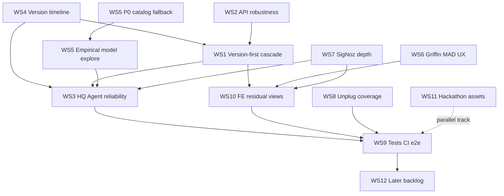
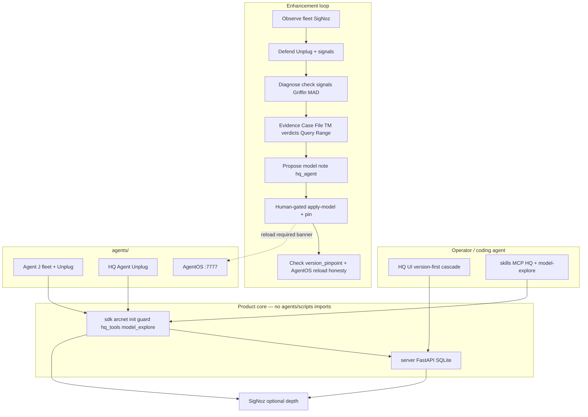

# ArcNet — Path to ~95% production-usable robustness

**Status:** Wave A **in progress** — foundations PR on `wave-a-path-to-95`.  
**Baseline:** honest **~48%** (founder-critical re-score 2026-07-22, [`17`](17-product-rework-plan.md)).  
**Target:** **~95%** = real enhancement layer operators and coding agents can trust — not checklist theater.

| Related | Role |
|---|---|
| [`16` §11](16-product-review-brief.md) | Founder decisions (authoritative) |
| [`17`](17-product-rework-plan.md) | R1–R3 + honesty scorecard + robustness backlog |
| [`18`](18-hq-agent.md) | HQ Agent design + honesty pins |
| [`15`](15-product-map.md) | Built inventory + adversarial findings |
| [`12`](12-data-api.md) | Frozen wire contract — **additive only** |
| [`plans/path-to-95-acceptance.md`](plans/path-to-95-acceptance.md) | Measurable acceptance-test appendix |

**Standing constraints (non-negotiable):**

- No claiming TabFM live. Griffin = **MAD** unless TabPFN token path is proven; TabFM only if latency budget met.
- Unplug stays **in-process** (no network hop on fail-closed path).
- `docs/12` changes are **additive** only (no breaking array list bodies without version bump).
- `sdk/` / `server/` / `hq/` **never** import `agents/` / `scripts/` (boundary script stays green).
- Exploration agents **recommend only** — never auto-mutate production without human gate (`confirm: true`).
- Hackathon ship assets (WS11) **do not inflate** product robustness %.

**Branch note:** Catalog fallback (WS5.P0) landed on main as `116d619`. Wave A executes WS4 → WS2 → WS1 → WS8 start from updated main.

---

## 1. Baseline truth

### 1.1 What ~48% means

Acceptance checkboxes for R1–R3 / HQ slices measure **surface existence**, not production-usable robustness. Surfaces exist; coupling, evidence depth, abuse controls, e2e loops, and empty/error UX do not yet meet an operator bar.

Refined scorecard (start of path-to-95):

| # | Area | Robustness (0–100) | Brutal one-liner |
|---|---|---:|---|
| 1 | Positioning / framing | 58 | Product tone better; hackathon/demo script still oversells depth |
| 2 | HQ frontend / IA | 55 | Cascade is **model-first**, not **version-first**; style ok, flows wrong |
| 3 | Human APIs | 58 | Pagination mostly; open write surface; optional webhook secret only |
| 4 | Agent APIs / tools | 64 | check/signals/incident/sources bounded; twins uneven; dashboards = status |
| 5 | HQ Agent | 56 | Tools + Unplug + apply loop scaffold; not a reliable ops agent |
| 6 | Version timeline / pinpoint | 52 | Pin + check narrative landed; cascade still model-not-version |
| 7 | Model explore / sims | 50 | Live catalog when key; prefer-list scaffold; not empirical TM-tied |
| 8 | Griffin (MAD) | 46 | Honest MAD on seeded series — not useful without hand-seed theater |
| 9 | SigNoz | 54 | Provision + probe + links; HQ is launcher; MCP stdio PARTIAL |
| 10 | Unplug coverage | 68 | Fleet + HQ Agent wired; untrusted-text ingest paths incomplete |
| 11 | Tests / CI / e2e | 48 | Unit + CI workflow; **no** seed→…→check e2e; **no** FE tests |
| 12 | Hackathon ship assets | 35 | Screenshots/video/Slack/form open — **separate track** |

**Overall ~48%** (equal-area average rounded; do not reweight to look better).

### 1.2 Gap vs checklist theater

| Checklist said | Reality |
|---|---|
| R2 cascade “done” | Agent → **model** → session; founder asked Agent → **LLM+version** → session |
| HQ Agent slices 1–3 “done” | Propose→apply→pin→check exists as UI/API pieces; loop not reliable e2e; apply does **not** restart AgentOS |
| R3 model explore “done” | Curated prefer-list + optional live list; sims not tied to Time Machine verdicts |
| SigNoz “Best Use” assets | Provisioned; HQ deep-evidence and MCP reliability still thin |
| Griffin “done” | MAD worker + seed path; useful anomaly UX without seed theater missing |
| Pagination “done” | Core lists paginate; HQ rarely consumes totals; some agent envelopes still cap-only |
| Unplug “wired” | Agent J + HQ Agent; tools that ingest Case File / signal text need explicit untrusted handling audit |
| CI “green” | Unit + build; no e2e path; no FE test job |

### 1.3 Non-negotiable definition of ~95%

**95% means:** an operator (or coding agent with MCP/skills) can, on a cold laptop with seeded DB:

1. Pick work via **Agent → version → model → session** without fighting defaults.
2. Diagnose with **bounded evidence** (check, signals, Case File, TM verdict, SigNoz deep-link/Query Range) — not link farms or full tool dumps.
3. Propose → human-gated apply → **pin** → **check narrative shows version pinpoint** — and know whether AgentOS is on the new model (honest status if restart required).
4. Trust writes enough for local-dev (abuse controls real, not theater) without pretending cloud multi-tenant auth.
5. See Griffin anomalies that matter **without** hand-planting JSON theater as the only path.
6. Run one **automated e2e** proving the loop; FE critical cascades covered by tests.
7. Never confuse hackathon capture % with product %.

**Inflation ban:** updating a row in the % table requires the area’s **exit criteria** (below) to pass. Checkbox PRs that only add docs/UI chrome do not move the needle.

---

## 2. 95% definition of done (areas 1–12)

Each area: target %, exit criteria (measurable), acceptance tests (summary — full scripts in [appendix](plans/path-to-95-acceptance.md)).

### 2.1 Positioning / framing → **92%**

**Exit:** User-facing chrome/README/`14` lead with enhancement-layer loop; `06` labeled hackathon narration; limitations honest (MCP PARTIAL, MAD, no TabFM, localhost trust). No “every panel twin perfect” absolute.

**Acceptance:** Grep HQ for `demo` badge / “run demo fleet” empty copy = 0 hits in user chrome; README Limitations section names MAD + MCP PARTIAL; `06` header says narration ≠ product framing.

### 2.2 HQ frontend / IA → **94%**

**Exit:** Shared cascade component: **Agent → version → model → session** on Case Files + Time Machine + HQ Agent diagnose flows; empty/error/loading consistent; hash deep-links include `version`; style preserved (founder: style ok-ish).

**Acceptance:** Manual cascade matrix (agent change resets version+model+session); Vitest/component tests for cascade reducers; `pnpm build` + FE test job green.

### 2.3 Human APIs → **93%**

**Exit:** All list endpoints documented in `12` expose `limit`/`offset` + `X-Total-Count` under filters; write-path abuse controls for local-dev (shared secret or loopback-only policy documented + enforced for `POST /api/signal`, session writes, webhook); additive only.

**Acceptance:** Unit tests for pagination under every filter combo; write without secret → 401/403 when `ARCNET_WRITE_SECRET` set; empty secret → documented localhost-trust (bind warning in logs).

### 2.4 Agent APIs / tools → **94%**

**Exit:** All agent-views in the product surface use the envelope `{view,id,generated_at,data,links,hints}`; no full `recorded_output` in agent bodies; SDK `hq` / `hq_tools` timeouts + stable error envelopes; sources/dashboards/signals twins documented and used by HQ agent mode.

**Acceptance:** Contract tests for every `agent-view` route; fuzz oversized transcripts stay bounded; tool timeout returns JSON error not hang.

### 2.5 HQ Agent → **93%**

**Exit:** Reliable propose→apply→pin→check loop with evidence refs; tool errors never silent; Unplug on; timeouts; apply reports AgentOS reload requirement honestly; skills/MCP match tools.

**Acceptance:** Scripted e2e (WS9) + unit tests for each tool happy/error path; apply without `confirm` → 400; mismatched session ownership → 4xx.

### 2.6 Version timeline / pinpoint → **95%**

**Exit:** Versions first-class in cascade + timeline UI; session pin visible; check envelope `version_pinpoint` names version_id, model, source_ref, created_at; apply creates timeline row; optional `source_ref` (git sha / prompt path) on register.

**Acceptance:** After apply+pin, `GET /api/agent-view/check/{session}` includes pinpoint; timeline newest-first matches apply.

### 2.7 Model explore / sims → **92%**

**Exit:** Live catalog failures **fall back** to curated snapshot (never raise into HQ/MCP); recommendations cite **Time Machine verdict evidence** when present; exploration agents recommend-only; skills/MCP bounded.

**Acceptance:** Mock OpenAI 500 → still returns recommendations + `catalog_degraded`; `compare_replay_verdicts` returns dimensions from stored replays; no apply path from explore tools.

### 2.8 Griffin (MAD) → **90%**

**Exit:** Useful HQ MAD strip (status, series warmth, last outlier) without requiring hand-seed theater for the happy path; evaluate can run on live `arcnet.*` / SQLite-derived series when SigNoz/metrics present; seed remains for cold demo; TabPFN **optional** behind `TABPFN_TOKEN`; never claim TabFM.

**Acceptance:** Without seed file, status returns `warming` or live series honestly; with seed, evaluate → `source=griffin` signal; HQ shows MAD label; TabPFN path skipped unless token.

### 2.9 SigNoz → **92%**

**Exit:** Reuse inventory honored (status + UUID deep-links + webhook→signal + Query Range evidence endpoint usable by HQ Agent); MCP reliability documented with Case File + Query Range fallback; dashboards/alerts evidence pack reproducible when key present.

**Acceptance:** `/api/signoz/status` returns per-board UUIDs; HQ cards open distinct UUIDs; Query Range probe + one evidence helper returns bounded series/spans; MCP hang → fallback path documented and tested as timeout.

### 2.10 Unplug coverage → **94%**

**Exit:** Audit matrix of every agent/tool that ingests untrusted text; all product agents use `arcnet.init` + `build_guard_hooks`; HQ Agent tools treat signal/Case File text as untrusted (excerpts only); in-process unchanged.

**Acceptance:** Coverage checklist green; import boundary green; S1/S2/S5 still pass; HQ Agent tool that echoes attacker string does not put full payload into spans.

### 2.11 Tests / CI / e2e → **95%**

**Exit:** CI: Python tests + boundary + HQ build + **FE tests** + **e2e script** (seed→cascade API→case file→propose→apply→pin→check). No flaky live OpenAI in default CI (record/mocks for e2e core).

**Acceptance:** `ci.yml` jobs all required; e2e script exit 0 on scratch DB; FE cascade tests exit 0.

### 2.12 Hackathon ship assets → **track only (does not count toward 95%)**

**Exit:** Screenshots, video, Slack provenance, submission form if still submitting. Track % separately; **never** average into product robustness.

---

## 3. Workstreams

Relative size: **S** (~1 focused PR), **M** (2–4 PRs / multi-surface), **L** (multi-day / multi-PR program).

---

### WS1 — HQ IA: version-first cascade + tight coupling + error/empty UX

| | |
|---|---|
| **Current → target** | 55% → 94% |
| **Size** | **L** |
| **Depends on** | WS4 (version list API richness); lightly WS2 (filters) |
| **Wave** | A (critical path) |

#### Problem (brutal)

Founder §11.8: cascade must be **Agent → LLM + version → Session ID**. Shipped R2 is **Agent → model (from session history) → session**. Version is a footnote on session rows / HQ Agent panel — not the picker spine. Empty/error copy still inconsistent across views (`Seam` vs ad-hoc strings); AgentOS-down / apply failures only partially surfaced.

#### Detailed tasks

1. Extract shared cascade state machine to `hq/src/cascade.ts` (or `hooks/useAgentCascade.ts`): fields `{agentId, versionId, model, sessionId}`; transitions reset children on parent change.
2. API: ensure `GET /api/agents/{id}/versions` + timeline drive picker; when version selected, constrain model to that version’s model (editable override only with warning).
3. Additive API if needed: `GET /api/sessions?agent_id=&agent_version=` (and/or `version_id`) — document in `12`.
4. Rewire `CaseFiles.tsx` + `TimeMachine.tsx` to version-first cascade; keep hero prefer (`s_ecfdb55d`, `s_2af44726`) inside filtered set.
5. Extend `hash.ts`: `#view?agent=&version=&model=&session=`; migrate old links (model-only still works).
6. HQ Agent diagnose strip: same cascade before propose/apply/pin.
7. Unify empty/error/loading: extend `components` (`Empty`, `Seam`) — api_down, AgentOS-down, no versions, no sessions, apply failed, pin missing.
8. Fleet / mini-fleet drill-down preserves agent into cascade (clear version/model/session).
9. Signals / Sources: agent (and optional session) filter consistency; guidance already rendered — verify all rows.

#### Order within stream

1 → 2/3 (API) → 4/5 (CF+TM+hash) → 6 (HQ Agent) → 7–9 (polish).

#### Risks / non-goals

- **Risk:** Empty `agent_versions` table → cascade dead. Mitigate: “unversioned / observed models” fallback lane labeled honest.
- **Non-goal:** Visual redesign / new design system (style stays).
- **Non-goal:** React Router migration (hash routes sufficient).

#### Acceptance / verify

- Manual: change agent → version+model+session clear; change version → session clears; heroes preferred when in set.
- FE unit tests for cascade reducer.
- Deep-link round-trip with `version` query.

---

### WS2 — API robustness: pagination, filters, envelopes, write abuse controls

| | |
|---|---|
| **Current → target** | 58% → 93% |
| **Size** | **M** |
| **Depends on** | — (parallel with WS1 after small filter additives) |
| **Wave** | A |

#### Problem (brutal)

Lists paginate in server tests; HQ often ignores `X-Total-Count`. Write paths (`POST /api/signal`, sessions ingest, webhook) are localhost-trust by design — fine for laptop, scary if bound `0.0.0.0` without any gate. Webhook optional secret exists; general write secret does not. Agent envelopes inconsistent for some twins.

#### Detailed tasks

1. Audit every list route in `server/arcnet_server/main.py` vs `12` — fill any missing `offset` / total headers (threats, sources, replays, signals filters).
2. Additive session filters: `agent_version` / `version_id` (WS1); keep `agent_id` + `model`.
3. HQ: show “showing N of Total” where lists can exceed page size (signals, versions, proposals).
4. Write abuse controls (local-dev appropriate, real):
   - Env `ARCNET_WRITE_SECRET` (or reuse webhook secret policy) for `POST /api/signal`, `POST /api/agents/.../apply-model` already gated by confirm — extend to raw signal/session injection routes as applicable.
   - When secret empty: log once at boot `localhost-trust: writes open`; document bind-to-127.0.0.1 in README/`12`.
   - When set: require `X-ArcNet-Write-Secret` or Bearer.
5. Webhook: keep `ARCNET_WEBHOOK_SECRET`; test reject path.
6. Normalize agent-view error shape: `{error, code, hint}` on 4xx inside or beside envelope policy — document additive.
7. Caps: confirm agent-view list caps + counts (session check must not lie when >cap).

#### Order

1 → 2 → 4/5 (security) → 3/6/7.

#### Risks / non-goals

- **Risk:** Breaking clients that POST without headers — mitigate: secret off by default; document; example `.env`.
- **Non-goal:** Full OAuth / multi-tenant auth.
- **Non-goal:** Breaking JSON array list bodies.

#### Acceptance / verify

- Unit tests: pagination × filters; write secret on/off; webhook secret.
- Manual: HQ pagination label on signals with >page rows.

---

### WS3 — HQ Agent reliability: tools, evidence, timeouts, Unplug, propose→apply→pin→check

| | |
|---|---|
| **Current → target** | 56% → 93% |
| **Size** | **L** |
| **Depends on** | WS4 (pinpoint), WS1 (cascade), WS5 (recommend evidence), WS9 (e2e) |
| **Wave** | B (after A foundations) |

#### Problem (brutal)

Tools exist in `sdk/arcnet/hq_tools.py` + `agents/hq_agent/` but reliability is scaffold-grade: weak timeouts, uneven error surfaces, evidence refs thin, apply updates SQLite **without restarting AgentOS** (live process keeps old model — silent lie). Propose→apply→pin→check not proven as one automated loop.

#### Detailed tasks

1. HTTP client hardening in `hq_tools.py`: per-call timeout, retry policy for idempotent GETs only, structured `{ok:false, error, tool}` results (never uncaught raise into Agno loop for catalog blips).
2. Evidence packing: `propose_model_change` must attach `evidence_refs[]` (check id, replay ids, griffin fingerprint, signoz dashboard UUID) — bounded strings.
3. Apply honesty: `apply_model_change` / API response includes `agentos_reload_required: true` + instructions; HQ UI banner “AgentOS still on old model until restart”; optional best-effort notify via env `ARCNET_AGENTOS_URL` health probe comparing model (no silent auto-mutate of AgentOS config files from server — coding-agent/human restarts).
4. Tool coverage vs docs/18 table — add any missing thin wrappers; remove dead tools.
5. Unplug: confirm `agents/hq_agent/agent.py` init + hooks; add regression test that tool args from signals are truncated before span attrs.
6. Skills/MCP (`skills/arcnet-hq-agent/`): sync tool schemas; JSON-RPC errors bounded.
7. Proposal inbox UX: filter `source=hq_agent`, prep_apply, confirm, session pin required for “pin” checkbox path; show pinpoint after apply.
8. Timeouts for SigNoz status / live catalog inside tools (coordinate WS5/WS7).

#### Order

1 → 5 → 2/3 → 7 → 4/6 → 8.

#### Risks / non-goals

- **Risk:** Auto-restarting AgentOS from server violates import/boundary and YAGNI — **do not**; honest reload flag only.
- **Non-goal:** Autonomous remediation / auto-kill fleet.
- **Non-goal:** Full chat UI for HQ Agent (thin panel + CLI/skill enough).

#### Acceptance / verify

- E2E WS9 green.
- Unit: each tool error path; apply without confirm fails; ownership mismatch fails.
- Manual: apply → banner shows reload required; after restart, new sessions use new model.

---

### WS4 — Version timeline / pinpoint to code/agent changes

| | |
|---|---|
| **Current → target** | 52% → 95% |
| **Size** | **M** |
| **Depends on** | — (unblocks WS1) |
| **Wave** | A |

#### Problem (brutal)

`agent_versions` table + APIs exist; check has `version_pinpoint`; cascade doesn’t use versions; `source_ref` rarely populated; no clear “this session ran code/prompt X” story for operators.

#### Detailed tasks

1. Seed / register: `scripts/seed_demo.py` (or bring-up) registers baseline versions for fleet agents with `source_ref` pointing at prompt path placeholders.
2. Enrich `version_pinpoint` in `read_models.py`: version_id, version tag, model, model_version, source_ref, notes, created_at, pinned_session match bool.
3. Timeline UI in Case Files / HQ Agent: vertical list newest-first; click version filters sessions.
4. Apply-model always writes version row (already) — ensure `source_ref` optional passthrough from HQ form.
5. Document additive session filter by version in `12`.
6. Tests: pin → check narrative; timeline ordering; unknown version 404 behavior.

#### Order

1 → 2 → 5 → 3/4 → 6.

#### Risks / non-goals

- **Risk:** Semver vs opaque tags — allow opaque; don’t force semver validation.
- **Non-goal:** Full git blame UI.

#### Acceptance / verify

- After pin, check envelope pinpoint non-null and matches `agent_versions` row.
- Cascade can list ≥1 version per seeded agent.

---

### WS5 — Model explore: live catalogs, TM-tied sims, exploration agents, skills/MCP

| | |
|---|---|
| **Current → target** | 50% → 92% |
| **Size** | **M** |
| **Depends on** | WS3 (for propose evidence); TM data already present |
| **Wave** | A (catalog fallback **blocking** for #13) then B for empirical sims |

#### Problem (brutal)

`model_explore.py` prefer-list + live OpenAI when key set; Greptile: live failures **escape** and break HQ/MCP. Recommendations not empirical against Time Machine verdicts. R3 exploration agent cadence optional/off. Thin curated catalog oversells “discovery.”

#### Detailed tasks

1. **P0 fix:** `fetch_provider_catalog` / `recommend_models` — try live; on timeout/HTTP/parse error → curated snapshot + `degraded: true` / `catalog_source: snapshot_fallback` (never raise).
2. `compare_replay_verdicts(session_id|scenario)` — read stored replays; rank models by security/reliability/cost dimensions from verdict JSON; cite `replay_id`s.
3. Wire recommend reasons to include TM evidence when `constraints.session_id` or recent hero replays present.
4. Exploration agent job (optional env `ARCNET_MODEL_EXPLORE_LOOP=1`): periodic recommend + `record` as `kind=note` `source=model_explorer` — **never** call apply/kill.
5. Skills/MCP (`skills/arcnet-model-explore/`): document tools; bounded JSON; tests with mocked HTTP.
6. Default TM candidate remains current reliable GPT-family id; editable in UI.
7. Docs: pin any provider dep changes; honesty — exploration only.

#### Order

1 (P0) → 2/3 → 5 → 4 → 6/7.

#### Risks / non-goals

- **Risk:** Live catalog rate limits — cache TTL + fallback.
- **Non-goal:** Full autonomous model-swap fleet.
- **Non-goal:** Claiming TabFM/TabPFN as model explorer.

#### Acceptance / verify

- Unit: mocked 500/timeout → fallback recommendations.
- `compare_replay_verdicts` on seeded heroes returns non-empty evidence_refs.
- Explore tools cannot call apply-model.

---

### WS6 — Griffin: useful anomaly UX without seed theater; MAD honest; TabPFN optional

| | |
|---|---|
| **Current → target** | 46% → 90% |
| **Size** | **M** |
| **Depends on** | WS7 helpful for Query Range series; can ship MAD UX on SQLite metrics first |
| **Wave** | B |

#### Problem (brutal)

MAD works on **hand-seeded** series; S4 choreographs Griffin→kill. HQ shows anomaly counts, not a MAD status strip / warmth / last outlier. Docs/07 still read TabFM-primary historically — product honesty is MAD. TabPFN gated on token; TabFM latency failed G2.

#### Detailed tasks

1. HQ Fleet Health: Griffin MAD strip — estimator label `MAD`, series count, warming vs ready, last anomaly fingerprint/time, link to griffin signals.
2. `GET /api/griffin/status` enrich: per-series warmth, last evaluate, estimator name.
3. Path without seed theater: pull recent `arcnet.*` from SigNoz Query Range when key present; else derive crude series from SQLite session usage/cost — label source honestly (`signoz` | `sqlite_proxy` | `seed`).
4. Keep `scripts/seed.py` for cold demo — not the only story.
5. TabPFN optional worker behind `TABPFN_TOKEN` + interface `forecast(history)->predictions`; failure → MAD; **no TabFM** unless new spike proves ≤ budget (document spike if attempted).
6. Tests: status shape; evaluate emits signal; HQ label MAD.
7. Update narration in `07`/`14`/`06` pointers: MAD locked; FM optional.

#### Order

2 → 1 → 3 → 4 → 6 → 5 → 7.

#### Risks / non-goals

- **Risk:** SQLite proxy series too naive → false positives — high noise floor + warming gates.
- **Non-goal:** Claiming foundation-model precog on camera.
- **Non-goal:** Replacing SigNoz seasonal alert (complement).

#### Acceptance / verify

- Without seed: status not crash; honest warming/empty.
- With metrics or seed: evaluate → griffin signal.
- UI visible MAD strip; no TabFM string in HQ.

---

### WS7 — SigNoz: reuse inventory, MCP reliability, Query Range depth, UUID deep-links, evidence

| | |
|---|---|
| **Current → target** | 54% → 92% |
| **Size** | **L** |
| **Depends on** | Human `SIGNOZ_API_KEY` for live evidence; code paths work degraded without |
| **Wave** | B (UUID links can start in A if status already returns map) |

#### Problem (brutal)

Provision + status probe + env/title UUID resolve exist; HQ still feels like a link farm. MCP stdio hung in G5. Query Range powers status, not judge-usable evidence in HQ Agent. Seasonal anomaly is screenshot artifact only — keep honest.

#### Detailed tasks

1. Confirm `/api/signoz/status.dashboards` map complete for Fleet/Threats/Cost/Agno; HQ `Dashboards.tsx` opens **distinct** `/dashboard/{uuid}` — adversarial A1 fix verified.
2. Additive evidence helper: `GET /api/signoz/evidence?session_id=` or HQ tool `signoz_evidence` — bounded Query Range / trace summary (ids, span names, token counts) — **no** full payloads; reuse server client (don’t duplicate in agent).
3. MCP: document hang failure mode; add timeout wrapper in install README; Case File hints prefer Query Range curl + evidence endpoint when MCP unhealthy.
4. Trace deep-link from Case File / check: `links.signoz_trace` when `trace_id` present.
5. Alerts evidence: status or provision report lists rule ids; HQ shows “alerts provisioned: N” not fake live fire for seasonal.
6. Reuse inventory table in `18` stays source of truth — update if new proxy added.
7. Tests: mock Query Range; UUID map; evidence bounds; status without key stays honest.

#### Order

1 → 4 → 2 → 3 → 5/6 → 7.

#### Risks / non-goals

- **Risk:** Noz Cloud AI / Cloud fallback — out of scope.
- **Non-goal:** Embedded SigNoz iframes (sparkline only if cheap later — WS12).
- **Non-goal:** Claiming MCP always live.

#### Acceptance / verify

- Three named HQ cards → three different UUIDs when provisioned.
- Evidence endpoint returns bounded JSON; 413/truncate if oversized.
- Without key: status `api_key_present=false`, no false provisioned claim.

---

### WS8 — Unplug coverage across agents/tools ingesting untrusted text

| | |
|---|---|
| **Current → target** | 68% → 94% |
| **Size** | **M** |
| **Depends on** | — |
| **Wave** | A/B parallel |

#### Problem (brutal)

Agent J + clones + HQ Agent wire Unplug; any path that pastes signal reasons, Case File text, scraped content, or MCP tool output into model context without checkpoints is a hole. Coverage never audited as a matrix.

#### Detailed tasks

1. Write coverage matrix in this plan appendix (and keep in `05` or `18`): agent × tool × checkpoint.
2. Audit `agents/arcnet_agents/tools.py`, HQ agent tools, model_explore MCP stdio, any script that builds prompts from DB text.
3. Ensure `fetch_url` retrieved path + taint_sources on side-effect tools remain S1-correct.
4. HQ Agent: never put full Case File JSON into LLM message — use agent-view excerpts only (enforce max chars in tool wrappers).
5. Replay harness: live guard unchanged; document.
6. Tests: matrix checklist automated where possible; S1/S2/S5 regression.
7. Confirm in-process (no Unplug server).

#### Order

1 → 2 → 4 → 3/5 → 6/7.

#### Risks / non-goals

- **Risk:** Over-blocking HQ Agent maintenance chat — tune excerpts, don’t disable guard.
- **Non-goal:** Vendoring unplug; optional LLM judge.

#### Acceptance / verify

- Matrix 100% for product agents; boundary script green; scenario tests green.

---

### WS9 — Tests / CI / e2e + FE tests

| | |
|---|---|
| **Current → target** | 48% → 95% |
| **Size** | **L** |
| **Depends on** | WS1–WS5 loops exist enough to script |
| **Wave** | C (wire continuously; gate 95% on green) |

#### Problem (brutal)

Unit tests + CI python/hq build exist; **no** FE tests; **no** e2e for the product loop. Robustness claims are unverified.

#### Detailed tasks

1. E2E script `scripts/e2e_path_to_95.py` (or `server/tests/test_e2e_loop.py` with TestClient + optional live):
   - seed scratch DB → register version → cascade filters → export case file → propose signal → apply-model confirm → pin session → check `version_pinpoint`.
2. Mock external OpenAI/SigNoz in default CI; optional nightly live job.
3. HQ: Vitest (or repo-standard) for cascade reducer + hash parse + critical api client error handling.
4. CI `.github/workflows/ci.yml`: add `hq-test`, `e2e` jobs; keep boundary + python + build.
5. Fix flaky ordering; deterministic ids in seed.
6. Document how to run e2e in README verification.

#### Order

1 (API e2e) → 4 → 3 → 2/5/6.

#### Risks / non-goals

- **Risk:** Live G4 3× in CI — keep offline recorded heroes; don’t block CI on provider.
- **Non-goal:** Full Playwright demo video automation (optional stretch).

#### Acceptance / verify

- CI green on PR; e2e exit 0; FE tests exit 0.

---

### WS10 — Frontend rework beyond cascade (remaining views)

| | |
|---|---|
| **Current → target** | 55% → 94% (shared with WS1; WS10 = residual views) |
| **Size** | **M** |
| **Depends on** | WS1 cascade shared component |
| **Wave** | B/C |

#### Problem (brutal)

Founder: style ok-ish; IA/flows wrong. Beyond cascade: signals HITL absent; sources→case file weak; threats API unused; dashboards launcher; Griffin strip; api_down mount-once; agent_view raw JSON on some panels; consistency of guidance/empty states.

#### Detailed tasks (remaining views)

1. **fleet_health** — Griffin MAD strip (WS6); clickable cards → case_files with agent; optional latency later (non-blocking).
2. **signals** — guidance column verified; HITL approve/reject UI if pause pending (server scaffold); agent mode uses `/api/agent-view/signals/{id}`.
3. **sources_trust** — agent envelope mode; row action → case_files session; trust badges consistent.
4. **time_machine** — version cascade (WS1); AgentOS-down seam; honest `mixed` badges; candidate default gpt-family.
5. **case_files** — version cascade; pin display; MCP hint honesty when `trace_id` null.
6. **dashboards** — UUID cards (WS7); agent-view status twin.
7. **hq_agent** — cascade + proposal inbox + reload banner (WS3).
8. **Shell** — re-probe fleet on focus/interval so `api_down` recovers without full reload; breadcrumb shows version when set.
9. Threats: compact fold-in on fleet or case file (API `GET /api/threats`) — no mandatory new nav item if folded well.
10. FE tests for critical navigations (WS9).

#### Order

Shared cascade first (WS1) → signals/sources agent twins → shell probe → threats fold → polish.

#### Risks / non-goals

- **Non-goal:** Redesign tokens / leave Unplug cyan language.
- **Non-goal:** Corpus scorecard UI (defer).

#### Acceptance / verify

- View-by-view checklist in appendix; `pnpm build` + FE tests; manual hash restore.

---

### WS11 — Hackathon ship assets (separate track)

| | |
|---|---|
| **Current → track %** | 35% → done-or-cut |
| **Size** | **S–M** (human-heavy) |
| **Depends on** | Stable HQ for screenshots; SigNoz up for board shots |
| **Wave** | Parallel — **never blocks / never inflates product %** |

#### Problem

Screenshots, video, Slack provenance, submission form still open per map/log.

#### Tasks

1. Screenshot slots per README / `14` §10.
2. Video from demo script `06` — honest `mixed` narration.
3. Slack unplug provenance ruling if required.
4. Submission form.
5. Track completion in a **separate** row; do not average into 95%.

#### Non-goals

- Using ship assets as proof of product robustness.

---

### WS12 — Later backlog from 15/16/17/18 (HITL, threats, sources twin, etc.)

| | |
|---|---|
| **Current → target** | folded gaps → pull product to 95% without fake 100% |
| **Size** | **M** aggregate |
| **Depends on** | Prior waves |
| **Wave** | C / post-95 stretch |

#### Items (do not drop)

| Item | Source | Notes |
|---|---|---|
| HITL pause UI + AgentOS relay honesty | map A8, `12` overclaim | UI decide; doc if relay still SQLite-only |
| Threats panel or explicit folded note | §9 #10 | Compact table or fleet drawer |
| Sources twin envelope everywhere | map PARTIAL | Finish agent mode |
| Embedded SigNoz sparkline | §9 #11 | Only if key present; YAGNI otherwise |
| Corpus scorecard | P1 GAP | Defer until `POST /api/replay/corpus` |
| TabPFN optional | `18` slice 4 | Token path only |
| Trace deep-links | `04` unchecked | With WS7 |
| `full_transcript` escape hatch hardening | map A15 | Prefer remove from agent default or gate |
| Demo script vs mixed verdict alignment | A14 | Product framing wins |
| Import boundary + thin `__all__` DX | A7 | Nice-to-have exports |
| Seasonal anomaly screenshot artifact | A6 | Keep never-live |

#### Acceptance

Each item either **done with tests** or **explicitly deferred** with reason in tracking table — no silent disappear.

---

## 4. Wave plan

### Critical path (hits 95% definition)

```text
WS4 (versions usable) ─┬─► WS1 (version cascade) ─► WS10 residual FE
WS2 (API/write) ───────┤
WS5.P0 (catalog fallback)
WS8 (Unplug audit) ────┘
        │
        ▼
WS3 (HQ Agent loop) ◄── WS5 empirical + WS7 evidence
        │
        ▼
WS6 (Griffin UX) ──► WS9 (e2e + FE CI) ──► scorecard ≥95%
WS11 parallel (ignored in %)
WS12 closes remaining gaps / explicit defer
```

### Waves

| Wave | Goal | Workstreams | Parallelism |
|---|---|---|---|
| **A — Foundations** | Unblock truthful cascade + API honesty + P0 catalog | WS4, WS2, WS5.P0, WS8 (start), WS1 (after WS4 API) | WS2 ∥ WS4 ∥ WS5.P0 ∥ WS8 |
| **B — Enhancement loop** | Reliable ops loop + evidence + Griffin + SigNoz depth | WS3, WS5 (empirical), WS6, WS7, WS10 | WS6 ∥ WS7; WS3 after A; WS10 after WS1 |
| **C — Prove it** | E2E/CI + residual backlog | WS9 (complete), WS12, WS11 track | WS11 ∥ WS12; WS9 gates declaration |

### What “~95% till Friday” means here

Calendar is **not** the constraint. Waves are ordered so execution can start immediately after approval; Friday is motivational only. Completeness > squeeze.

---

## 5. Tracking (anti-inflation)

### 5.1 Scorecard update protocol

1. Only update an area % when its **§2 exit criteria** pass (or explicitly partial with evidence).
2. Record in `docs/log.md` + table in this doc §1.1.
3. PR description must cite **acceptance tests run** (commands + result), not “added X feature.”
4. Hackathon assets update **WS11 track only**.
5. Forbidden: averaging in unchecked boxes; renaming MAD→FM; claiming MCP live on hang; claiming AgentOS model swapped without reload proof.

### 5.2 Running scoreboard (update in PRs)

| Area | Start | After A | After B | After C (target) |
|---|---:|---:|---:|---:|
| Positioning | 58 | | | 92 |
| HQ frontend | 55 | ~70 | | 94 |
| Human APIs | 58 | ~72 | | 93 |
| Agent APIs | 64 | | | 94 |
| HQ Agent | 56 | | | 93 |
| Version pinpoint | 52 | ~78 | | 95 |
| Model explore | 50 | ~62 (P0) | | 92 |
| Griffin | 46 | | | 90 |
| SigNoz | 54 | | | 92 |
| Unplug | 68 | ~72 (matrix stub) | | 94 |
| Tests/CI/e2e | 48 | ~55 (FE cascade unit) | | 95 |
| **Overall (excl. WS11)** | **~48** | **~62–68 est.** | ~85–90 est. | **~95** |
| Hackathon assets (track) | 35 | — | — | track |

Estimates are planning aids — **measured** scores replace them.

### 5.3 Definition of “done enough to claim 95%”

- Overall equal-weight average of areas 1–11 ≥ 94.5 (round to 95).
- WS9 e2e green in CI.
- No honesty pin violated (TabFM, Unplug in-process, additive `12`, import boundary, explore no auto-apply).

---

## 6. Mermaid

### 6.1 Workstream dependency graph



### 6.2 Target ~95% product architecture



---

## 7. Execution start checklist (after approval)

1. Land Greptile P0 on live catalog fallback (WS5.P0) — unblocks merging robustness-pass-1 if still open.
2. Open Wave A PRs in order: WS4 → WS2 filters → WS1 cascade → WS8 matrix start.
3. Keep `docs/12` additive diffs in the same PR as API changes.
4. Update scoreboard in this doc per §5.
5. Do **not** start WS11 capture until Wave B HQ is stable enough to screenshot honestly.

---

## 8. Related doc updates (this plan PR)

- README → link `docs/19-path-to-95.md`
- `17` → pointer to path-to-95 as next execution plan
- `18` → pointer for HQ Agent reliability work under WS3
- Appendix: [`plans/path-to-95-acceptance.md`](plans/path-to-95-acceptance.md)

---

*Plan only. No product feature implementation in the plan PR beyond documentation and links.*
