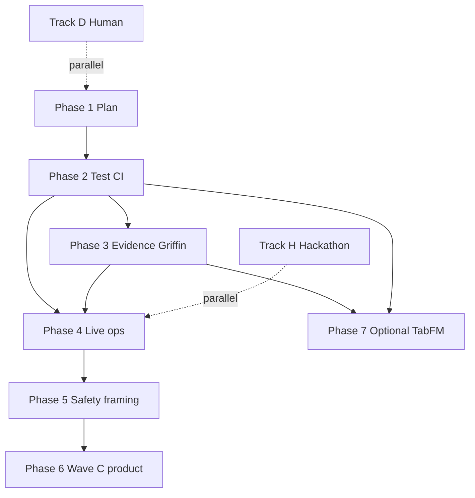

# ArcNet next phases plan

**Status:** Phase 1 deliverable — plan & measure only. **No feature code in this PR.**  
**Date:** 2026-07-23  
**Baseline:** PR #16 merged on `main`; honest readiness **~55%** (≤60% cap).  
**Companions:** [`20-honest-progress.md`](20-honest-progress.md) (measured scorecard), [`19-path-to-95.md`](19-path-to-95.md) (workstream catalog), [`plans/path-to-95-acceptance.md`](plans/path-to-95-acceptance.md) (exit scripts).

---

## Baseline

| Fact | Value |
|---|---|
| Overall (areas 1–11) | **~55%** — do not inflate; no 74/80/95 theater |
| Cap until exits pass | **≤60%** |
| Wave A / Wave B surfaces | Landed (cascade, MAD strip, evidence helpers, HQ tools, P1 fixes) |
| What did **not** land | e2e CI, FE Vitest job, Griffin cold soak proof, SigNoz fixtures, live propose→apply→pin loop, Wave C product |
| Griffin estimator | **MAD locked**; TabFM / TabPFN not claimed |
| Hackathon assets (WS11) | Parallel track — **excluded from %** |

**Phase 1 (this doc):** inventoring leftovers, bundling by dependency, writing measurable exits. Code starts at Phase 2+.

---

## TabFM research note

### User clarification

- TabFM is available as a normal Hugging Face model — **no TabPFN token path required** for TabFM itself.
- TabPFN optional path can stay **deferred / out** unless we explicitly reopen it later.
- **Do not implement TabFM in Phases 2–5.** Optional Wave only (Phase 7) if MAD proves insufficient.

### Hub inventory (2026-07-23)

| Repo | Backend | Role | Downloads (approx.) |
|---|---|---|---:|
| [`google/tabfm-1.0.0-pytorch`](https://huggingface.co/google/tabfm-1.0.0-pytorch) | PyTorch + safetensors | **Recommended** if/when adopted | ~29k |
| [`google/tabfm-1.0.0-jax`](https://huggingface.co/google/tabfm-1.0.0-jax) | JAX/Flax Orbax | Sibling only — skip for ArcNet | ~2.7k |

No other `google/tabfm*` size variants (no small/medium/large SKUs). One architecture (v1.0.0), two framework packs, each with:

| Subfolder | Task | Griffin fit |
|---|---|---|
| `regression/` | Continuous targets (`TabFMRegressor`) | **Yes** — metric forecast |
| `classification/` | ≤10 classes (`TabFMClassifier`) | No (anomaly bands need regression) |

Weights are large (~6.2–6.5 GiB safetensors per task). License: **TabFM Non-Commercial License v1.0** (weights); Apache-2.0 for upstream code via `google-research/tabfm`. Not suitable for commercial/production deployment without a separate Google license.

Install / load paths from the model card:

```text
pip install tabfm[pytorch]
# or
TabFM_HF.from_pretrained("google/tabfm-1.0.0-pytorch", subfolder="regression")
```

Architecture (relevant): 24-block ICL transformer over row CLS tokens; zero-shot in-context learning — history rows as context, predict next value; memory scales with training-row count; designed for tables ≤~500 features.

### Mapping to Griffin / fleet anomaly

Griffin’s contract ([`07-griffin-anomaly.md`](07-griffin-anomaly.md)): pull `arcnet.*` (or SQLite proxy) series → forecast + conformal band → outlier iff outside band **and** above noise floor → emit `arcnet.anomaly` → signal bus. Estimator slot is `forecast(history, features) → predictions`; MAD fills that slot today.

**Prior G2 spike (2026-07-21, still authoritative):**

- Install OK; loader friction around `model.safetensors` vs older `pytorch_model.bin` expectation (card now documents safetensors — re-check on adopt).
- Load ~28 s; fit+predict ~12–26 s/**series** → ~150 s for default 12 series ≫ **15 s cycle budget** → **FALLBACK**.
- Conformal bands still required (TabFM is point-predict only).

### Recommendation (if/when we adopt)

| Choice | Decision |
|---|---|
| **Checkpoint** | `google/tabfm-1.0.0-pytorch` + **`subfolder="regression"`** |
| **Why not JAX** | Spike + server stack already PyTorch-shaped; JAX Orbax pack is heavier ops surface for no Griffin gain |
| **Why not classification** | Forecasting continuous metrics needs regressor |
| **Inputs** | Per-series tabular rows: time index, minute-of-hour, rolling mean/std (5m/15m), lags, observed value; train = history minus conformal tail (C≈20); predict current bucket |
| **Hardware** | CPU possible but **too slow for multi-series 60 s loop**; practical path = **async worker / separate process**, GPU preferred, or **1–2 series only** with long cadence |
| **Hackathon vs post** | **Post-hackathon / Phase 7.** Hackathon stays MAD narration. TabFM is research/demo polish, not a % unlock |
| **License** | Non-commercial weights — fine for research/hackathon demos; **block production commercial use** until licensed |
| **TabPFN** | Stay **out / deferred** (token friction, user clarification). Do not block harden phases on Prior Labs token |

**Honest product line until Phase 7 exits:** Griffin = MAD statistical baseline. Never claim TabFM live in HQ/README.

---

## Phasing principles

1. **Bundle similar leftover work** — one PR theme per phase; avoid scattershot feature theater.
2. **Harden before Wave C product** — tests/CI and evidence trust move %; HITL/threats/twins do not until gates exist.
3. **Measurable exits only** — cite commands / soak criteria from [`plans/path-to-95-acceptance.md`](plans/path-to-95-acceptance.md); checklist UI without exit = no % move.
4. **Dependencies respect the loop** — e2e before claiming live ops; evidence fixtures before agent trust; MAD soak before FM optional.
5. **Tracks H/D never inflate overall %.**
6. **docs/12 additive only**; Unplug in-process; import boundary green; explore never auto-applies.

Leftover sources folded below: `20` §5 top-5 harden list, `19` WS3/WS6/WS7/WS8/WS9/WS10/WS12, map adversarial A1–A22 (residual), Wave C backlog, human ship blockers.

---

## Phase 1 (this doc): Plan & measure

| | |
|---|---|
| **Bundled** | Inventory post–Wave B leftovers; TabFM research; phase bundling; honesty pin (~55%) |
| **Why** | User-requested planning gate before code |
| **Exit** | This doc on branch `plan/next-phases`; readiness still documented as **~55% / ≤60%** |
| **Depends on** | PR #16 on main |
| **Effort** | **S** |
| **Status** | **In progress → done when merged/accepted** |

---

## Phase 2: Test & CI gates

| | |
|---|---|
| **Bundled** | WS9 e2e script (`scripts/e2e_path_to_95.py` or TestClient equiv); HQ Vitest cascade + hash reducer; CI jobs `e2e` + `hq-test`; HQ tool error matrix (timeout / 4xx / 5xx → stable `{ok:false,error,tool}`); recommend/propose always carry `evidence_refs` or explicit empty reason |
| **Why** | `20` top items #1, #2, #5 — without these, no % can move past theater; tool matrix shares test harness with e2e |
| **Exit** | CI green: python + boundary + hq build + **hq test** + **e2e** on scratch DB; e2e asserts propose→apply(`confirm`)→pin→`version_pinpoint` + `agentos_reload_required`; each hq_tool has ≥1 error-path unit |
| **Depends on** | Phase 1 (plan accepted); Wave A/B APIs already on main |
| **Effort** | **L** |
| **Maps to** | Areas 5, 11 (primary); unblocks honest re-score later |

---

## Phase 3: Evidence & Griffin trust

| | |
|---|---|
| **Bundled** | SigNoz Query Range **golden fixtures** (span-like + non-span shapes); MCP hang documented + **HTTP/Query Range preferred** in HQ Agent skills/Case File hints; Griffin **cold-path soak** (no seed file: N cycles keep `series_source=sqlite_proxy` or honest empty/warming; status not stuck `cold`; Fleet MAD strip without seed theater); A1 residual verify (distinct dashboard UUIDs when provisioned) |
| **Why** | `20` items #3–#4; evidence fidelity (area 9) and Griffin (area 8) are the trust gap after Wave B P1s — fixtures + soak are the same “don’t lie when cold/offline” theme |
| **Exit** | Fixture tests green without live cloud; soak script/log: ≥N cycles no seed write; HQ Agent instructions name HTTP fallback before MCP; provisioned status → ≥3 distinct UUIDs |
| **Depends on** | Phase 2 preferred (soak/e2e can share harness); can start fixtures in parallel with Phase 2 late |
| **Effort** | **M** |

---

## Phase 4: Live ops loop

| | |
|---|---|
| **Bundled** | AgentOS reload UX proven (banner + operator restart → new sessions use new model); propose→apply→pin **live** (not only CI) on seeded demo DB; pagination / filter labels proven in HQ (“showing N of Total”) under real list sizes; session filters `agent_version` / `version_id` exercised end-to-end |
| **Why** | Surfaces exist; operator trust does not. Bundles WS3 remaining live path + WS2 HQ consumption of totals |
| **Exit** | Documented dry-run checklist pass (commands + screenshots optional); apply shows reload required; after restart, model matches; signals/proposals lists show totals when >page |
| **Depends on** | Phase 2 (automated guard) strongly; Phase 3 helpful for evidence refs in live propose |
| **Effort** | **M** |

---

## Phase 5: Safety matrix & positioning

| | |
|---|---|
| **Bundled** | Unplug WS8 coverage matrix completion (agent × tool × checkpoint); S1/S2/S5 regression green; HQ tool excerpt caps on Case File / signal text; honesty chrome cleanup (README/`14`/`06`: MAD + MCP PARTIAL; no demo-badge / TabFM-live claims; A14 demo script vs `mixed` alignment); A15 `full_transcript` escape hatch harden or gate; write-secret / localhost-trust docs already present — verify boot log + tests stay green |
| **Why** | Safety + framing are “stop lying / stop leaking” work — same PR theme; founder positioning exits from area 1 |
| **Exit** | Matrix 100% for product agents or explicit defer rows; boundary + S1/S2/S5 green; grep user chrome: 0 TabFM-live / 0 demo-badge claims; Limitations names MAD + MCP PARTIAL |
| **Depends on** | Phases 2–4 preferably done so framing matches proven loop |
| **Effort** | **M** |

---

## Phase 6: Wave C product (after exits)

| | |
|---|---|
| **Bundled** | HITL pause UI + honesty if AgentOS relay still SQLite-only (A8); threats fold-in / compact table (API already); sources + dashboards **agent-view twins** finished; shell `api_down` recover on focus/interval (A21); optional corpus scorecard **only if** `POST /api/replay/corpus` exists — else explicit defer; residual WS10 polish |
| **Why** | Classic Wave C / WS12 feature surface — **forbidden as % fuel** until Phases 2–5 exits move the scorecard |
| **Exit** | Per-item done-with-tests **or** explicit defer in tracking table; overall still only moves when area exits in `19` §2 pass |
| **Depends on** | Phase 2–5 exits (hard gate) |
| **Effort** | **L** aggregate |

---

## Phase 7: Optional TabFM

| | |
|---|---|
| **Bundled** | Spike re-measure latency on `google/tabfm-1.0.0-pytorch` `regression/`; worker isolation behind `forecast(...)`; conformal bands; degrade to MAD; narration toggle; **no TabPFN unless reopened** |
| **Why** | Only if MAD insufficient for product story; license + latency mean this is optional |
| **Exit** | Either (a) cycle budget met for chosen series count on target hardware **and** HQ labels `tabfm` honestly, or (b) explicit defer with MAD retained; never claim without exit |
| **Depends on** | Phase 3 Griffin soak (know cold path first); preferably Phase 2 CI so regressor swap is tested |
| **Effort** | **L** (weights ~6.5 GiB, worker, soak) |
| **Hackathon** | **Out of critical path** |

---

## Track H: Hackathon assets (parallel)

| | |
|---|---|
| **Bundled** | Screenshots per README/`14`; video from `06` with honest `mixed`; Slack Unplug provenance; submission form |
| **Why** | WS11 — ship theater ≠ product robustness |
| **Exit** | Done or explicitly cut; track % separate; **never** average into overall |
| **Depends on** | Stable HQ for honest screenshots (after Phase 4 ideal) |
| **Effort** | **S–M** (human-heavy) |

---

## Track D: Human blockers

| | |
|---|---|
| **Bundled** | Items that cannot be coded away: organizer Slack ruling / provenance, submission form, visual capture, any remaining key/policy humans own |
| **Why** | Log historically H1/H2/H3-class; keep visible so agents don’t “implement around” them |
| **Exit** | Human checkbox or cut |
| **Depends on** | — |
| **Effort** | Human |

---

## Dependency sketch



---

## Suggested first execution after planning

1. **Phase 2 (Test & CI gates)** — highest leverage; unlocks honest % movement.
2. Phase 3 in parallel once e2e harness exists.
3. Defer Phase 6–7 and do not touch TabFM until MAD soak fails product need.

---

## Anti-inflation reminders

- Updating [`20`](20-honest-progress.md) / [`19` §5.2](19-path-to-95.md) requires citing Phase exits, not “landed UI.”
- Overall stays **≤60%** until Phase 2 (+ preferably 3–4) exits pass measured re-score.
- TabFM research ≠ TabFM shipped.
- Track H/D excluded from overall.

---

*Plan only. No product feature implementation in this document’s commit beyond documentation.*
