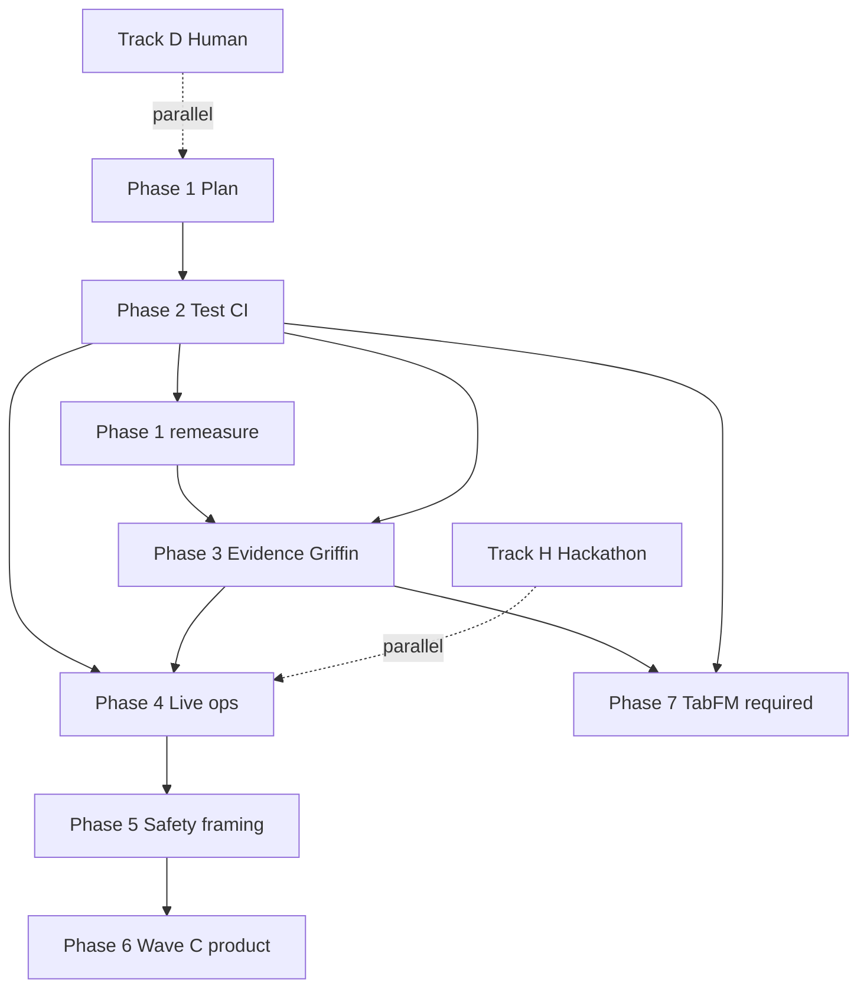

# ArcNet next phases plan

**Status:** Phase 3 **merged** (PR #18 → `main`). Phase 4 (Live ops) **in progress** on `phase-4-live-ops`. Phase 2 on `main` (PR #17). Readiness **~57%** (≤60% cap).  
**Date:** 2026-07-23  
**Baseline:** PR #18 merged on `main`; post–Phase-2/3 remeasure **~57%** (≤60% cap).  
**User pin:** no further SigNoz/seed/fixture/data polish beyond what already landed in Phase 3.  
**Companions:** [`20-honest-progress.md`](20-honest-progress.md) (measured scorecard), [`19-path-to-95.md`](19-path-to-95.md) (workstream catalog), [`plans/path-to-95-acceptance.md`](plans/path-to-95-acceptance.md) (exit scripts), [`23-product-overview.md`](23-product-overview.md) (product overview), [`22-next-agent-packets.md`](22-next-agent-packets.md) (packets).

---

## Baseline

| Fact | Value |
|---|---|
| Overall (areas 1–11) | **~64%** — current authority in [`20`](20-honest-progress.md); do not inflate; no 74/80/95 theater |
| Cap until exits pass | **≤65%** |
| Wave A / Wave B surfaces | Landed (cascade, MAD strip, evidence helpers, HQ tools, P1 fixes) |
| Phase 2 gates | e2e script + CI, HQ FE cascade/hash tests + CI, HQ tool error matrix — **on main** |
| Phase 3 gates | Query Range golden fixtures; Griffin cold soak (no seed); HTTP preferred before MCP; ≥3 distinct dashboard UUIDs — **on main via PR #18** |
| What did **not** land | Wave C product, **TabFM path (Phase 7 — required, not coded yet)** |
| User pin | **No further data/fixture/seed polish** after Phase 3 |
| Griffin estimator | **MAD locked** until TabFM phase exits; TabPFN deferred |
| Hackathon assets (WS11) | Parallel track — **excluded from %** |

**Phase 1:** inventoring leftovers, bundling by dependency, writing measurable exits; **remeasured after Phase 2** (~55→~57).  
**Phase 2:** test/CI gates — **done** (PR #17).  
**Phase 3:** Evidence & Griffin trust — **done** (PR #18 merged).  
**Phase 4:** Live ops loop — this implementation.

---

## TabFM research note

### User clarification (updated)

- TabFM is available as a normal Hugging Face model — **no TabPFN token path required** for TabFM itself.
- TabPFN optional path stays **deferred / out** unless we explicitly reopen it later.
- **TabFM integration is REQUIRED** (Phase 7) — not “optional if MAD insufficient.” We **will** ship a TabFM forecast path.
- **Do not fully implement TabFM in Phases 2–5.** Phase 7 owns the worker + load + HQ label; MAD remains the **runtime fallback** when TabFM is cold/slow/unavailable.
- HF pick (locked): [`google/tabfm-1.0.0-pytorch`](https://huggingface.co/google/tabfm-1.0.0-pytorch) with **`subfolder="regression"`**.

### Hub inventory (2026-07-23)

| Repo | Backend | Role | Downloads (approx.) |
|---|---|---:|
| [`google/tabfm-1.0.0-pytorch`](https://huggingface.co/google/tabfm-1.0.0-pytorch) | PyTorch + safetensors | **Required** checkpoint | ~29k |
| [`google/tabfm-1.0.0-jax`](https://huggingface.co/google/tabfm-1.0.0-jax) | JAX/Flax Orbax | Sibling only — skip for ArcNet | ~2.7k |

No other `google/tabfm*` size variants (no small/medium/large SKUs). One architecture (v1.0.0), two framework packs, each with:

| Subfolder | Task | Griffin fit |
|---|---|---|
| `regression/` | Continuous targets (`TabFMRegressor`) | **Yes** — metric forecast |
| `classification/` | ≤10 classes (`TabFMClassifier`) | No (anomaly bands need regression) |

Weights are large (~6.2–6.5 GiB safetensors per task). License: **TabFM Non-Commercial License v1.0** (weights); Apache-2.0 for upstream code via `google-research/tabfm`. Not suitable for commercial/production deployment without a separate Google license.

Install / load paths from the model card:

```text
pip install tabfm[pytorch]
# or
TabFM_HF.from_pretrained("google/tabfm-1.0.0-pytorch", subfolder="regression")
```

Architecture (relevant): 24-block ICL transformer over row CLS tokens; zero-shot in-context learning — history rows as context, predict next value; memory scales with training-row count; designed for tables ≤~500 features.

### Mapping to Griffin / fleet anomaly

Griffin’s contract ([`07-griffin-anomaly.md`](07-griffin-anomaly.md)): pull `arcnet.*` (or SQLite proxy) series → forecast + conformal band → outlier iff outside band **and** above noise floor → emit `arcnet.anomaly` → signal bus. Estimator slot is `forecast(history, features) → predictions`; MAD fills that slot today; TabFM will fill it when Phase 7 exits, with MAD degrade.

**Prior G2 spike (2026-07-21, still authoritative):**

- Install OK; loader friction around `model.safetensors` vs older `pytorch_model.bin` expectation (card now documents safetensors — re-check on adopt).
- Load ~28 s; fit+predict ~12–26 s/**series** → ~150 s for default 12 series ≫ **15 s cycle budget** → must use **async worker / subset series / longer cadence**; MAD degrade is OK at runtime.
- Conformal bands still required (TabFM is point-predict only).

### Recommendation (required adopt)

| Choice | Decision |
|---|---|
| **Checkpoint** | `google/tabfm-1.0.0-pytorch` + **`subfolder="regression"`** |
| **Why not JAX** | Spike + server stack already PyTorch-shaped; JAX Orbax pack is heavier ops surface for no Griffin gain |
| **Why not classification** | Forecasting continuous metrics needs regressor |
| **Inputs** | Per-series tabular rows: time index, minute-of-hour, rolling mean/std (5m/15m), lags, observed value; train = history minus conformal tail (C≈20); predict current bucket |
| **Hardware** | CPU possible but **too slow for multi-series 60 s loop**; practical path = **async worker / separate process**, GPU preferred, or **1–2 series only** with long cadence |
| **Schedule** | **Phase 7 (required)** after Phase 3 Griffin soak; can prep spike/worker sketch in parallel once Phase 3 cold-path is honest |
| **Fallback** | Degrade-to-MAD at runtime is OK; **shipping the TabFM path is still required** |
| **License** | Non-commercial weights — fine for research/hackathon demos; **block production commercial use** until licensed |
| **TabPFN** | Stay **out / deferred** (token friction). Do not block harden phases on Prior Labs token |

**Honest product line until Phase 7 exits:** Griffin = MAD statistical baseline. Never claim TabFM live in HQ/README until Phase 7 exit (a).

---

## Phasing principles

1. **Bundle similar leftover work** — one PR theme per phase; avoid scattershot feature theater.
2. **Harden before Wave C product** — tests/CI and evidence trust move %; HITL/threats/twins do not until gates exist.
3. **Measurable exits only** — cite commands / soak criteria from [`plans/path-to-95-acceptance.md`](plans/path-to-95-acceptance.md); checklist UI without exit = no % move.
4. **Dependencies respect the loop** — e2e before claiming live ops; evidence fixtures before agent trust; MAD soak before TabFM ship.
5. **Tracks H/D never inflate overall %.**
6. **docs/12 additive only**; Unplug in-process; import boundary green; explore never auto-applies.

Leftover sources folded below: `20` §5 top-5 harden list, `19` WS3/WS6/WS7/WS8/WS9/WS10/WS12, map adversarial A1–A22 (residual), Wave C backlog, human ship blockers.

---

## Phase 1: Plan & measure

| | |
|---|---|
| **Bundled** | Inventory post–Wave B leftovers; TabFM research; phase bundling; honesty pin (~55%) |
| **Why** | User-requested planning gate before code |
| **Exit** | This doc landed; readiness documented as **~55% / ≤60%** |
| **Depends on** | PR #16 on main |
| **Effort** | **S** |
| **Status** | **Done** (plan + post–Phase-2 remeasure ~57% / ≤60%) |

**Revisit after Phase 2:** scorecard updated in [`20`](20-honest-progress.md) (~55→~57 citing Phase 2 CI exits). Do not inflate further without Phase 3–4 exits.

---

## Phase 2: Test & CI gates

| | |
|---|---|
| **Bundled** | WS9 e2e (`scripts/e2e_path_to_95.py`); HQ cascade + hash node:test; CI jobs `e2e` + `hq-test`; HQ tool error matrix (timeout / 4xx / 5xx → `{ok:false,error,tool}`); recommend/propose carry `evidence_refs` or `evidence_refs_empty_reason` |
| **Why** | `20` top items #1, #2, #5 — without these, no % can move past theater |
| **Exit** | CI green: python + boundary + hq build + **hq-test** + **e2e** on scratch DB; e2e asserts propose→apply(`confirm`)→pin→`version_pinpoint` + `agentos_reload_required`; each hq_tool has ≥1 error-path unit |
| **Depends on** | Phase 1 (plan accepted); Wave A/B APIs already on main |
| **Effort** | **L** |
| **Maps to** | Areas 5, 11 (primary); unblocks honest re-score later |
| **Status** | **Done** (exits met on `main` via PR #17; overall % ~57 / ≤60 after remeasure) |

### Phase 2 checklist

- [x] `scripts/e2e_path_to_95.py` — seed → propose → apply(confirm) → pin → check `version_pinpoint` + reload flag
- [x] CI job `e2e`
- [x] HQ cascade + hash tests (`pnpm test`)
- [x] CI job `hq-test`
- [x] HQ tool error matrix unit tests (timeout / 4xx / 5xx + per-tool error path)
- [x] recommend/propose `evidence_refs` or explicit empty reason

---

## Phase 3: Evidence & Griffin trust

| | |
|---|---|
| **Bundled** | SigNoz Query Range **golden fixtures** (span-like + non-span shapes); MCP hang documented + **HTTP/Query Range preferred** in HQ Agent skills/Case File hints; Griffin **cold-path soak** (no seed file: N cycles keep `series_source=sqlite_proxy` or honest empty/warming; status not stuck `cold`; Fleet MAD strip without seed theater); A1 residual verify (distinct dashboard UUIDs when provisioned) |
| **Why** | `20` items #3–#4; evidence fidelity (area 9) and Griffin (area 8) are the trust gap after Wave B P1s |
| **Exit** | Fixture tests green without live cloud; soak script/log: ≥N cycles no seed write; HQ Agent instructions name HTTP fallback before MCP; provisioned status → ≥3 distinct UUIDs |
| **Depends on** | Phase 2 preferred (soak/e2e can share harness); fixtures can start in parallel with late Phase 2 |
| **Effort** | **M** |
| **Status** | **Done** (exits met on `main` via PR #18; overall still ≤60 / ~57 — no theater). **No further data/fixture polish per user.** |

### Phase 3 checklist

- [x] Query Range golden fixtures (`server/tests/fixtures/query_range_*.json`) + extractor/evidence tests
- [x] Griffin cold-path soak (`scripts/griffin_cold_soak.py`) — N cycles, no seed write, `sqlite_proxy`, status not stuck cold
- [x] HQ Agent skills / prompt / Case File hints prefer HTTP/Query Range before MCP
- [x] Provisioned dashboard map → ≥3 distinct UUIDs (env + list-API unit tests)

---

## Phase 4: Live ops loop

| | |
|---|---|
| **Bundled** | AgentOS reload UX proven (banner + operator restart → new sessions use new model); propose→apply→pin **live** (not only CI) on seeded demo DB; pagination / filter labels proven in HQ (“showing N of Total”) under real list sizes; session filters `agent_version` / `version_id` exercised end-to-end |
| **Why** | Surfaces exist; operator trust does not. Bundles WS3 remaining live path + WS2 HQ consumption of totals |
| **Exit** | Documented dry-run checklist pass (commands + screenshots optional); apply shows reload required; after restart, model matches; signals/proposals lists show totals when >page |
| **Depends on** | Phase 2 (automated guard) strongly; Phase 3 helpful for evidence refs in live propose |
| **Effort** | **M** |
| **Status** | **Done on this branch** (exits met; overall still ~57 / ≤60 — no inflation). Remainder: optional live AgentOS screenshot after human restart. |

### Phase 4 checklist

- [x] `scripts/live_ops_dry_run.py` — propose→apply→pin + reload flag + `agentos_probe` + session filters + pagination totals > page
- [x] Apply returns `agentos_probe` (best-effort `ARCNET_AGENTOS_URL/internal/runtime`); HQ banner shows reload + probe note
- [x] AgentOS `GET /internal/runtime` exposes process `ARCNET_MODEL` for match-after-restart
- [x] HQ “showing N of Total” on signals, proposals, versions, Case Files sessions
- [x] Session filters `agent_version` / `version_id` asserted in dry-run + unit tests
- [x] Unit tests `server/tests/test_phase4_live_ops.py` + HQ `pageLabel.test.ts`
- [ ] Optional operator screenshot after real AgentOS restart (human) — not blocking exit

---

## Phase 5: Safety matrix & positioning

| | |
|---|---|
| **Bundled** | Unplug WS8 coverage matrix completion (agent × tool × checkpoint); S1/S2/S5 regression green; HQ tool excerpt caps on Case File / signal text; honesty chrome cleanup (README/`14`/`06`: MAD + MCP PARTIAL; no demo-badge / TabFM-live claims until Phase 7 exit; A14 demo script vs `mixed` alignment); A15 `full_transcript` escape hatch harden or gate; write-secret / localhost-trust docs already present — verify boot log + tests stay green |
| **Why** | Safety + framing are “stop lying / stop leaking” work — same PR theme; founder positioning exits from area 1 |
| **Exit** | Matrix 100% for product agents or explicit defer rows; boundary + S1/S2/S5 green; grep user chrome: 0 TabFM-live / 0 demo-badge claims (until Phase 7); Limitations names MAD + MCP PARTIAL |
| **Depends on** | Phases 2–4 preferably done so framing matches proven loop |
| **Effort** | **M** |

---

## Phase 6: Wave C product (after exits)

| | |
|---|---|
| **Bundled** | HITL pause UI + honesty if AgentOS relay still SQLite-only (A8); threats fold-in / compact table (API already); sources + dashboards **agent-view twins** finished; shell `api_down` recover on focus/interval (A21); optional corpus scorecard **only if** `POST /api/replay/corpus` exists — else explicit defer; residual WS10 polish |
| **Why** | Classic Wave C / WS12 feature surface — **forbidden as % fuel** until Phases 2–5 exits move the scorecard |
| **Exit** | Per-item done-with-tests **or** explicit defer in tracking table; overall still only moves when area exits in `19` §2 pass |
| **Depends on** | Phase 2–5 exits (hard gate) |
| **Effort** | **L** aggregate |

---

## Phase 7: TabFM integration (required)

| | |
|---|---|
| **Bundled** | Spike re-measure latency on `google/tabfm-1.0.0-pytorch` `regression/`; worker isolation behind `forecast(...)`; conformal bands; **degrade to MAD** (runtime OK); HQ/status labels `tabfm` only when live; narration toggle; **no TabPFN unless reopened** |
| **Why** | Required product path — MAD alone is not the end state; latency/weight constraints force worker + subset series, but the TabFM path must ship |
| **Exit** | Cycle budget met for chosen series count on target hardware **and** HQ labels `tabfm` honestly when active; MAD degrade path tested; never claim without exit |
| **Depends on** | Phase 3 Griffin soak (know cold path first); Phase 2 CI so regressor swap is tested |
| **Effort** | **L** (weights ~6.5 GiB, worker, soak) |
| **Hackathon** | Can demo MAD; TabFM may land post-hackathon if weights/latency block critical path — still **required** on the roadmap |
| **Status** | **Scheduled** (after Phase 3; parallel prep OK once soak exists) |

---

## Track H: Hackathon assets (parallel)

| | |
|---|---|
| **Bundled** | Screenshots per README/`14`; video from `06` with honest `mixed`; Slack Unplug provenance; submission form |
| **Why** | WS11 — ship theater ≠ product robustness |
| **Exit** | Done or explicitly cut; track % separate; **never** average into overall |
| **Depends on** | Stable HQ for honest screenshots (after Phase 4 ideal) |
| **Effort** | **S–M** (human-heavy) |

---

## Track D: Human blockers

| | |
|---|---|
| **Bundled** | Items that cannot be coded away: organizer Slack ruling / provenance, submission form, visual capture, any remaining key/policy humans own |
| **Why** | Log historically H1/H2/H3-class; keep visible so agents don’t “implement around” them |
| **Exit** | Human checkbox or cut |
| **Depends on** | — |
| **Effort** | Human |

---

## Dependency sketch



---

## Suggested execution sequence (current)

1. ~~Phase 2 (Test & CI gates)~~ — **done** (PR #17).
2. ~~Brief Phase 1 revisit~~ — **done** (~57% / ≤60%).
3. ~~Phase 3 (Evidence & Griffin)~~ — **done** (PR #18 merged).
4. ~~Phase 4 (Live ops loop)~~ — **done** (PR #19 merged).
5. Phase 5 → 6 as exits unlock — run order + prompts in [`24-ship-week-plan.md`](24-ship-week-plan.md).
6. **Phase 7 TabFM integration (required)** — **not started / not coded**; after Griffin soak (done); MAD degrade OK at runtime.

---

## Anti-inflation reminders

- Updating [`20`](20-honest-progress.md) / [`19` §5.2](19-path-to-95.md) requires citing Phase exits, not “landed UI.”
- Overall stays **≤60%** / honest **~57%** after Phases 2–4 — does **not** unlock 70%+.
- TabFM research ≠ TabFM shipped; Phase 7 required before any TabFM-live claim.
- Track H/D excluded from overall.
- **No further SigNoz/seed/fixture data polish** after Phase 3 (user pin).

---

*Phase 4 live ops + Phase 3 merge. TabFM remains required Phase 7 — not implemented yet.*
