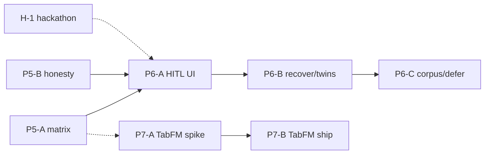

# ArcNet — Next agent work packets (Phases 5–7 + TabFM)

**Date:** 2026-07-23  
**Branch base:** `main` (Phase 4 merged via PR #19)  
**Readiness pin:** overall **~57% / ≤60%** ([`20-honest-progress.md`](20-honest-progress.md)). Do not inflate.  
**Companion plan:** [`21-next-phases-plan.md`](21-next-phases-plan.md) (phase bundles). Product overview: [`23-product-overview.md`](23-product-overview.md). This doc turns Phases **5 / 6 / 7** into **concrete agent packets** with goals, files, exits, deps.

**Audit context (same day):** quality gates green on Phase 4 tip; product loop partially E2E (API/CI) vs demo theater (live AgentOS restart, SigNoz depth, TabFM missing). Hackathon readiness ≠ product readiness.

---

## Quality snapshot (re-run 2026-07-23)

| Check | Result |
|---|---|
| `server/tests` | **PASS** — 121 |
| `sdk/tests` | **PASS** — 6 |
| `agents/tests` | **PASS** — 4 |
| `scripts/check_import_boundaries.py` | **PASS** |
| `hq` `pnpm test` | **PASS** — 18 |
| `hq` `pnpm build` | **PASS** |
| `scripts/e2e_path_to_95.py` | **PASS** — propose→apply→pin→pinpoint + reload flag |
| `scripts/live_ops_dry_run.py` | **PASS** — AgentOS probe `reachable=False` (expected without :7777) |

No quality blockers for Phase 5 start. Optional live AgentOS screenshot remains human/Track H.

---

## Product verdict (honest)

| Loop step | Status | Notes |
|---|---|---|
| Observe (fleet / signals / SigNoz) | **Partial E2E** | Fleet + SSE signals work on SQLite; SigNoz optional / MCP PARTIAL |
| Defend (Unplug) | **Demo-proven** | In-process guard + scenarios; WS8 matrix incomplete (Phase 5) |
| Replay (Time Machine) | **Usable w/ keys** | Cascade + heroes + SSE; needs `OPENAI_API_KEY` + AgentOS for live `replay.run()` |
| Case File | **Usable** | Cascade + export zip; HTTP evidence preferred over MCP |
| Improve (HQ Agent propose→apply→pin) | **API/CI E2E** | Dry-run green; live reload still operator restart (by design) |
| TabFM forecast | **Not built** | Required Phase 7; MAD-only honesty strings in HQ/Griffin |

**HQ views:** Case Files / Time Machine cascade (agent→version→model→session) **usable**; HQ Agent diagnose strip (agent→version→session) + apply-form model **usable**; Fleet Health MAD strip **usable** (cold honesty OK); Time Machine / Case File **usable** with seed; HQ Agent **usable** for propose/apply/pin + reload banner. Gaps: HITL UI missing; `api_down` does not auto-recover on focus; no dedicated threats table; TabFM absent.

**Operator feedback:** pagination “showing N of Total” landed (Phase 4); reload banner + probe note landed; shell `api_down` seam exists but **one-shot mount probe** (A21 → Phase 6).

**Hackathon vs product:** Track H (screenshots/video/submission) can ship a **demo** on MAD + seeded heroes without Phase 5–7. Product readiness stays **~57%** until Phase 5+ exits move [`20`](20-honest-progress.md).

---

## How to use these packets

1. One agent (or PR) per packet unless noted “can parallel.”
2. Exit criteria are **commands / greps / tests** — not “UI looks fine.”
3. Overall % moves only when [`20`](20-honest-progress.md) cites a Phase exit — cap stays **≤60** until Phase 5+ remeasure rules in `19`/`21` say otherwise.
4. **No further SigNoz/seed/fixture polish** (user pin after Phase 3).
5. Prefer branch naming: `phase-5-…`, `phase-6-…`, `phase-7-tabfm-…`.

---

## Packet index

| ID | Phase | Goal (one line) | Effort | Depends on |
|---|---|---|---|---|
| **P5-A** | 5 | Unplug coverage matrix + S1/S2/S5 regression | M | Phase 4 tip / #19 |
| **P5-B** | 5 | Honesty chrome + excerpt / `full_transcript` harden | S–M | Can parallel P5-A |
| **P6-A** | 6 | HITL pause UI + honesty (SQLite relay) | M | Phase 5 exits |
| **P6-B** | 6 | Shell recover + threats fold-in + agent-view twins | M | Phase 5; can follow P6-A |
| **P6-C** | 6 | Corpus scorecard **or** explicit defer | S | Phase 5; gate on API existence |
| **P7-A** | 7 | TabFM spike re-measure + worker sketch | M | Phase 3 done; parallel OK after P5 start |
| **P7-B** | 7 | TabFM forecast path + MAD degrade + HQ labels | L | P7-A; Phase 2 CI |
| **H-1** | Track H | Hackathon capture (parallel, no % fuel) | S–M | Stable HQ (Phase 4+) |

---

## Phase 5 packets — Safety matrix & positioning

### P5-A — Unplug coverage matrix + scenario regression

| | |
|---|---|
| **Goal** | Complete product-agent × tool × checkpoint matrix (WS8); keep S1/S2/S5 green; document any explicit defer rows. |
| **Why** | Defend loop is demo-proven but not matrix-complete — blocks honest “coverage” claims. |
| **Files likely touched** | `sdk/` Unplug guard paths; `agents/scenarios/` (`runner.py`, S1/S2/S5); `agents/tests/`; new or updated matrix doc under `docs/` or `plans/` (e.g. coverage table); optional `server/tests/` if signals asserted. |
| **Exit criteria** | (a) Matrix table: 100% of in-scope product agents **or** explicit `DEFER` rows with reason; (b) `PYTHONPATH=sdk:agents uv run python agents/scenarios/runner.py --scenario S1` (and S2/S5) green with key **or** CI-equivalent unit stubs if live key absent — document which; (c) import boundary still green; (d) no new auto-remediation. |
| **Dependencies** | Phase 4 branch / #19 preferred; `OPENAI_API_KEY` for live scenarios. |
| **Anti-scope** | TabFM; SigNoz fixture polish; Wave C HITL UI. |

### P5-B — Honesty chrome + excerpt caps + transcript hatch

| | |
|---|---|
| **Goal** | Stop lying / stop leaking: README/`14`/`06` Limitations name **MAD + MCP PARTIAL**; zero user-chrome “TabFM live” / demo-badge claims; harden Case File / signal excerpt caps; gate or harden `full_transcript` escape (A15). |
| **Why** | Positioning (area 1) + safety excerpts — same “stop theater” theme as Phase 5. |
| **Files likely touched** | `README.md`; `docs/14-product-guide.md`; `docs/06-demo-script.md`; `hq/src/views/*` (grep chrome); `server/arcnet_server/read_models.py`; `server/tests/test_case_file.py` / robustness tests; `agents/hq_agent/prompt.md` + `skills/arcnet-hq-agent/`. |
| **Exit criteria** | (a) `rg -n 'TabFM live|demo.badge|demo badge' README.md docs/14-product-guide.md docs/06-demo-script.md hq/src` → **0** product claims (honesty “not live” OK); (b) Limitations mention MAD + MCP PARTIAL; (c) unit tests prove excerpt bounds / no giant dumps on agent-view incident/signals; (d) `full_transcript` either gated (auth/flag/size) or documented + tested as intentional hatch; (e) `hq` build + server tests green. |
| **Dependencies** | Can **parallel** P5-A. |
| **Anti-scope** | New product features (HITL UI, TabFM worker). |

**Phase 5 combined exit (from [`21`](21-next-phases-plan.md)):** matrix done-or-deferred + boundary + S1/S2/S5 green + honesty greps clean → then allow Phase 6. **Do not** bump overall above 60% without a measured re-score citing these exits.

---

## Phase 6 packets — Wave C product

### P6-A — HITL pause UI + relay honesty

| | |
|---|---|
| **Goal** | Operator can see pending HITL and approve/reject in HQ; if AgentOS relay is still SQLite-only, UI/docs say so (A8). |
| **Files likely touched** | `hq/src/views/Signals.tsx` (or new `Hitl.tsx`); `hq/src/api.ts`; `hq/src/App.tsx` nav if needed; `server/arcnet_server/main.py` HITL routes (already exist); `server/tests/`; `docs/14` Limitations update. |
| **Exit criteria** | (a) HQ shows open `hitl_requests` and can POST approve/reject; (b) SSE or poll updates status; (c) unit/FE test or e2e smoke for decide path; (d) honesty string if pause does not stop a live AgentOS run. |
| **Dependencies** | **Hard:** Phase 5 exits. API: `POST /api/hitl`, `POST /api/hitl/{id}` already on server. |
| **Anti-scope** | Auto-approve; TabFM. |

### P6-B — Shell recover + threats fold-in + agent-view twins

| | |
|---|---|
| **Goal** | (1) `api_down` recovers on **focus / interval** without full page reload (A21); (2) compact threats table or fold-in (API `GET /api/threats` exists); (3) finish sources + dashboards **agent-view** twins where missing. |
| **Files likely touched** | `hq/src/App.tsx`; `hq/src/views/SourcesTrust.tsx`; `hq/src/views/Dashboards.tsx`; optional threats panel; `hq/src/api.ts`; `server/arcnet_server/main.py` / `read_models.py` if twin routes missing; `server/tests/test_read_models.py`. |
| **Exit criteria** | (a) With server stopped → `api_down`; start server → within ~N s or on window focus, breadcrumb returns `· live` **without** manual reload; (b) threats visible as compact table **or** explicit defer row in tracking; (c) agent_view on sources/dashboards returns envelope (not only raw list) **or** defer documented; (d) `pnpm test` + `pnpm build` green. |
| **Dependencies** | Phase 5; can run after or lightly parallel with P6-A if conflicts avoided in `App.tsx`. |
| **Anti-scope** | SigNoz data polish; new dashboard provisioning. |

### P6-C — Corpus scorecard or explicit defer

| | |
|---|---|
| **Goal** | If `POST /api/replay/corpus` (or equivalent) exists, ship minimal scorecard UI/API consumption; else **explicit DEFER** in tracking — no fake UI. |
| **Files likely touched** | Grep first: `server/arcnet_server/main.py`, `docs/12-data-api.md`; if missing → update `docs/21` / this doc tracking only; if present → `hq/src/views/TimeMachine.tsx` + tests. |
| **Exit criteria** | Tracking row: **DONE-with-tests** **or** **DEFER (no endpoint)** — never half-wired chrome. |
| **Dependencies** | Phase 5; prefer after P6-A/B. |
| **Anti-scope** | Inventing corpus API “for the scorecard.” |

**Phase 6 note:** Feature surface is **not % fuel** until area exits in `19` §2 pass. Prefer “done-or-defer” table over ship theater.

---

## Phase 7 packets — TabFM integration (required)

**Product gap callout:** TabFM is **required** in plan ([`21`](21-next-phases-plan.md) Phase 7) and **not implemented**. Griffin/`hq` honesty correctly say MAD-only. Prior spike: `scripts/phase2_tabfm_spike.py` + `docs/_phase2_g2.json` — latency ≫ 15s cycle → **async worker / subset series** mandatory.

### P7-A — Spike re-measure + worker contract

| | |
|---|---|
| **Goal** | Re-measure `google/tabfm-1.0.0-pytorch` `subfolder=regression` load/fit/predict; lock worker interface `forecast(history, features) → predictions` + conformal band plan; document hardware cadence. |
| **Files likely touched** | `scripts/phase2_tabfm_spike.py` (or `scripts/phase7_tabfm_spike.py`); `docs/_phase7_g7.json` (new result); `docs/07-griffin-anomaly.md` (additive note); sketch module e.g. `server/arcnet_server/tabfm_worker.py` (stub OK). |
| **Exit criteria** | (a) Spike JSON with load_s / fit_predict_s / projected cycle for N series; (b) written decision: series count + cadence + CPU vs GPU; (c) interface stub with MAD fallback callable; (d) **no** HQ label `tabfm` yet. |
| **Dependencies** | Phase 3 Griffin soak (done); HF download ~6.5 GiB; can **prep in parallel** with Phase 5 once soak exists. |
| **Anti-scope** | Claiming TabFM live; TabPFN token path. |

### P7-B — Ship TabFM path + MAD degrade + honest HQ labels

| | |
|---|---|
| **Goal** | Wire TabFM behind Griffin `forecast(...)`; conformal bands; runtime **degrade to MAD**; HQ/status show `estimator=tabfm` **only when live**. |
| **Files likely touched** | `server/arcnet_server/griffin.py`; new worker process/module; `server/arcnet_server/main.py` griffin status; `server/tests/` (MAD degrade + label honesty); `hq/src/views/FleetHealth.tsx`; `hq/src/views/HqAgent.tsx`; `agents/hq_agent/prompt.md`; `docs/14` / README Limitations after exit. |
| **Exit criteria** | (a) Cycle budget met for **chosen** series count on target hardware; (b) status/HQ label `tabfm` only when worker healthy; (c) forced failure → MAD + honesty string tested; (d) soak script or unit proving no seed-file theater regression; (e) never claim in demo script until (a–d). |
| **Dependencies** | **P7-A**; Phase 2 CI (regressor swap tested); Phase 3 soak. Prefer Phase 5 framing done so docs don’t contradict. |
| **Hackathon** | MAD demo OK if weights/latency block; TabFM still **required** on roadmap post-hackathon. |
| **License** | TabFM Non-Commercial weights — fine for research/hackathon; block commercial prod claims. |

---

## Track H packet (parallel — excluded from %)

### H-1 — Hackathon assets

| | |
|---|---|
| **Goal** | Screenshots per README/`14`; video from `06` with honest `mixed`; Slack Unplug provenance; submission form. |
| **Files** | Media assets / README slots — mostly human; do not invent product % from screenshots. |
| **Exit** | Done or cut; track % separate. |
| **Depends** | Stable HQ after Phase 4 ideal. |

---

## Suggested agent order

```text
Now:     P5-A ∥ P5-B
Then:    P6-A → P6-B → P6-C
TabFM:   P7-A (parallel after P5 starts) → P7-B
Always:  H-1 parallel when humans available
```



---

## Tracking table (agents: update status only)

| Packet | Status | PR / notes |
|---|---|---|
| P5-A | **DONE** | [`docs/plans/unplug-coverage-matrix.md`](plans/unplug-coverage-matrix.md) — 128 rows (99 COVERED / 29 N/A); S1/S2/S5 CI stubs in `agents/tests/`; live runner DEFER driver session |
| P5-B | **DONE** | honesty greps clean; excerpt bounds + A15 hatch tested |
| P6-A | **TODO** | blocked on Phase 5 |
| P6-B | **TODO** | blocked on Phase 5 |
| P6-C | **TODO** | defer-or-build |
| P7-A | **DONE** | spike `docs/_phase7_g7.json` — load~54s, fit+predict median~80s/series CPU; decision N=1 @ 360s cadence; `tabfm_worker.py` stub + MAD fallback test; not wired / no HQ `tabfm` label |
| P7-B | **TODO** | blocked on P7-A |
| H-1 | **TODO** | Track H |

---

## Anti-inflation (copy into PR bodies)

- Overall remains **~57% / ≤60%** until a measured re-score cites Phase exits.
- TabFM research / spike ≠ TabFM shipped.
- Hackathon screenshots ≠ product robustness.
- No SigNoz/seed/fixture polish beyond Phase 3.

---

*Drafted after quality+product audit on Phase 4 tip. Prefer this file over editing `21` until #19 merges; then optionally link from `21` §Suggested execution.*
