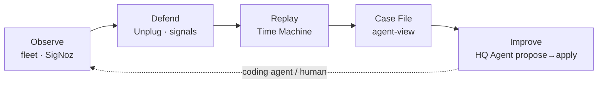

# ArcNet — Product overview

**Audience:** operators, reviewers, next agents.  
**Honesty pin:** overall readiness **~57% / ≤60%** ([`20-honest-progress.md`](20-honest-progress.md)). No 74/80/95 theater.  
**Measurement / roadmap source of truth:** [`20`](20-honest-progress.md) · [`21`](21-next-phases-plan.md) · [`22`](22-next-agent-packets.md).

---

## What ArcNet is

**ArcNet is an agent enhancement layer** — not a SigNoz clone, not demo theater.

It helps you make agents work properly and then improve them:

```
observe → defend → replay → case file → improve
```

| Step | What it means |
|---|---|
| **Observe** | Fleet health, signals, source trust, optional SigNoz traces/metrics |
| **Defend** | Unplug in-process: trust tags, filter untrusted ingest, block tainted tool calls; signals (`steer` / `kill` / `note`) |
| **Replay** | Time Machine: whole-session counterfactual against a candidate model (tools mocked from transcript, guard live) |
| **Case file** | Export incident + agent-view envelope for coding agents (HTTP evidence preferred; MCP hints optional) |
| **Improve** | HQ Agent proposes model/version changes; human confirms apply; version pin + reload honesty |

HQ is the **operator control plane** for that loop.

---

## What ArcNet is not

- **Not a SigNoz replacement** — SigNoz is optional depth (dashboards, alerts, Query Range). ArcNet’s SQLite-primary path is the default.
- **Not AgentOS / an evolver** — no DSPy/GEPA autonomy; humans + existing coding agents apply fixes.
- **Not live TabFM/TabPFN today** — Griffin runs **MAD** now. **TabFM is required** on Phase 7 (`google/tabfm-1.0.0-pytorch`, `subfolder="regression"`); MAD remains the runtime degrade path. TabPFN is deferred/out.
- **Not production auth** — localhost trust; optional write/webhook secrets ≠ product auth.
- **Not “HITL relays to AgentOS” yet** — HITL decide updates SQLite today; live AgentOS pause relay is Phase 6 honesty work ([`12`](12-data-api.md), [`22`](22-next-agent-packets.md) P6-A).
- **Not “apply confirm = auth”** — `confirm: true` is a human gate on model apply, not authentication.
- **Not “MCP fully live”** — SigNoz MCP handoff remains **PARTIAL**; Case File prefers HTTP/Query Range.

---

## Core loop (one system)



Prefer **fix → test → measure** over feature theater. Surfaces that exist without exits in [`20`](20-honest-progress.md) do not move the readiness %.

---

## What’s shipped vs deferred

### Shipped (usable with honesty)

| Surface | Status |
|---|---|
| Fleet Health + MAD Griffin strip | Usable; cold-path honesty OK |
| Signals + SSE | Usable; HITL approve UI still missing |
| Sources & Trust | Usable |
| Time Machine cascade + heroes | Usable with key + AgentOS for live `replay.run()` |
| Case Files cascade + zip export | Usable |
| Dashboards / SigNoz status | Usable as launcher + probe; MCP PARTIAL |
| HQ Agent propose→apply→pin | API/CI + dry-run E2E; live AgentOS restart is **operator step** (probe + banner) |
| Pagination “showing N of Total” | Shipped (Phase 4) |
| Agent → version → model → session cascade | Shipped on Case Files / Time Machine; HQ Agent = agent/version/session + apply-form model |
| Tests / CI (e2e, hq-test, tool matrix) | Phase 2 exits met |

### Deferred / required next

| Item | Where |
|---|---|
| Phase 5 safety matrix + honesty chrome | [`21`](21-next-phases-plan.md) / [`22`](22-next-agent-packets.md) P5-* |
| Phase 6 Wave C (HITL UI, api_down recover, twins) | P6-* — not % fuel until exits |
| **TabFM integration (required)** | **Phase 7** — HF regression subfolder; MAD degrade OK; **not coded** |
| TabPFN | Deferred/out |
| Hackathon screenshots/video | Track H — excluded from % |
| Corpus scorecard | Defer unless API exists |

---

## HQ views — how they evolved

Early HQ was a **six-panel demo HUD** (fleet / signals / sources / time machine / case files / dashboards) with a global `human_view ⇄ agent_view` toggle — strong for hackathon beats, weak as an operator control plane.

Product rework (R1–R3 + HQ Agent + Waves A/B + Phase 4) shifted direction:

| View / concern | Then | Now |
|---|---|---|
| **Case Files / Time Machine pickers** | Flat session lists | **Cascade:** Agent → version → model → session (hash deep-links) |
| **Fleet Health** | Cards + aggregates | Same + **MAD** Griffin status strip (not TabFM) |
| **Time Machine** | Replay + verdict | Cascade + heroes + SSE progress + reload-adjacent honesty elsewhere |
| **Case File** | Export zip | Cascade + incident preview + HTTP-prefer evidence hints |
| **HQ Agent** | Absent | Propose → human **confirm** apply → version pin; **`agentos_reload_required`** + probe (restart not auto) |
| **Lists** | Unbounded / no totals | `limit`/`offset` + **“showing N of Total”** |
| **Shell** | `api_down` on mount fail | Still one-shot mount probe — auto-recover on focus = Phase 6 |
| **HITL** | API row in `12` claimed AgentOS relay | Decide writes **SQLite**; live relay = Phase 6 |

Chrome framing moved from “demo fleet” language toward **operator enhancement layer** — measurement docs ([`20`](20-honest-progress.md)) stay authoritative over marketing tone elsewhere.

---

## Honest status

| Pin | Value |
|---|---|
| Overall (excl. hackathon assets) | **~57%** |
| Cap until further measured exits | **≤60%** |
| Withdrawn estimates | 74 / 80 / 95 theater |

Cite exits in [`20`](20-honest-progress.md) §3 before moving cells. Phases 2–4 done ≠ “70%+ product.”

---

## Roadmap pointer

1. **Now:** Phase 5 (safety matrix + honesty) — [`22`](22-next-agent-packets.md) P5-A ∥ P5-B  
2. **Then:** Phase 6 Wave C (HITL UI + recover + twins) — after Phase 5 exits  
3. **Required:** Phase 7 **TabFM** — `google/tabfm-1.0.0-pytorch` + `subfolder="regression"`; worker + conformal bands; **MAD degrade** at runtime; HQ labels `tabfm` only when live; TabPFN stays out  

Full bundles: [`21-next-phases-plan.md`](21-next-phases-plan.md). Packets: [`22-next-agent-packets.md`](22-next-agent-packets.md).

---

## Related docs

| Doc | Role |
|---|---|
| [`14-product-guide.md`](14-product-guide.md) | How to run / use HQ |
| [`17-product-rework-plan.md`](17-product-rework-plan.md) | R1–R3 + HQ Agent productization |
| [`18-hq-agent.md`](18-hq-agent.md) | HQ Agent design |
| [`20-honest-progress.md`](20-honest-progress.md) | **Measured scorecard** |
| [`21-next-phases-plan.md`](21-next-phases-plan.md) | **Phase plan + TabFM research** |
| [`22-next-agent-packets.md`](22-next-agent-packets.md) | **Next agent work packets** |
| [`01-product.md`](01-product.md) | Feature/loop spec (historical + aligned) |
| [`07-griffin-anomaly.md`](07-griffin-anomaly.md) | Griffin design (MAD now; TabFM Phase 7) |
| [`12-data-api.md`](12-data-api.md) | Wire contract (additive) |
