# ArcNet HQ — Frontend relationship map (complete)

**Date:** 2026-07-24  
**Packet:** P8-A  
**Honesty pins:** readiness **~62% (cap ≤65)** · Griffin = **MAD** runtime (TabFM = Phase 7 stub, not live) · SigNoz MCP = **PARTIAL**  
**Scope:** `hq/src/**` relationship graph + completeness proof. Server contract is additive-only ([`12-data-api.md`](12-data-api.md)); this packet changes **no** server code.

Companion product inventory: [`15-product-map.md`](15-product-map.md). This doc is the **frontend graph proof** — every view, helper, `api.ts` export, and server route accounted for.

---

## 1. Relationship graph

```mermaid
flowchart TB
  subgraph entry["entry"]
    main["main.tsx"]
    App["App.tsx"]
    main --> App
  end

  subgraph views["Views"]
    Home["Home"]
    FleetHealth["FleetHealth"]
    ThreatsPanel["ThreatsPanel\n(embedded)"]
    Signals["Signals"]
    Hitl["Hitl"]
    SourcesTrust["SourcesTrust"]
    TimeMachine["TimeMachine"]
    CaseFiles["CaseFiles"]
    Dashboards["Dashboards"]
    HqAgent["HqAgent"]
  end

  subgraph helpers["Shared helpers"]
    hash["hash.ts\nparseHash formatHash writeHash navigate"]
    defaultView["defaultView.ts\nresolveViewFromPath"]
    cascade["cascade.ts\ncascadeReducer emptyCascade preferHeroSession preferVersion"]
    apiRecover["apiRecover.ts\nAPI_RECOVER_INTERVAL_MS shouldRecoverProbe apiBreadcrumbStatus"]
    homeStats["homeStats.ts\ncountAgents countThreatsBlocked formatStatValue buildHomeStats"]
    hitlUtils["hitlUtils.ts\nhitlPayloadSummary HITL_RELAY_HONESTY"]
    pageLabel["pageLabel.ts\nshowingOfTotal"]
    components["components.tsx\nSeam Empty AgentJson ts money"]
    types["types.ts\nView Mode rows envelopes"]
  end

  subgraph apiMod["api.ts functions"]
    fleet["fleet"]
    agentModels["agentModels"]
    sessions["sessions"]
    sessionsPage["sessionsPage"]
    replays["replays"]
    signals["signals"]
    signalsPage["signalsPage"]
    agentVersions["agentVersions"]
    agentVersionsPage["agentVersionsPage"]
    agentVersionTimeline["agentVersionTimeline"]
    applyModel["applyModel"]
    sources["sources"]
    threatsPage["threatsPage"]
    agentView["agentView"]
    runReplay["runReplay"]
    caseFileUrl["caseFileUrl"]
    signozStatus["signozStatus"]
    griffinStatus["griffinStatus"]
    signozEvidence["signozEvidence"]
    hitlPage["hitlPage"]
    decideHitl["decideHitl"]
    subscribeBus["subscribeBus"]
  end

  subgraph server["Server endpoints"]
    GET_fleet["GET /api/fleet"]
    GET_sessions["GET /api/sessions"]
    GET_session["GET /api/sessions/{id}"]
    GET_models["GET /api/agents/{id}/models"]
    GET_versions["GET /api/agents/{id}/versions"]
    GET_timeline["GET /api/agents/{id}/versions/timeline"]
    POST_versions["POST /api/agents/{id}/versions"]
    POST_apply["POST /api/agents/{id}/apply-model"]
    GET_threats["GET /api/threats"]
    GET_sources["GET /api/sources"]
    GET_signals["GET /api/signals"]
    GET_replays["GET /api/replays"]
    POST_replay["POST /api/replay"]
    GET_agent_view["GET /api/agent-view/{view}/{id}"]
    GET_agent_replay["GET /api/agent-view/replay/{id}"]
    GET_export["GET /export/case-file/{id}"]
    GET_hitl["GET /api/hitl"]
    POST_hitl["POST /api/hitl"]
    POST_hitl_id["POST /api/hitl/{id}"]
    GET_griffin["GET /api/griffin/status"]
    POST_griffin["POST /api/griffin/evaluate"]
    GET_signoz["GET /api/signoz/status"]
    GET_evidence["GET /api/signoz/evidence"]
    GET_health["GET /health"]
    POST_agents["POST /api/agents"]
    POST_sessions["POST /api/sessions"]
    POST_threats["POST /api/threats"]
    POST_sources["POST /api/sources"]
    POST_signal["POST /api/signal"]
    POST_webhook["POST /webhooks/signoz"]
  end

  subgraph sse["SSE /signals/stream"]
    SSE_signal["event: signal"]
    SSE_replay["event: replay_progress"]
    SSE_hitl["event: hitl_request"]
  end

  %% shell wiring
  App --> Home
  App --> FleetHealth
  App --> Signals
  App --> Hitl
  App --> SourcesTrust
  App --> TimeMachine
  App --> CaseFiles
  App --> Dashboards
  App --> HqAgent
  FleetHealth --> ThreatsPanel
  App --> hash
  App --> apiRecover
  App --> fleet
  hash --> defaultView
  Home --> hash
  Home --> homeStats
  FleetHealth --> components
  ThreatsPanel --> components
  ThreatsPanel --> pageLabel
  Signals --> components
  Signals --> pageLabel
  Hitl --> components
  Hitl --> hitlUtils
  Hitl --> pageLabel
  SourcesTrust --> components
  TimeMachine --> cascade
  TimeMachine --> components
  CaseFiles --> cascade
  CaseFiles --> components
  CaseFiles --> pageLabel
  HqAgent --> cascade
  HqAgent --> components
  HqAgent --> pageLabel
  Dashboards --> components
  components --> agentView

  %% api consumers
  fleet --> GET_fleet
  agentModels --> GET_models
  sessions --> GET_sessions
  sessionsPage --> GET_sessions
  replays --> GET_replays
  signals --> GET_signals
  signalsPage --> GET_signals
  agentVersions --> GET_versions
  agentVersionsPage --> GET_versions
  agentVersionTimeline --> GET_timeline
  applyModel --> POST_apply
  sources --> GET_sources
  threatsPage --> GET_threats
  agentView --> GET_agent_view
  agentView --> GET_agent_replay
  runReplay --> POST_replay
  caseFileUrl --> GET_export
  signozStatus --> GET_signoz
  griffinStatus --> GET_griffin
  signozEvidence --> GET_evidence
  hitlPage --> GET_hitl
  decideHitl --> POST_hitl_id
  subscribeBus --> SSE_signal
  subscribeBus --> SSE_replay
  subscribeBus --> SSE_hitl

  Home --> fleet
  Home --> sessionsPage
  Home --> threatsPage
  Home --> signalsPage
  Home --> replays
  FleetHealth --> fleet
  FleetHealth --> griffinStatus
  ThreatsPanel --> threatsPage
  Signals --> fleet
  Signals --> signalsPage
  Signals --> subscribeBus
  Hitl --> hitlPage
  Hitl --> decideHitl
  Hitl --> subscribeBus
  SourcesTrust --> fleet
  SourcesTrust --> sources
  TimeMachine --> fleet
  TimeMachine --> agentVersions
  TimeMachine --> agentModels
  TimeMachine --> sessions
  TimeMachine --> replays
  TimeMachine --> runReplay
  TimeMachine --> caseFileUrl
  TimeMachine --> subscribeBus
  CaseFiles --> fleet
  CaseFiles --> agentVersions
  CaseFiles --> agentModels
  CaseFiles --> sessions
  CaseFiles --> agentView
  CaseFiles --> caseFileUrl
  Dashboards --> signozStatus
  HqAgent --> signalsPage
  HqAgent --> agentVersionTimeline
  HqAgent --> agentVersionsPage
  HqAgent --> applyModel
  HqAgent --> agentView
```

### View → API (human path summary)

| View | `api.*` / SSE used |
|---|---|
| **Shell (App)** | `fleet` (probe + mini-fleet); breadcrumb via `apiRecover` |
| **home** | `fleet`, `sessionsPage`, `threatsPage`, `signalsPage`, `replays` |
| **fleet_health** | `fleet`, `griffinStatus`; embeds **ThreatsPanel** → `threatsPage` |
| **signals** | `fleet`, `signalsPage`, `subscribeBus` → `signal` |
| **hitl** | `hitlPage`, `decideHitl`, `subscribeBus` → `hitl_request` |
| **sources_trust** | `fleet`, `sources` |
| **time_machine** | `fleet`, `agentVersions`, `agentModels`, `sessions`, `replays`, `runReplay`, `caseFileUrl`, `subscribeBus` → `replay_progress` |
| **case_files** | `fleet`, `agentVersions`, `agentModels`, `sessions`, `agentView("incident")`, `caseFileUrl` |
| **dashboards** | `signozStatus` (+ env fallback URLs) |
| **hq_agent** | `signalsPage(source=hq_agent)`, `agentVersionTimeline`, `agentVersionsPage`, `applyModel`, `agentView("check")` |
| **agent_view mode** | `AgentJson` → `agentView` for fleet/signals/sources/replay/incident/dashboards |

---

## 2. Completeness tables (graph is whole)

### 2.1 Every view reachable via hash routing

`KNOWN_VIEWS` in `defaultView.ts` + `NAV` in `App.tsx` + `View` union in `types.ts` must match.

| View id | In `types.View` | In `KNOWN_VIEWS` | In `App` NAV | Rendered branch in `App` | Hash example |
|---|---|---|---|---|---|
| `home` | yes | yes | yes (`// home`) | yes | `#home` / `#` / unknown → home |
| `fleet_health` | yes | yes | yes (`// observe`) | yes | `#fleet_health` |
| `signals` | yes | yes | yes | yes | `#signals?agent=agent_j` |
| `hitl` | yes | yes | yes | yes | `#hitl` |
| `sources_trust` | yes | yes | yes | yes | `#sources_trust?agent=agent_j` |
| `time_machine` | yes | yes | yes (`// improve`) | yes | `#time_machine?agent=&version=&model=&session=` |
| `case_files` | yes | yes | yes | yes | `#case_files?agent=&version=&model=&session=` |
| `dashboards` | yes | yes | yes | yes | `#dashboards` |
| `hq_agent` | yes | yes | yes | yes | `#hq_agent?agent=&version=&session=` |

| Non-route UI piece | Reachability | Notes |
|---|---|---|
| **ThreatsPanel** | Embedded only under `fleet_health` | Not a hash view by design (fold-in panel) |
| **Shell mini-fleet** | Always in sidebar | Click → `navigate({ view: "case_files", agent })` |

**Proof:** 9/9 `View` members appear in `KNOWN_VIEWS`, sidebar `NAV`, and `App` conditional render. Unknown hash path → `resolveViewFromPath` → `home`.

### 2.2 Every `api.ts` export consumed by ≥1 view (or flagged)

| Export | Consumers | Status |
|---|---|---|
| `api.fleet` | App, Home, FleetHealth, Signals, SourcesTrust, TimeMachine, CaseFiles | consumed |
| `api.agentModels` | TimeMachine, CaseFiles | consumed |
| `api.sessions` | TimeMachine, CaseFiles | consumed |
| `api.sessionsPage` | Home | consumed |
| `api.replays` | Home, TimeMachine | consumed |
| `api.signals` | — | **flagged unused** — thin non-paged twin of `signalsPage`; kept for ad-hoc / agent tools parity; HQ lists use `signalsPage` for `X-Total-Count` |
| `api.signalsPage` | Home, Signals, HqAgent | consumed |
| `api.agentVersions` | TimeMachine, CaseFiles | consumed |
| `api.agentVersionsPage` | HqAgent | consumed |
| `api.agentVersionTimeline` | HqAgent | consumed |
| `api.applyModel` | HqAgent | consumed |
| `api.sources` | SourcesTrust | consumed |
| `api.threatsPage` | Home, ThreatsPanel | consumed |
| `api.agentView` | components.AgentJson; CaseFiles (`incident`); HqAgent (`check`) | consumed |
| `api.runReplay` | TimeMachine | consumed |
| `api.caseFileUrl` | TimeMachine, CaseFiles | consumed |
| `api.signozStatus` | Dashboards | consumed |
| `api.griffinStatus` | FleetHealth | consumed |
| `api.signozEvidence` | — | **flagged unused in HQ UI** — SDK / HQ Agent tool surface (`arcnet.hq_tools.signoz_evidence`); Case Files uses agent-view links + MCP hints instead |
| `api.hitlPage` | Hitl | consumed |
| `api.decideHitl` | Hitl | consumed |
| `subscribeBus` | Signals (`signal`), Hitl (`hitl_request`), TimeMachine (`replay_progress`) | consumed |
| types `PageMeta` / `Paged` / `ReplayRow` / `SignozStatus` / `GriffinStatus` / `AgentVersionRow` / `BusEvent` | imported by views / tests | type-only |

**Zero unknown cells.** Two deliberate non-UI exports flagged above (not dead server routes).

### 2.3 Every server endpoint: HQ-consumed or not-surfaced

From `server/arcnet_server/main.py` route table:

#### Consumed by HQ (directly or via `api.ts`)

| Endpoint | HQ consumer |
|---|---|
| `GET /api/fleet` | App probe, Home, FleetHealth, Signals, SourcesTrust, TimeMachine, CaseFiles |
| `GET /api/sessions` | Home (`sessionsPage`), TimeMachine, CaseFiles |
| `GET /api/agents/{id}/models` | TimeMachine, CaseFiles |
| `GET /api/agents/{id}/versions` | TimeMachine, CaseFiles, HqAgent (`agentVersionsPage`) |
| `GET /api/agents/{id}/versions/timeline` | HqAgent |
| `POST /api/agents/{id}/apply-model` | HqAgent |
| `GET /api/threats` | Home, ThreatsPanel |
| `GET /api/sources` | SourcesTrust |
| `GET /api/signals` | Home, Signals, HqAgent |
| `GET /api/replays` | Home, TimeMachine |
| `POST /api/replay` | TimeMachine |
| `GET /api/agent-view/{view}/{id}` | AgentJson + CaseFiles incident + HqAgent check |
| `GET /api/agent-view/replay/{id}` | TimeMachine agent mode via AgentJson |
| `GET /export/case-file/{session_id}` | TimeMachine, CaseFiles download links |
| `GET /signals/stream` | `subscribeBus` (Signals / Hitl / TimeMachine) |
| `GET /api/hitl` | Hitl |
| `POST /api/hitl/{hitl_id}` | Hitl decide |
| `GET /api/griffin/status` | FleetHealth MAD strip |
| `GET /api/signoz/status` | Dashboards |
| `GET /api/signoz/evidence` | **api export only** (no view call yet) — see §2.2 |

#### Not surfaced in HQ (agent-facing / ops-only)

| Endpoint | Reason (one line) |
|---|---|
| `GET /health` | Process liveness for ops/CI; shell probes fleet instead |
| `POST /api/agents` | SDK/register upsert on first telemetry — not an operator form |
| `POST /api/sessions` | Transcript/recorder ingest from instrumented agents |
| `POST /api/threats` | Unplug guard telemetry write path |
| `POST /api/sources` | Unplug ingested-source ledger write path |
| `POST /api/signal` | SDK inline steer/kill/note + optional write-secret |
| `GET /api/sessions/{session_id}` | Full session (+ optional transcript) for agents/tools; HQ uses list + agent-view |
| `POST /api/agents/{id}/versions` | Programmatic register; HQ uses human-gated `apply-model` |
| `POST /api/hitl` | Create HITL rows from agents/SDK; HQ is the decide UI |
| `POST /webhooks/signoz` | SigNoz alert ingress; not a human form |
| `POST /api/griffin/evaluate` | Worker/ops force-evaluate MAD cycle; HQ reads status only |
| `POST /api/replay/corpus` | **Not implemented** (P1 / deferred corpus scorecard) — absent from `main.py` |

### 2.4 Every non-trivial helper has a `*.test.ts`

| Helper module | Test file | Covered symbols |
|---|---|---|
| `hash.ts` | `hash.test.ts` | parse / format / navigate semantics |
| `defaultView.ts` | `defaultView.test.ts` | empty / known / unknown → home |
| `cascade.ts` | `cascade.test.ts` | reducer parent-clears-children, preferHero/Version |
| `apiRecover.ts` | `apiRecover.test.ts` | shouldRecoverProbe, breadcrumb status, interval const |
| `homeStats.ts` | `homeStats.test.ts` | counts, partial `N+`, buildHomeStats |
| `hitlUtils.ts` | `hitl.test.ts` | payload summary + decideHitl client |
| `pageLabel.ts` | `pageLabel.test.ts` | showing N of Total |

| Module | Test | Rationale |
|---|---|---|
| `components.tsx` | none (UI) | Presentational React; behavior covered via view usage |
| `types.ts` | none | Type-only |
| `api.ts` | partial via `hitl.test.ts` | HTTP client; integration covered by server tests + Hitl decide mock |
| `App.tsx` / views | none | React mount; packet baseline is helper unit tests (37) |

---

## 3. UI audit (null / empty / error) + small fixes

Audit criteria: API-down degrades (no crash) via shell `apiRecover` + per-view `Seam`/`Empty`; empty lists show `Empty`; ids render monospace (`code` / global JetBrains Mono).

| View | API-down | Empty | Loading | Ids monospace | Small fix this packet |
|---|---|---|---|---|---|
| **Shell** | breadcrumb `connecting`→`live`/`api_down`; focus+20s re-probe when down; banner | mini-fleet `no agents` | probe null | mini-fleet `<code>` | yes — wrap agent ids |
| **home** | soft err strip; tiles `—` | tiles stay `—` | initial null stats | n/a | none needed |
| **fleet_health** | `Seam` + MAD seam | `Empty` no agents; MAD empty outliers | loading… | agent_id `<code>` | yes |
| **ThreatsPanel** | `Seam` | `Empty` no threats | loading… | agent/session `<code>` | yes — loading + code |
| **signals** | `Seam` | `Empty` + S1 hint | loading… | agent/session `<code>` | yes |
| **hitl** | `Seam` | `Empty` | loading… | hitl/run/session `<code>` | yes |
| **sources_trust** | `Seam` | `Empty` | loading…; clear on agent change | agent/session `<code>` | yes |
| **time_machine** | `Seam` | empty sessions / no replay | cascade load | mono global + selects | none (larger cascade polish deferred) |
| **case_files** | `Seam` + fleet empty | empty versions/sessions | loading incident… | agent_id `<code>` | yes — incident loading |
| **dashboards** | warn meta; links still open fallback base | n/a (always cards) | probing… | URLs in meta | none |
| **hq_agent** | `Seam` friendly unreachable | empty proposals/versions | loading… | inputs mono | none |

### Larger findings (doc only — not fixed here)

1. **`api.signals` + `api.signozEvidence` unused by views** — keep for parity/tools; optional later: Case Files “pull evidence” button → `signozEvidence`.
2. **Sources list has no pagination chrome** — server supports limit/offset headers; HQ loads full default page without `showing N of Total`.
3. **ThreatsPanel / Signals first-page only** — no next-page control when `total > page size` (label admits page size).
4. **HqAgent has no `mode` / agent_view twin** — only human operator form (by design for apply confirm).
5. **Home agent_view** is local JSON of stats, not `/api/agent-view/*`.
6. **docs/15 still says “no URL router”** in places — stale vs hash deep-links (`hash.ts`); this map is authoritative for routing.
7. **HITL decide = SQLite only** — honesty string present; live AgentOS pause relay remains future work.
8. **TabFM** — never claimed live; FleetHealth/HqAgent/Home honesty = MAD / Phase 7 stub.
9. **SigNoz MCP PARTIAL** — Dashboards/Case Files degrade without UI; MCP handoff not embedded in HQ.

---

## 4. File inventory (`hq/src`)

| Path | Role |
|---|---|
| `main.tsx` | React mount |
| `App.tsx` | Shell, NAV, hash state, api probe/recover, view switch |
| `api.ts` | REST + SSE client |
| `hash.ts` / `defaultView.ts` | Hash routing |
| `cascade.ts` | Agent→version→model→session reducer |
| `apiRecover.ts` | Shell recover policy |
| `homeStats.ts` | Home tile math |
| `hitlUtils.ts` | HITL payload summary + honesty const |
| `pageLabel.ts` | Pagination chrome string |
| `components.tsx` | Seam, Empty, AgentJson, ts, money |
| `types.ts` | Shared types |
| `styles.css` | Global mono theme |
| `views/*.tsx` | Nine routed views + ThreatsPanel |
| `*.test.ts` | Seven helper test modules |

---

## 5. Verification notes

- `cd hq && pnpm install && pnpm test` — see packet exit notes for exact count (baseline 37).
- Honesty greps: Home strip `readiness ~62%`; Griffin MAD / TabFM not live; no server edits.
- No new dependencies.
