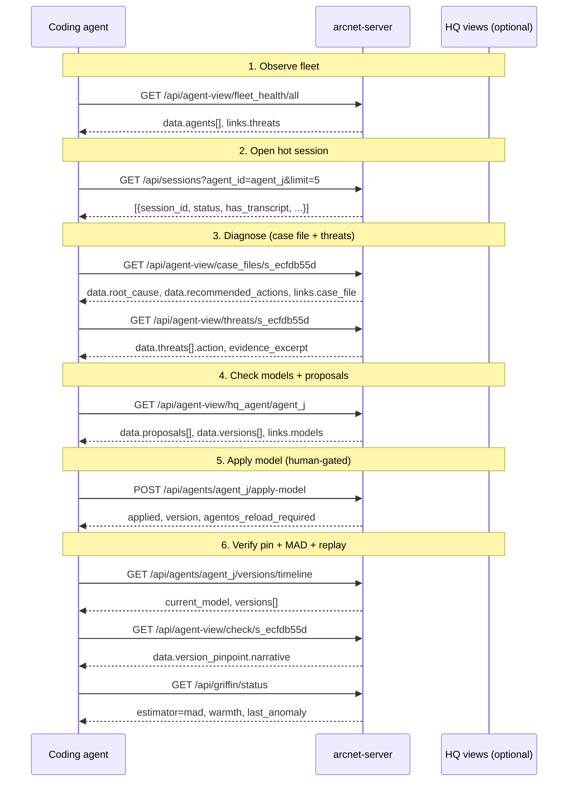

# Agent consumer guide — improve an observed agent (P8-B)

Machine-readable guide for coding agents operating ArcNet HQ without the React UI.
Every HQ view has a JSON twin at `GET /api/agent-view/{view}/{id}` using the standard envelope (`view`, `id`, `generated_at`, `data`, `links`, `hints`).

**Honesty pins (unchanged):** readiness ~62% (cap <=65); Griffin = MAD runtime (not TabFM-live); SigNoz MCP = PARTIAL.

**Base URL:** `http://localhost:8000` (no `.env` in worktrees — live keys: DEFER to driver session).

---

## HQ view → agent-view map

| HQ view | Agent twin | Typical `id` |
|---|---|---|
| home | `/api/agent-view/home/all` | `all` |
| fleet_health | `/api/agent-view/fleet_health/all` | `all` |
| signals | `/api/agent-view/signals/{agent\|session\|all}` | `agent_j`, `s_…`, or `all` |
| sources_trust | `/api/agent-view/sources_trust/{agent\|session}` | `agent_j` or `s_…` |
| time_machine | `/api/agent-view/time_machine/{session\|replay}` | `s_…` or `r_…` |
| case_files | `/api/agent-view/case_files/{session}` | `s_…` |
| hq_agent | `/api/agent-view/hq_agent/{agent}` | `agent_j` |
| hitl | `/api/agent-view/hitl/{session\|all}` | `s_…` or `all` |
| dashboards | `/api/agent-view/dashboards/all` | `all` or `status` |
| threats | `/api/agent-view/threats/{agent\|session\|all}` | `agent_j`, `s_…`, or `all` |

Legacy names (`fleet`, `sources`, `incident`, `session`, `check`, `replay`) remain valid.

**Graph links:** every session-scoped twin includes `links.case_file` → `/export/case-file/{id}`; agent-scoped twins include `links.models`, `links.versions`, `links.versions_timeline`.

**Errors:** 404/409 bodies are `{detail, hint?}` — follow `hint` for the next list endpoint.

---

## The improve loop (observe → diagnose → apply → verify)



---

## Step-by-step curls (replace ids from your fleet)

### 1. Observe fleet

```bash
curl -s http://localhost:8000/api/agent-view/fleet_health/all | jq '{
  agents: [.data.agents[] | {agent_id, model, health}],
  griffin: .data.griffin_status,
  next: .links.threats
}'
```

**Read:** `data.agents[].health.threats_24h`, `data.agents[].health.active_signals`, `links.threats`.

### 2. Pick a session

```bash
curl -s 'http://localhost:8000/api/sessions?agent_id=agent_j&limit=5' | jq '[.[] | {session_id, status, scenario, has_transcript}]'
```

**Read:** `session_id` where `status` is `failed` or `has_transcript` is true.

### 3. Diagnose via case file + threats

```bash
SESSION=s_ecfdb55d
curl -s "http://localhost:8000/api/agent-view/case_files/${SESSION}" | jq '{
  root_cause: .data.root_cause,
  actions: .data.recommended_actions,
  export: .data.export.zip,
  signoz: .links.signoz_trace
}'
curl -s "http://localhost:8000/api/agent-view/threats/${SESSION}" | jq '.data.threats[] | {action, category, evidence_excerpt}'
```

**Read:** `data.root_cause.action` (e.g. `block`), `data.recommended_actions[]`, `links.case_file`.

Optional zip for offline handoff:

```bash
curl -sOJ "http://localhost:8000/export/case-file/${SESSION}"
```

### 4. Check models and HQ proposals

```bash
AGENT=agent_j
curl -s "http://localhost:8000/api/agents/${AGENT}/models" | jq '.[] | {model, session_count}'
curl -s "http://localhost:8000/api/agent-view/hq_agent/${AGENT}" | jq '{
  current_model: .data.current_model,
  proposals: [.data.proposals[] | {signal_id, reason_excerpt, status}],
  versions: [.data.versions[] | {version_id, version, model}],
  apply: .data.apply_endpoint
}'
```

**Read:** `data.proposals[]` (source=hq_agent signals), `data.versions[]`, `links.versions_timeline`.

### 5. Apply model (requires `confirm: true`)

```bash
curl -s -X POST "http://localhost:8000/api/agents/${AGENT}/apply-model" \
  -H 'Content-Type: application/json' \
  -d '{"confirm":true,"model":"gpt-4o","version":"post-incident-1","session_id":"'"${SESSION}"'","notes":"coding-agent apply"}' \
  | jq '{applied, model, version_id: .version.version_id, reload: .agentos_reload_required, probe: .agentos_probe}'
```

**Read:** `applied`, `version.version_id`, `agentos_reload_required`, `agentos_probe.models_match`.

On duplicate `version_id`, expect **409** with `hint` to auto-generate a fresh id.

### 6. Verify via versions, check, Griffin, Time Machine

```bash
curl -s "http://localhost:8000/api/agents/${AGENT}/versions/timeline" | jq '{current_model, versions: [.versions[] | {version_id, model, created_at}]}'
curl -s "http://localhost:8000/api/agent-view/check/${SESSION}" | jq '.data.version_pinpoint | {pin, version_id, narrative, fleet_current_model}'
curl -s http://localhost:8000/api/griffin/status | jq '{estimator, status, last_anomaly, honesty}'
curl -s "http://localhost:8000/api/agent-view/time_machine/${SESSION}" | jq '.data | {latest_replay_id, latest_verdict}'
```

**Read:** `versions/timeline.current_model` matches applied model; `version_pinpoint.narrative` explains pin drift; `griffin.estimator` stays `mad`; `time_machine.latest_verdict` after a replay run.

Run a counterfactual replay (needs `OPENAI_API_KEY` + AgentOS — DEFER to driver session if absent):

```bash
curl -s -X POST http://localhost:8000/api/replay \
  -H 'Content-Type: application/json' \
  -d '{"session_id":"'"${SESSION}"'","candidate_model":"gpt-4o"}' \
  | jq '{overall, recommendation, replay_id}'
```

Then fetch the stored verdict twin:

```bash
curl -s "http://localhost:8000/api/agent-view/replay/${REPLAY_ID}" | jq '.data'
```

---

## Structured error examples

```bash
curl -s http://localhost:8000/api/agent-view/case_files/s_missing | jq .
# {"detail":"session s_missing not found","hint":"list ids via GET /api/sessions"}
```

```bash
curl -s -X POST http://localhost:8000/api/agents/agent_j/apply-model \
  -H 'Content-Type: application/json' \
  -d '{"confirm":true,"model":"gpt-4o","version":"x","version_id":"av_existing"}' | jq .
# 409 {"detail":"version_id av_existing already exists","hint":"omit version_id to auto-generate or pick a fresh version_id"}
```

---

## Related docs

- API contract (additive-only): [`12-data-api.md`](12-data-api.md)
- Read model projections: [`13-read-models.md`](13-read-models.md) (if present) / `server/arcnet_server/read_models.py`
- HQ Agent tools: `sdk/arcnet/hq_tools.py`
