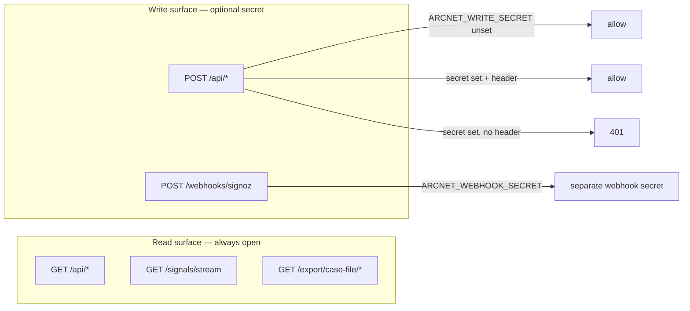

# Deployment notes (honest)

ArcNet v1 is a **localhost demo** with an optional write secret — not a production-hardened SaaS. This doc maps every `ARCNET_*` env var and names what is **still missing** if you expose the server beyond `127.0.0.1`.

Overall readiness stays **~64% / ≤65%** ([`docs/20-honest-progress.md`](20-honest-progress.md)). Setting secrets does not move that number.

## Environment surface

| Variable | Default / typical | What it does |
|---|---|---|
| `ARCNET_DB_PATH` | `data/arcnet.db` | SQLite file path. Single-writer, single-file — no HA, no replication. |
| `ARCNET_SERVER_URL` | `http://localhost:8000` | Base URL for SDK signal client, HQ, and tooling. |
| `ARCNET_AGENTOS_URL` | `http://localhost:7777` | AgentOS replay adapter (`/internal/replay`, `/internal/runtime` probe after apply-model). |
| `ARCNET_MODEL` | `gpt-4o-mini` | Baseline model id for agents and pricing lookups. |
| `ARCNET_CANDIDATE_MODEL` | `gpt-4o` | Time Machine candidate model id. |
| `ARCNET_WRITE_SECRET` | *(unset)* | When set: all mutating `POST` routes require `X-Arcnet-Write-Secret` or `Authorization: Bearer …`. When unset: **localhost-trust** — writes open (demo default). |
| `ARCNET_WEBHOOK_SECRET` | *(unset)* | When set: `POST /webhooks/signoz` requires `X-ArcNet-Webhook-Secret` or Bearer. **Separate from write secret** — configure SigNoz Alertmanager with the matching header. |
| `ARCNET_GRIFFIN_DEMO` | *(unset)* | `1` / `true` → faster Griffin demo cadence. |
| `ARCNET_GRIFFIN_CADENCE_S` | `60` | Griffin MAD loop interval (seconds). |
| `ARCNET_GRIFFIN_DEMO_CADENCE_S` | `10` | Demo cadence when `ARCNET_GRIFFIN_DEMO` is on. |
| `ARCNET_GRIFFIN_SERIES` | *(unset)* | Path to Griffin series JSON override (tests / cold soak). |
| `ARCNET_TABFM` | *(unset)* | `1` → opt-in TabFM async worker (Phase 7); default runtime stays MAD. |
| `ARCNET_TABFM_CADENCE_S` | `360` | TabFM worker interval when enabled. |
| `ARCNET_MODEL_EXPLORE_LOOP` | *(unset)* | `1` → optional recommend+record note loop (never apply/kill). |
| `ARCNET_EXPLORE_DIR` | `data/model_explore` | Output dir for model explore artifacts. |
| `ARCNET_SERVER_PORT` | `8000` | Used by `scripts/run-demo.sh` only. |
| `ARCNET_AGENTOS_PORT` | `7777` | Used by `scripts/run-demo.sh` only. |

Related non-`ARCNET_*` vars: `OPENAI_API_KEY`, `SIGNOZ_URL`, `SIGNOZ_API_KEY`, `SIGNOZ_DASHBOARD_*`, `OTEL_EXPORTER_OTLP_ENDPOINT`, `HF_TOKEN`, `TABPFN_TOKEN` — see `.env.example`.

## Auth model (v1)



- **Write auth:** `require_write_auth` in `arcnet_server/write_auth.py`. Unset secret = today's behavior exactly.
- **Webhook auth:** own secret because SigNoz sends alerts with Alertmanager-configured headers, not the SDK write path.
- **Read auth:** **none**. Fleet, sessions (with transcript), threats, case files, agent-view twins — all readable without credentials. Deliberate for demo + coding-agent consumers on a trusted host; **not** a security boundary.

## What is still missing for “real” production

Do **not** deploy ArcNet thinking these gaps are closed:

| Gap | Status |
|---|---|
| TLS / HTTPS termination | **Missing** — run behind your own reverse proxy. |
| Multi-tenant isolation | **Missing** — single SQLite, single org assumption. |
| RBAC / user accounts | **Missing** — no roles, no per-agent ACLs. |
| Read-path authentication | **Missing by design** — see above. |
| HITL → live AgentOS relay | **Missing** — SQLite status only ([`docs/12`](12-data-api.md)). |
| Auto AgentOS restart after apply | **Missing** — operator restarts with `ARCNET_MODEL` ([`docs/21`](21-next-phases-plan.md)). |
| SQLite HA / migrations | **Missing** — WAL + `CREATE IF NOT EXISTS`; schema wipe acceptable in v1. |
| Rate limiting / WAF | **Missing**. |
| CORS lockdown | **Permissive** (`allow_origins=["*"]`) — tighten at proxy if exposed. |
| Audit log / tamper evidence | **Partial** — SQLite rows + webhook_events; no signed audit chain. |
| Griffin TabFM default | **MAD** until `ARCNET_TABFM=1`; TabFM is opt-in ([`docs/20`](20-honest-progress.md)). |

## Minimal “beyond localhost” checklist

1. Bind API to `127.0.0.1` or private interface; put TLS + auth at the proxy if users need remote access.
2. Set `ARCNET_WRITE_SECRET` and configure SDK/agents/HQ to send `X-Arcnet-Write-Secret`.
3. Set `ARCNET_WEBHOOK_SECRET` and match SigNoz Alertmanager webhook headers.
4. Accept that **reads remain open** to anything that can reach the port — or block reads at the proxy (ArcNet does not support read tokens yet).
5. Back up `ARCNET_DB_PATH`; treat it as the only source of truth.
6. Re-read [`docs/20-honest-progress.md`](20-honest-progress.md) before claiming production readiness.

## Demo database hygiene

`data/arcnet.db` mixes **recorded hero incidents**, **seed_demo background fleet rows**, and (historically) **test-suite telemetry** that leaked in before suite guards landed. The live DB is precious — treat cleanup as conservative surgery, not a wipe.

### Inspect / prune test-origin rows

```bash
# dry run (default) — prints grouped counts + sample session_ids, changes nothing
.venv/bin/python scripts/clean_demo_db.py

# apply — timestamped backup beside the DB first, then delete
.venv/bin/python scripts/clean_demo_db.py --apply
```

**Removal criteria (conservative):**

| Rule | What it catches | Why it is safe |
|---|---|---|
| **Orphan child rows** | `threats`, `sources`, `signals`, `replays`, or `hitl_requests` rows whose `session_id` is set but has **no** matching `sessions` row | Tests POST telemetry (threats/sources/signals) without creating a session — the dominant leak mode (`s_replay_steer` and short-lived `s_*` ids with synthetic S1-shaped threat sets). No session row ⇒ not a recorded incident. |
| **Known test session trees** | A `sessions` row whose id is an **explicit literal** from a test module (e.g. `s_replay_cc`, `s_hitl_relay`, `s_robust`) | Only ids copied from test source — never pattern-matched hex ids. Removes the session and all dependent rows. |

**Hard-protected (never removed, asserted before and after `--apply`):**

- Hero recordings: `s_ecfdb55d` (Edgar S1), `s_2af44726` (Worms S4)
- Seed fleet: any `s_demo_*` session from `scripts/seed_demo.py`

Duplicate scenario recordings with transcripts (extra S1/S2/S4/S5 runs on `agent_j`) are **kept** — they may be genuine re-recordings; deleting a real session is worse than leaving a stray orphan's parent missing (orphan children are still removed by the first rule).

`--apply` copies `arcnet.db.backup.<UTC-timestamp>` next to the database and aborts if the backup cannot be written. Dry-run prints before/projected-after table counts.

### Nuclear option — pristine DB from fixtures

When you want a cold clone with **only** seeded fleet + fixture-backed heroes (no historical recordings):

```bash
rm -f data/arcnet.db data/arcnet.db-wal data/arcnet.db-shm
.venv/bin/python scripts/seed.py              # Griffin MAD history → data/griffin_series.json
.venv/bin/python scripts/seed_demo.py         # background agents agent_l / agent_o
.venv/bin/python scripts/seed_heroes.py       # Edgar + Worms from fixtures/heroes.json
```

Or run `./scripts/run-demo.sh` (without `--no-seed`), which runs all three seed steps before starting services. This reproduces both hero incidents and their stored replay verdicts with **no API key**. It does **not** restore ad-hoc scenario re-recordings that lived only in an old `arcnet.db`.
